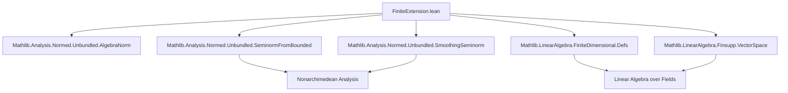

### Technical Brief: `FiniteExtension.lean`

---

#### **1. Key Definitions & Theorems**

| Name | Type / Signature | Purpose |
|------|------------------|---------|
| `Basis.norm` | `def norm (x : L) : ℝ := Finset.sup' univ univ_nonempty (fun i ↦ ‖B.repr x i‖)` | Defines a real-valued function on $L$ by taking the maximum norm of coefficients of $x$ w.r.t. a $K$-basis $B$. |
| `norm_repr_le_norm` | `∀ x i, ‖B.repr x i‖ ≤ B.norm x` | Coefficient norms are bounded by the basis norm. |
| `norm_zero`, `norm_neg`, `norm_nonneg` | `B.norm 0 = 0`, `B.norm (-x) = B.norm x`, `0 ≤ B.norm x` | Basic properties of `B.norm` as a candidate seminorm. |
| `norm_extends` | `B i = 1 ⇒ B.norm (algebraMap K L x) = ‖x‖` | Ensures `B.norm` extends the norm on $K$ when the basis contains $1$. |
| `norm_isNonarchimedean` | `IsNonarchimedean (Norm.norm K) ⇒ IsNonarchimedean B.norm` | If the norm on $K$ is nonarchimedean, so is `B.norm`. |
| `norm_mul_le_const_mul_norm` | `∃ c > 0, ∀ x y, B.norm (x * y) ≤ c * B.norm x * B.norm y` | Multiplication is *bounded* w.r.t. `B.norm`. Key step toward constructing an algebra norm. |
| `norm_smul` | `B i = 1 ⇒ B.norm ((algebraMap K L) k * y) = B.norm ((algebraMap K L) k) * B.norm y` | Compatibility of `B.norm` with scalar multiplication by $K$. |
| `exists_nonarchimedean_pow_mul_seminorm_of_finiteDimensional` | `FiniteDimensional K L ∧ IsNonarchimedean (norm K) ⇒ ∃ f : AlgebraNorm K L, IsPowMul f ∧ f extends norm K ∧ IsNonarchimedean f` | Main theorem: existence of a power-multiplicative, nonarchimedean $K$-algebra norm on $L$ extending the norm on $K$. |

---

#### **2. Naming Conventions**

- **Prefixes**:
  - `norm_`: properties of `B.norm` (e.g., `norm_zero`, `norm_neg`, `norm_extends`)
  - `is_`: properties of functions (e.g., `isNonarchimedean`, `isPowMul`)
- **Suffixes**:
  - `_le_`: inequalities (e.g., `norm_mul_le_const_mul_norm`)
  - `_apply`: function application lemmas (e.g., `seminormFromBounded_of_mul_apply`)
- **Structure**:
  - `seminormFromBounded`, `smoothingSeminorm`: named after their construction from boundedness/data.
  - `BGR` references indicate reliance on *Bosch–Günzer–Remmert*.

---

#### **3. Tactic Stack**

Frequent tactics used in proofs:

| Tactic | Role |
|--------|------|
| `simp` / `simp_rw` | Simplification of `norm`, `repr`, `smul`, `map`, etc. |
| `aesop` | Automated reasoning for simple goals (e.g., `norm_extends`). |
| `rcases`, `obtain ⟨…⟩` | Extract witnesses from existential quantifiers (e.g., indices achieving suprema). |
| `rw`, `erw` | Rewriting using equalities, especially with `seminormFromBounded` and `smoothingSeminorm`. |
| `apply le_antisymm` | Proving equality via double inequality (e.g., `norm_extends`). |
| `exact`, `exact?` | Finishing goals with known terms. |
| `convert`, `congr'` | For structural congruence (e.g., in `smul'` proof). |
| `have`, `set` | Introduce intermediate definitions/lemmas (e.g., `set g := B.norm`). |
| `rw [← h]` | Rewriting backwards to substitute definitions. |

---

#### **4. Proof Logic**

The logical flow follows a **constructive approximation strategy**:

1. **Basis Setup**:
   - Choose a basis $B = \{1, e_2, ..., e_n\}$ of $L/K$ containing $1$ (via `Basis.extend`).
   - Define `B.norm` as the sup-norm of coefficients.

2. **Verification of Seminorm Properties**:
   - Show `B.norm` satisfies:
     - `B.norm 0 = 0`
     - `B.norm(-x) = B.norm x`
     - `B.norm(x + y) ≤ max(B.norm x, B.norm y)` (nonarchimedean triangle inequality)
     - `B.norm(k·x) = ‖k‖·B.norm x` for $k ∈ K$
     - Multiplicative boundedness: `B.norm(x·y) ≤ c·B.norm x·B.norm y`

3. **Smoothing to a Ring Norm**:
   - Use `seminormFromBounded` (BGR Prop. 1.2.1/2) to convert `B.norm` into a ring norm `f` extending the $K$-norm.

4. **Power-Multiplicative Refinement**:
   - Apply `smoothingSeminorm` (BGR Prop. 1.3.2/1) to `f` to obtain a *power-multiplicative* norm `F`.

5. **Final Verification**:
   - Check that `F` is:
     - An `AlgebraNorm K L`
     - Power-multiplicative (`IsPowMul`)
     - Extends the $K$-norm
     - Nonarchimedean (`IsNonarchimedean`)

---

#### **5. Imports & Dependencies**

| Module | Role |
|--------|------|
| `Mathlib.Analysis.Normed.Unbundled.AlgebraNorm` | Defines `AlgebraNorm`, ring norms compatible with $K$-algebra structure. |
| `Mathlib.Analysis.Normed.Unbundled.SeminormFromBounded` | Construction of ring norm from bounded multiplication (BGR Prop. 1.2.1/2). |
| `Mathlib.Analysis.Normed.Unbundled.SmoothingSeminorm` | Construction of power-multiplicative norm from a bounded seminorm (BGR Prop. 1.3.2/1). |
| `Mathlib.LinearAlgebra.FiniteDimensional.Defs` | Provides `FiniteDimensional`, `fintypeBasisIndex`, etc. |
| `Mathlib.LinearAlgebra.Finsupp.VectorSpace` | Basis representation via `Basis.repr`, `Finsupp`, etc. |

---

#### **6. Mermaid Diagrams**

##### **Dependency Graph (Module-Level)**



##### **Overview of Theory Flow**

```mermaid
flowchart LR
  subgraph Setup
    B[Basis B of L/K with 1 ∈ B]
    g[B.norm: sup-norm of coefficients]
  end

  subgraph Properties
    P1[B.norm 0 = 0]
    P2[B.norm(-x) = B.norm x]
    P3[B.norm(x+y) ≤ max(B.norm x, B.norm y)]
    P4[B.norm(k·x) = ‖k‖·B.norm x]
    P5[B.norm(x·y) ≤ c·B.norm x·B.norm y]
  end

  subgraph Construction
    S[seminormFromBounded g → f]
    T[smoothingSeminorm f → F]
  end

  subgraph Result
    R[∃ F : AlgebraNorm K L,
        IsPowMul F ∧ F extends norm K ∧ IsNonarchimedean F]
  end

  B --> g
  g --> P1 & P2 & P3 & P4 & P5
  P1 & P2 & P3 & P4 & P5 --> S
  S --> T
  T --> R
```

---

#### **7. Summary**

This file formalizes a foundational result in nonarchimedean functional analysis: the existence of a power-multiplicative, nonarchimedean $K$-algebra norm on a finite extension $L/K$, assuming $K$ itself is a nonarchimedean normed field. The construction proceeds via:

- A *basis-dependent* sup-norm (`B.norm`)
- A *smoothing* process (`seminormFromBounded`, `smoothingSeminorm`) to obtain a well-behaved algebra norm.

The proof is highly structured, leveraging Lean’s `seminorm` and `algebraNorm` infrastructure, and closely mirrors the classical argument from *Bosch–Günzer–Remmert, Non-Archimedean Analysis*.

--- 

Let me know if you'd like a formalized dependency graph (e.g., `.lean` imports tree) or a proof-term extraction.
