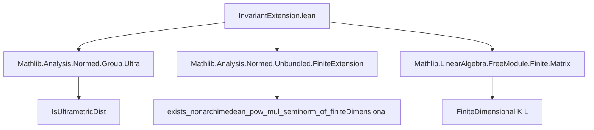

### Technical Brief: `InvariantExtension.lean`

---

#### **1. Key Definitions & Theorems**

| Name | Type / Signature | Purpose |
|------|------------------|---------|
| `algNormOfAlgEquiv` | `(σ : L ≃ₐ[K] L) → AlgebraNorm K L` | Constructs a $K$-algebra norm on $L$ by pulling back the given norm via a $K$-algebra automorphism $\sigma$. |
| `invariantExtension` | `AlgebraNorm K L` | Defines a $K$-algebra norm on $L$ as the supremum (over all $K$-algebra automorphisms $\sigma$) of `algNormOfAlgEquiv σ`. |
| `algNormOfAlgEquiv_apply` | `algNormOfAlgEquiv σ x = ‖σ x‖` | Explicitly describes the value of `algNormOfAlgEquiv`. |
| `isPowMul_algNormOfAlgEquiv` | `IsPowMul (algNormOfAlgEquiv σ)` | Shows `algNormOfAlgEquiv` preserves powers: $\|x^n\| = \|x\|^n$. |
| `isNonarchimedean_algNormOfAlgEquiv` | `IsNonarchimedean (algNormOfAlgEquiv σ)` | Shows `algNormOfAlgEquiv` satisfies the ultrametric inequality: $\|x + y\| \leq \max(\|x\|, \|y\|)$. |
| `algNormOfAlgEquiv_extends` | `(algNormOfAlgEquiv σ) ∘ algebraMap = ‖·‖` | Confirms `algNormOfAlgEquiv σ` extends the original norm on $K$. |
| `isPowMul_invariantExtension` | `IsPowMul (invariantExtension K L)` | Shows the invariant extension is power-multiplicative. |
| `isNonarchimedean_invariantExtension` | `IsNonarchimedean (invariantExtension K L)` | Shows the invariant extension is nonarchimedean. |
| `invariantExtension_extends` | `(invariantExtension K L) ∘ algebraMap = ‖·‖` | Confirms the invariant extension extends the norm on $K$. |

---

#### **2. Naming Conventions**

- **Prefixes**:
  - `algNormOfAlgEquiv`: Combines *algebra norm* and *automorphism*.
  - `invariantExtension`: Reflects invariance under automorphisms and extension from $K$ to $L$.
- **Suffixes**:
  - `_apply`: For definitional equalities (e.g., `algNormOfAlgEquiv_apply`).
  - `_extends`: For properties about extending the base norm.
  - `isPowMul_`, `isNonarchimedean_`: Predicate-style naming for structural properties.

---

#### **3. Tactic Stack**

Frequently used tactics:
- `simp` / `simp only`: Simplify using definitional equalities and lemmas.
- `rw`: Rewrite using previously proven theorems (e.g., `algNormOfAlgEquiv_apply`).
- `exact`: Apply known lemmas directly (e.g., `Classical.choose_spec`).
- `ciSup_le`, `le_ciSup`: Handle supremum-based inequalities.
- `intro`, `contrapose!`: Standard logical reasoning.
- `apply_nonneg`, `norm_nonneg`: Use positivity of norms.
- `iSup_congr`, `iSup_const`: Manipulate indexed suprema.

---

#### **4. Proof Logic**

- **Induction / Case Analysis**: Not used directly; proofs rely on structural properties of algebra norms and automorphisms.
- **Core Strategy**:
  1. Use `Classical.choose_spec` to extract properties (power-multiplicativity, nonarchimedean, extension) from the existence lemma `exists_nonarchimedean_pow_mul_seminorm_of_finiteDimensional`.
  2. For `invariantExtension`, reduce properties to those of `algNormOfAlgEquiv` via:
     - Supremum characterizations (`iSup`, `ciSup_le`, `le_ciSup`).
     - Monotonicity and positivity of norms.
  3. Use `AlgEquiv.commutes` to handle extension over $K$.

---

#### **5. Imports & Dependencies**

| Module | Purpose |
|--------|---------|
| `Mathlib.Analysis.Normed.Group.Ultra` | Provides `IsUltrametricDist`, nonarchimedean normed group theory. |
| `Mathlib.Analysis.Normed.Unbundled.FiniteExtension` | Supplies `exists_nonarchimedean_pow_mul_seminorm_of_finiteDimensional`, key existence result. |
| `Mathlib.LinearAlgebra.FreeModule.Finite.Matrix` | Likely used for finite-dimensionality machinery (e.g., `FiniteDimensional`). |

---

#### **6. Mermaid Diagrams**

##### **Dependency Graph**



##### **Overview of Theory Flow**

```mermaid
flowchart LR
  K[Normed Field K] --> L[Finite Algebraic Extension L/K]
  L --> σ[Automorphisms L ≃ₐ[K] L]
  σ --> algNormOfAlgEquiv[algNormOfAlgEquiv σ]
  algNormOfAlgEquiv --> invariantExtension[invariantExtension = sup_σ algNormOfAlgEquiv σ]
  invariantExtension --> isPowMul[Power-Multiplicative]
  invariantExtension --> isNonarchimedean[Ultrametric]
  invariantExtension --> extends[Extends ‖·‖_K]
```

---

#### **7. Summary**

This file constructs two canonical $K$-algebra norms on a finite extension $L/K$ of a nonarchimedean normed field $K$:
- One per automorphism (`algNormOfAlgEquiv`), and
- One globally invariant under all $K$-algebra automorphisms (`invariantExtension`).

Both inherit key properties (power-multiplicativity, nonarchimedean, extension) from the base existence result in `FiniteExtension`. The proofs are largely mechanical, leveraging `Classical.choose_spec`, supremum calculus, and norm properties.

This is foundational for constructing canonical extensions of norms in nonarchimedean geometry and Galois theory.
