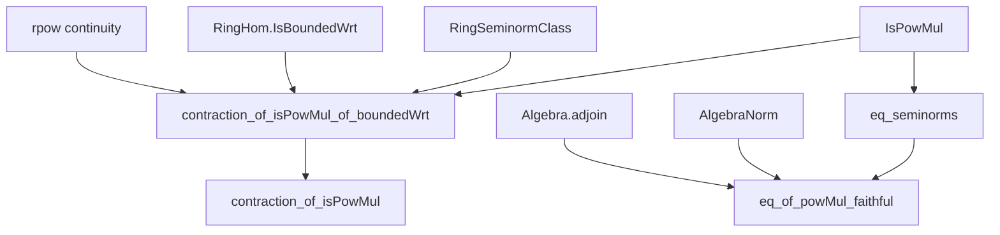
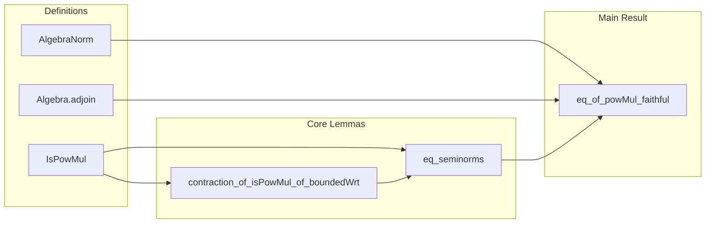

**Technical Brief: `IsPowMulFaithful.lean`**

---

### 1. **Key Definitions & Theorems**

| Name | Type / Signature | Purpose |
|------|------------------|---------|
| `IsPowMul` | `β → ℝ → Prop` (implicit) | Predicate stating that a function `nβ : β → ℝ` is *power-multiplicative*: `nβ (x ^ n) = nβ x ^ n` for all `n : ℕ`, `x : β`. |
| `contraction_of_isPowMul_of_boundedWrt` | `{F : Type*} → ... → nβ (f x) ≤ nα x` | If a ring homomorphism `f : α →+* β` is bounded w.r.t. a ring seminorm `nα` and a power-multiplicative `nβ`, then `f` is a *contraction* (i.e., `nβ ∘ f ≤ nα`). |
| `contraction_of_isPowMul` | `[SeminormedRing α] → [SeminormedRing β] → IsPowMul norm → f.IsBounded → norm (f x) ≤ norm x` | Special case of above for the canonical norm on seminormed rings. |
| `eq_seminorms` | `{f g : F} → IsPowMul f → IsPowMul g → (∃ r > 0, f ≤ r • g) → (∃ s > 0, g ≤ s • f) → f = g` | Two power-multiplicative ring seminorms that are *mutually bounded* (i.e., equivalent up to constants) must be equal. |
| `eq_of_powMul_faithful` | `(f₁ f₂ : AlgebraNorm R S) → IsPowMul f₁ → IsPowMul f₂ → (∀ y, f₁ ≃ f₂ on R[y]) → f₁ = f₂` | Main theorem: If two power-multiplicative algebra norms agree *locally* on all singly-generated subalgebras `R[y]`, then they are globally equal. This is the formalization of [BGR, Prop. 3.1.5/1]. |

---

### 2. **Naming Conventions**

- **`isPowMul_` / `IsPowMul`**: Predicate for power-multiplicativity.
- **`contraction_of_`**: Implies a bound of the form `norm (f x) ≤ norm x`.
- **`boundedWrt`**: Used for boundedness of maps between normed structures w.r.t. given seminorms.
- **`eq_` / `eq_seminorms`**: Equality criteria for seminorms under boundedness assumptions.
- **`restriction`**: Used to restrict an algebra norm to a subalgebra (e.g., `AlgebraNorm.restriction`).
- **`self_mem_adjoin_singleton`**: Standard lemma that `x ∈ R[x]`.

Prefixes/suffixes:
- `is_`, `contraction_of_`, `boundedWrt`, `eq_`, `restriction`, `adjoin`, `self_mem_`.

---

### 3. **Tactic Stack**

Frequently used tactics in proofs:
- `obtain ⟨...⟩` — destruct existential/and hypotheses.
- `rw [...]` — rewrite using equalities/lemmas.
- `simp only [...]` — simplify with precise lemmas.
- `apply le_antisymm ...` — prove equality of reals via double inequality.
- `exact ...`, `apply ...`, `exact?` — direct proof steps.
- `rpow_*` lemmas (`rpow_mul`, `rpow_natCast`, `inv_mul_cancel₀`, etc.) — used in analysis of powers.
- `tendsto_*`, `continuousAt_*`, `rpow_zero` — for limit arguments.
- `nth_rewrite`, `mul_pow`, `map_pow`, `mul_le_mul_iff_right₀` — algebraic manipulations.

---

### 4. **Proof Logic**

The logical flow in `eq_of_powMul_faithful` is:

1. **Goal reduction**: To show `f₁ = f₂`, it suffices (by extensionality) to show `f₁ x = f₂ x` for arbitrary `x : S`.
2. **Localization**: Consider the subalgebra `R[x] ⊆ S`, and restrict `f₁`, `f₂` to it: `g₁`, `g₂`.
3. **Use assumption**: By hypothesis `h_eq`, `f₁` and `f₂` are equivalent on `R[x]`, i.e., `g₁ ≤ C₁ • g₂` and `g₂ ≤ C₂ • g₁`.
4. **Apply `eq_seminorms`**: Since `g₁`, `g₂` are power-multiplicative (by `IsPowMul.restriction`), mutual boundedness implies `g₁ = g₂`.
5. **Unfold**: Use `y.val = x` where `y ∈ R[x]` is the inclusion of `x`, to conclude `f₁ x = g₁ y = g₂ y = f₂ x`.

The supporting lemmas (`contraction_of_isPowMul_of_boundedWrt`, `eq_seminorms`) rely on:
- Inductive or analytic arguments for powers (via `rpow` continuity and limits).
- Ring homomorphism properties (`map_pow`, `map_mul`).
- Positivity and invertibility of scalars (`0 < C`, `n ≠ 0`).

---

### 5. **Imports**

- `Mathlib.Analysis.Normed.Unbundled.AlgebraNorm`  
  → Provides `AlgebraNorm`, `AlgebraNorm.restriction`, and basic algebra norm theory.

- `Mathlib.Analysis.SpecialFunctions.Pow.Continuity`  
  → Provides continuity and limit properties of `rpow`, essential for the analytic part of `contraction_of_isPowMul_of_boundedWrt`.

Other open scopes:
- `Real`, `Topology` (via `Filter`, `atTop`, `𝓝`).

---

### 6. **Mermaid Diagrams**

#### Dependency Graph (High-Level)

#### Overview of `IsPowMulFaithful.lean`

---

### 7. **Theoretical Context**

This file formalizes a foundational result in non-Archimedean geometry: *power-multiplicative algebra norms are determined by their behavior on singly-generated subalgebras*. This is crucial for constructing and comparing valuations or norms in rigid geometry (e.g., in the theory of Banach algebras over non-Archimedean fields). The result shows that the assignment `y ↦ f|_{R[y]}` is *faithful* — hence the module name `IsPowMulFaithful`.

The proof strategy reflects the standard technique in non-Archimedean analysis: reduce global equality to local (finitely generated) cases, using boundedness and power-multiplicativity to control growth.

--- 

Let me know if you'd like a formalized dependency graph (e.g., for `leanproject`), or a visualization of the proof tree for `eq_of_powMul_faithful`.
