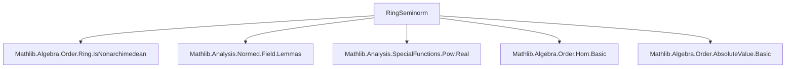

### Technical Brief: `RingSeminorm.lean`

---

#### **1. Key Definitions & Theorems**

| Name | Type / Structure | Purpose |
|------|------------------|---------|
| `RingSeminorm R` | `structure` | A function `f : R → ℝ` that is a seminorm for the additive group and satisfies submultiplicativity (`f(x*y) ≤ f(x)*f(y)`) and symmetry (`f(-x) = f(x)`). Extends `AddGroupSeminorm R`. |
| `RingNorm R` | `structure` | A `RingSeminorm` that is also an additive group norm (`f x = 0 ↔ x = 0`). |
| `MulRingSeminorm R` | `structure` | A `RingSeminorm` that is also a multiplicative monoid-with-zero homomorphism (`f(x*y) = f(x)*f(y)`, `f(1) = 1`, `f(0) = 0`). |
| `MulRingNorm R` | `structure` | A `MulRingSeminorm` that is also an additive group norm. Equivalent to `AbsoluteValue R ℝ` for nontrivial rings. |
| `normRingSeminorm R` | `def` | The canonical seminorm on a `NonUnitalSeminormedRing R`, induced by its norm. |
| `normRingNorm R` | `def` | The canonical norm on a `NonUnitalNormedRing R`. |
| `SeminormedRing.toRingSeminorm R` | `def` | Same as `normRingSeminorm`, but for `SeminormedRing`. |
| `NormedRing.toRingNorm R` | `def` | Same as `normRingNorm`, but for `NormedRing`. |
| `NormedField.toMulRingNorm R` | `def` | The norm on a `NormedField`, viewed as a multiplicative norm. |
| `NormedField.toAbsoluteValue R` | `def` | The norm on a `NormedField`, viewed as an `AbsoluteValue`. |
| `RingSeminorm.toRingNorm K hnt` | `def` | Converts a nonzero ring seminorm on a field `K` into a ring norm. |
| `mulRingNormEquivAbsoluteValue` | `def` | Equivalence between `MulRingNorm R` and `AbsoluteValue R ℝ` for nontrivial rings. |
| `map_pow_le_pow` | `thm` | For any `RingSeminormClass`-compatible `f`, `f(a^n) ≤ f(a)^n` for `n ≠ 0`. |
| `map_pow_le_pow'` | `thm` | Same as above, but holds for all `n : ℕ` if `f(1) ≤ 1`. |
| `isBoundedUnder` | `thm` | Under `p(1) ≤ 1`, expressions like `p(x^{s(ψ n)})^{1/ψ n}` are eventually bounded. |
| `seminorm_one_eq_one_iff_ne_zero` | `thm` | For `p(1) ≤ 1`, `p(1) = 1 ↔ p ≠ 0`. |
| `exists_index_pow_le` | `thm` | Non-Archimedean version of binomial bound: for `p` non-Archimedean, `p((x+y)^n)` is bounded by a term involving `p(x^m)*p(y^{n−m})`. |

---

#### **2. Naming Conventions**

- **Prefixes**:
  - `RingSeminorm`, `RingNorm`, `MulRingSeminorm`, `MulRingNorm`: core structures.
  - `normRingSeminorm`, `normRingNorm`, `toRingSeminorm`, `toRingNorm`, `toMulRingNorm`, `toAbsoluteValue`: canonical constructions from existing normed structures.
  - `seminorm_one_eq_one_iff_ne_zero`, `map_pow_le_pow`, `isBoundedUnder`: descriptive theorem names.

- **Suffixes**:
  - `'` (prime): often used for variants (e.g., `map_mul_le_mul'` vs `map_mul_le_mul`).
  - `Class`: typeclass instances (e.g., `RingSeminormClass`, `MulRingSeminormClass`).
  - `Equiv`: for equivalences (e.g., `mulRingNormEquivAbsoluteValue`).

- **Structure fields**:
  - `toFun`, `map_zero'`, `add_le'`, `mul_le'`, `neg'`, `map_mul'`, `map_one'`, `eq_zero_of_map_eq_zero'`.

---

#### **3. Tactic Stack**

Frequently used tactics:
- `rfl`, `congr`, `ext`, `cases`, `obtain`, `by_cases`, `simp`, `simp only`, `simp_rw`, `grw`, `gcongr`, `rpow_*`, `div_*`, `cast_*`, `le_trans`, `antisymm`, `eq_or_ne`, `eq_zero_of_map_eq_zero'`, `ne_zero_iff`, `DFunLike.ext`, `mul_one`, `zero_mul`, `mul_zero`, `one_mul`, `pow_succ`, `pow_one`, `pow_zero`, `norm_*`, `normed_*`.

Tactic patterns:
- **Induction**: rarely explicit; instead, `pow_succ` + `grw` or `map_pow_le_pow` recursion.
- **Cases on equalities**: `eq_or_ne x 0`, `eq_or_ne y 0`, `eq_or_ne (p x) 0`.
- **Positivity reasoning**: `by positivity`, `mod_cast`, `cast_nonneg`.
- **Bounding arguments**: `isBoundedUnder_of`, `le_trans`, `rpow_le_one`, `rpow_le_self_of_one_le`.

---

#### **4. Proof Logic**

- **Structure definitions** are straightforward extensions of existing classes (`AddGroupSeminorm`, `AddGroupNorm`, `MonoidWithZeroHom`).
- **Theorems** often follow a pattern:
  - Use `map_mul_le_mul` or `map_mul'` to reduce multiplicative behavior.
  - Use `map_pow_le_pow`/`map_pow_le_pow'` for powers.
  - Use `seminorm_one_eq_one_iff_ne_zero` to relate `p(1)` to nontriviality.
  - Use `isBoundedUnder` for asymptotic behavior (e.g., in non-Archimedean analysis).
- **Non-Archimedean arguments** rely on `IsNonarchimedean.add_pow_le` and `exists_index_pow_le`.
- **Equivalence proofs** (`mulRingNormEquivAbsoluteValue`) use `ext` and `simp` to show componentwise equality.

---

#### **5. Imports**

| Module | Purpose |
|--------|---------|
| `Mathlib.Algebra.Order.Ring.IsNonarchimedean` | For `IsNonarchimedean` and related lemmas. |
| `Mathlib.Analysis.Normed.Field.Lemmas` | For normed field properties (e.g., `norm_mul`, `norm_neg`). |
| `Mathlib.Analysis.SpecialFunctions.Pow.Real` | For real exponentiation (`rpow_*`) used in `isBoundedUnder`. |

---

#### **6. Dependency & Theory Overview**

##### **Mermaid Diagram: Module Dependencies**



##### **Mermaid Diagram: Theory Overview**

```mermaid
graph TD
  A[RingSeminorm R] --> B[AddGroupSeminorm R]
  A --> C[Submultiplicativity: f(x*y) ≤ f(x)f(y)]
  A --> D[f(-x) = f(x)]

  E[RingNorm R] --> A
  E --> F[AddGroupNorm R]
  E --> G[Definiteness: f(x)=0 ↔ x=0]

  H[MulRingSeminorm R] --> A
  H --> I[MonoidWithZeroHom R ℝ]
  H --> J[f(x*y) = f(x)f(y)]

  K[MulRingNorm R] --> H
  K --> F
  K --> G

  L[NormedRing R] -->|→| M[NormedAddCommGroup R]
  L -->|→| N[Ring R]
  M -->|→| O[RingSeminorm R]
  N -->|→| O

  P[NormedField R] -->|→| Q[MulRingNorm R]
  P -->|→| R[AbsoluteValue R ℝ]
  Q <-->|equiv| R
```

##### **Key Relationships**
- `RingSeminorm` and `RingNorm` generalize seminorms/norms to arbitrary rings (not necessarily unital).
- `MulRingSeminorm` and `MulRingNorm` enforce *multiplicativity* (`f(xy) = f(x)f(y)`), aligning with absolute values.
- `MulRingNorm R ≃ AbsoluteValue R ℝ` for nontrivial rings — avoids duplication.
- `NormedRing`, `NormedField` embed into `RingNorm`, `MulRingNorm` respectively.
- `RingSeminorm.toRingNorm` shows that on fields, nonzero seminorms are automatically norms.

---

#### **7. Summary**

This module formalizes (multiplicative) seminorms and norms on rings, bridging algebraic and analytic structures. It provides:
- A unified framework for seminorms on non-unital rings.
- Canonical embeddings from `NormedRing`, `NormedField`.
- Equivalence with `AbsoluteValue` for multiplicative norms.
- Tools for non-Archimedean analysis (e.g., power bounds, boundedness under filters).

It serves as a foundational layer for further development in non-Archimedean geometry and functional analysis in Lean.
