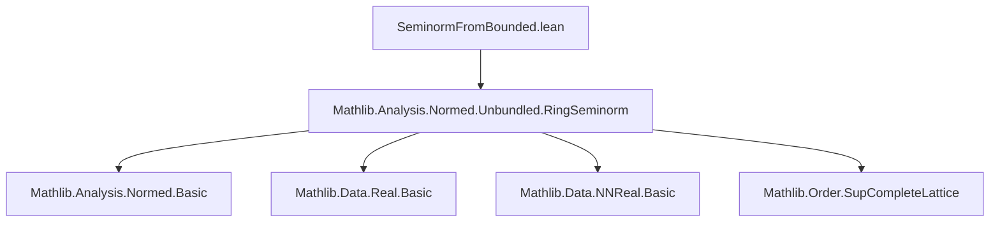

### Technical Brief: `SeminormFromBounded.lean`

---

#### **1. Key Definitions & Theorems**

| Name | Type / Signature | Purpose |
|------|------------------|---------|
| `seminormFromBounded'` | `R → ℝ` | Constructs a real-valued function from `f : R → ℝ` via supremum: $x \mapsto \sup_{y \in R} \frac{f(x \cdot y)}{f(y)}$ |
| `seminormFromBounded` | `(f_zero : f 0 = 0) → (f_nonneg : 0 ≤ f) → (f_mul : ∀ x y, f(x*y) ≤ c * f x * f y) → (f_add : ∀ a b, f(a+b) ≤ f a + f b) → (f_neg : ∀ x, f(-x) = f x) → RingSeminorm R` | Promotes `seminormFromBounded' f` to a *ring seminorm* under suitable hypotheses |
| `normFromBounded` | Same premises as `seminormFromBounded`, plus `f_ker : f⁻¹'{0} = {0}` → `RingNorm R` | Promotes `seminormFromBounded' f` to a *ring norm* when `f` has trivial kernel |
| `map_one_ne_zero` | `f ≠ 0 → 0 ≤ f → (∀ x y, f(x*y) ≤ c * f x * f y) → f 1 ≠ 0` | Ensures `f(1) ≠ 0` under nonzero and multiplicative boundedness assumptions |
| `seminormFromBounded_zero` | `f 0 = 0 → seminormFromBounded' f 0 = 0` | Preserves zero |
| `seminormFromBounded_add` | `0 ≤ f → f_mul → f_add → seminormFromBounded' f (x + y) ≤ seminormFromBounded' f x + seminormFromBounded' f y` | Subadditivity of constructed seminorm |
| `seminormFromBounded_mul` | `0 ≤ f → f_mul → seminormFromBounded' f (x * y) ≤ seminormFromBounded' f x * seminormFromBounded' f y` | Submultiplicativity of constructed seminorm |
| `seminormFromBounded_one` | `f ≠ 0 → 0 ≤ f → f_mul → seminormFromBounded' f 1 = 1` | Normalization at 1 under nonzero assumption |
| `seminormFromBounded_isNonarchimedean` | `0 ≤ f → f_mul → IsNonarchimedean f → IsNonarchimedean (seminormFromBounded' f)` | Nonarchimedean property lifts to constructed seminorm |
| `seminormFromBounded_of_mul_apply` | `0 ≤ f → f_mul → (∀ y, f(x*y) = f x * f y) → seminormFromBounded' f x = f x` | If `x` is *multiplicative* for `f`, then equality holds |
| `seminormFromBounded_of_mul_le` | `0 ≤ f → (∀ y, f(x*y) ≤ f x * f y) → f 1 ≤ 1 → seminormFromBounded' f x = f x` | If `x` is *submultiplicative* and `f(1) ≤ 1`, then equality holds |
| `seminormFromBounded_eq_zero_iff` | `0 ≤ f → f_mul → seminormFromBounded' f x = 0 ↔ f x = 0` | Kernel characterization |
| `seminormFromBounded_ker` | `0 ≤ f → f_mul → ker(seminormFromBounded' f) = ker(f)` | Kernel equality |
| `seminormFromBounded_is_norm_iff` | Under standard assumptions, `seminormFromBounded f` is a norm ⇔ `ker(f) = {0}` | Norm characterization |

---

#### **2. Naming Conventions**

- **Prefixes**:
  - `seminormFromBounded_`: Main construction and its properties.
  - `map_`: Properties of `f` itself (e.g., `map_one_ne_zero`, `map_pow_ne_zero`, `map_mul_zero_of_map_zero`).
  - `seminormFromBounded_of_`: Special cases where equality or behavior simplifies (e.g., `of_mul_apply`, `of_mul_le`, `of_mul_is_mul`).
- **Suffixes**:
  - `_le`, `_ge`, `_eq_zero_iff`, `_ne_zero`, `_nonneg`, `_one`, `_add`, `_mul`, `_neg`, `_isNonarchimedean`, `_ker`, `_is_norm_iff`: Indicate the type of inequality/equality/property being established.
- **Logical structure**:
  - `bddAbove_range`, `aux`, `zero`, `one`, `neg`, `add`, `mul`, `eq_zero_iff`, `is_norm_iff`, `is_mul`: Reflect standard seminorm axioms and logical goals.

---

#### **3. Tactic Stack**

Frequent tactics used in proofs:

| Tactic | Usage |
|--------|-------|
| `rcases` / `cases` | Splitting on `f y = 0` or `f y > 0`, or `eq_or_lt'` for nonnegative reals |
| `rw [← ...]` / `simp_rw` | Rewriting using multiplicative properties, division laws, and definitions |
| `apply le_antisymm` | Proving equality by bounding above and below |
| `exact`, `linarith`, ` positivity` | Closing arithmetic goals, especially with inequalities |
| `conv_lhs => rw [...]` | Local rewriting in left-hand side of equations |
| `convert`, `congr`, `ext` | Equality of functions/sets via extensionality |
| `by_cases` / `by_contra` | Case analysis on equalities like `f y = 0`, `f 1 = 0`, etc. |
| `div_le_iff₀`, `div_self`, `div_zero`, `zero_div` | Division arithmetic in `ℝ` |
| `ciSup_le`, `le_ciSup`, `le_csSup_of_le` | Handling suprema in definitions of `seminormFromBounded'` |
| `simp only`, `simp_rw`, `simp` | Simplifying expressions with definitions and known lemmas |
| `aesop` (not present) | Not used — proofs are highly manual and case-sensitive |

---

#### **4. Proof Logic**

The logical flow across most proofs follows this pattern:

1. **Case split on `f y = 0` or `f y > 0`**  
   - This is critical because the definition involves division by `f y`.  
   - Zero case often reduces to `0 ≤ 0` or `0 = 0`.  
   - Positive case uses multiplicative boundedness (`f(x*y) ≤ c * f x * f y`) and positivity of `f`.

2. **Bounding via supremum properties**  
   - Use `ciSup_le` or `le_ciSup` to relate `seminormFromBounded' f x` to `f x`.  
   - Often rely on `seminormFromBounded_bddAbove_range` to ensure supremum exists.

3. **Equality via `le_antisymm`**  
   - Prove both `≤` and `≥` directions separately.  
   - For `≥`, often evaluate at `y = 1` (or unit) and use `seminormFromBounded_ge`.

4. **Kernel and norm characterizations**  
   - Use `seminormFromBounded_eq_zero_iff` to reduce to properties of `f`.  
   - For `normFromBounded`, apply `seminormFromBounded_is_norm_iff`.

5. **Nonarchimedean lifting**  
   - Use `hna : IsNonarchimedean f` to get `f((x+y)*z) ≤ max(f(x*z), f(y*z))`.  
   - Then lift to supremum via `le_max_iff`.

6. **Multiplicativity preservation**  
   - If `f(x*y) = f(x)*f(y)`, then `f(x*y)/f(y) = f(x)` for `f(y) ≠ 0`, so supremum is exactly `f(x)`.

---

#### **5. Imports**

```lean
import Mathlib.Analysis.Normed.Unbundled.RingSeminorm
```

- **Scope**: This module builds on *unbundled* ring seminorms (i.e., functions `R → ℝ` satisfying seminorm axioms, not bundled as a type with structure).
- **Dependencies**:
  - `Mathlib.Analysis.Normed.Unbundled.RingSeminorm`: Core definitions of `RingSeminorm`, `RingNorm`, `IsNonarchimedean`, etc.
  - Implicit use of `Real`, `NNReal`, `Topological`, `Order` libraries (e.g., `iSup`, `BddAbove`, `div_le_iff₀`, `le_max_iff`).

---

#### **6. Mermaid Diagrams**

##### **Dependency Graph (Module Level)**



##### **Overview of Theory Flow**

```mermaid
flowchart LR
  subgraph Input
    f["f : R → ℝ"]
    assumptions["0 ≤ f", "f(0) = 0", "f(-x) = f(x)", "f_add", "f_mul"]
  end

  subgraph Construction
    sb["seminormFromBounded' f"]
    sb_ring["seminormFromBounded f"]
    sb_norm["normFromBounded f"]
  end

  subgraph Properties
    zero["Preserves 0"]
    add["Subadditive"]
    mul["Submultiplicative"]
    neg["Invariant under negation"]
    one["Normalizes at 1"]
    nonarch["Lifts nonarchimedean"]
    ker["ker(seminorm) = ker(f)"]
    norm_iff["Is norm ⇔ ker(f) = {0}"]
  end

  f --> sb
  assumptions --> sb
  sb --> sb_ring
  sb_ring --> sb_norm
  sb --> zero
  sb --> add
  sb --> mul
  sb --> neg
  sb --> one
  sb --> nonarch
  sb --> ker
  sb --> norm_iff
```

##### **Proof Strategy Dependency (for `seminormFromBounded_mul`)**
```mermaid
graph TD
  A[Goal: seminorm(x*y) ≤ seminorm(x) * seminorm(y)] --> B[Apply ciSup_le]
  B --> C[Fix z : R]
  C --> D{Case: f(z) = 0?}
  D -->|Yes| E[Use map_mul_zero_of_map_zero]
  D -->|No| F[Use div_le_iff₀]
  F --> G[Apply f_mul to x,z and y,x*z]
  G --> H[Use seminormFromBounded_bddAbove_range]
  H --> I[Conclude via le_ciSup]
```

---

#### **7. Summary**

This file formalizes a classical construction from non-archimedean analysis: given a *multiplicatively bounded* additive seminorm `f` on a commutative ring `R`, one can construct a *ring seminorm* (or even a *ring norm*, under trivial kernel) via a supremum over scaled ratios $f(x y)/f(y)$. The construction is subtle due to division by potentially zero values, and the proofs carefully handle zero/nonzero cases using positivity, boundedness, and ring-theoretic properties.

The file is a textbook example of Lean-style analysis: heavy use of case analysis, supremum calculus, and inequality manipulation, with a clear separation between *definition*, *basic properties*, and *special cases* (e.g., multiplicative elements, nonarchimedean functions). It serves as a foundational tool for building non-archimedean norms from more primitive data, as in [Bosch–Günzer–Remmert, *Non-Archimedean Analysis*].

--- 

Let me know if you'd like a formalized dependency graph (e.g., for `leanproject`), or a tactic trace for a specific theorem.
