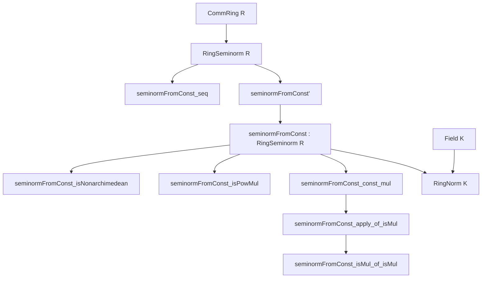
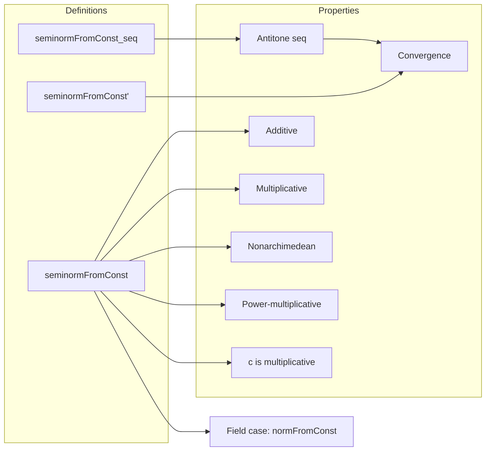

### Technical Brief: `SeminormFromConst.lean`

---

#### **1. Key Definitions & Theorems**

| Name | Type / Signature | Purpose |
|------|------------------|---------|
| `seminormFromConst_seq` | `R → ℕ → ℝ` | Sequence $ n \mapsto \frac{f(x \cdot c^n)}{f(c)^n} $ for fixed $c, f$ |
| `seminormFromConst'` | `R → ℝ` | Real-valued function defined as the infimum (limit) of `seminormFromConst_seq c f x` |
| `seminormFromConst` | `RingSeminorm R` | The function `seminormFromConst' c f` equipped with proof it satisfies all ring seminorm axioms |
| `seminormFromConst_isNonarchimedean` | `IsNonarchimedean f → IsNonarchimedean (seminormFromConst' c f)` | If `f` is nonarchimedean, so is the new seminorm |
| `seminormFromConst_isPowMul` | `IsPowMul (seminormFromConst' c f)` | The new seminorm is power-multiplicative |
| `seminormFromConst_const_mul` | `seminormFromConst' c f (c * x) = seminormFromConst' c f c * seminormFromConst' c f x` | `c` becomes multiplicative under the new seminorm |
| `seminormFromConst_apply_of_isMul` | `(∀ y, f(x*y) = f x * f y) → seminormFromConst' c f x = f x` | If `x` is multiplicative for `f`, it remains unchanged |
| `normFromConst` | `RingNorm K` (when `K` is a field) | Lifts `seminormFromConst` to a genuine norm when `c` is nonzero |

---

#### **2. Naming Conventions**

- **Prefixes**:
  - `seminormFromConst_`: Main construction and properties.
  - `seminormFromConst_seq_`: Properties of the defining sequence.
- **Suffixes**:
  - `_seq`: Sequence-related definitions/lemmas.
  - `_def`: Definition lemmas (`rfl`-provable equalities).
  - `_nonneg`, `_bddBelow`, `_antitone`: Monotonicity/boundedness properties.
  - `_isNonarchimedean`, `_isPowMul`, `_isMul`: Structural properties.
  - `_le_`, `_eq_`: Comparison or equality lemmas.

---

#### **3. Tactic Stack**

Frequently used tactics in proofs:

| Tactic | Role |
|--------|------|
| `simp only [...]` | Simplify using precise rewrite rules (often with `seminormFromConst_seq_def`, `pow_add`, etc.) |
| `rw [...]` | Rewrite using definitions or lemmas (e.g., `hpm`, `mul_assoc`) |
| `gcongr` | Handle inequalities with multiplicative structure |
| `apply le_of_tendsto_of_tendsto'` | Prove inequality via convergence of sequences |
| `tendsto_nhds_unique` | Identify limits uniquely |
| `convert ... using 1` | Match goals up to definitional equality |
| `nth_rw` | Rewrite at specific position (e.g., `nth_rw 1 [← Nat.add_sub_of_le hmn]`) |
| `cases hmn.eq_or_lt` | Case analysis on natural number inequalities |
| `ring_nf`, `ring` | Simplify ring expressions |
| ` positivity` | Prove positivity of expressions (e.g., denominators) |

---

#### **4. Proof Logic**

The logical flow across most proofs follows this pattern:

1. **Sequence Analysis**:
   - Show the sequence `seminormFromConst_seq c f x` is:
     - Nonnegative (`seminormFromConst_seq_nonneg`)
     - Bounded below (`seminormFromConst_bddBelow`)
     - Antitone (`seminormFromConst_seq_antitone`)
   - Conclude it converges to its infimum (`tendsto_seminormFromConst_seq_atTop`).

2. **Limit Properties**:
   - Use convergence to transfer properties from `f` to `seminormFromConst' c f`:
     - Additivity: via `map_add_le_add f` and `tendsto_add`.
     - Multiplicativity: via `map_mul_le_mul f` and convergence of subsequences (e.g., `2*n`, `m*n`).
     - Nonarchimedean: via `max`-inequality and convergence.

3. **Special Cases**:
   - For `x = 1`, use `hpm` and `hf1` to show the sequence stabilizes at `1`.
   - For `x = c`, show the sequence is constant using `hpm` and `pow_succ`.
   - For multiplicative `x`, show the sequence stabilizes at `f(x)`.

4. **Norm Construction (Field case)**:
   - Use `seminormFromConst` and show it's nonzero on some element (`c`) to lift to `RingNorm`.

---

#### **5. Imports**

- `Mathlib.Analysis.Normed.Unbundled.RingSeminorm`: Core definitions of `RingSeminorm`, `IsNonarchimedean`, `IsPowMul`, etc.

---

#### **6. Mermaid Diagrams**

##### **Dependency Graph**

##### **Overview of File Structure**

---

#### **7. Summary**

This file formalizes a construction from *Non-Archimedean Analysis* (Bosch–Günzer–Remmert), transforming a power-multiplicative seminorm `f` on a commutative ring `R` into a new seminorm where a chosen nonzero element `c ∈ R` becomes multiplicative. The construction uses limits of scaled sequences and leverages monotone convergence in `ℝ`. It is foundational for refining seminorms in non-archimedean geometry, especially for constructing multiplicative seminorms from general ones.

--- 

Let me know if you'd like a formalized dependency graph in `leanpkg` format or a visualization of the proof tree for a specific theorem.
