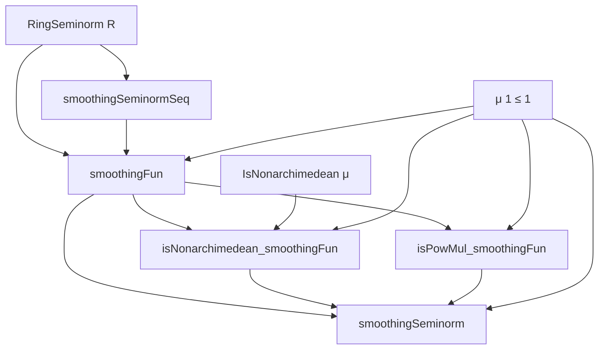
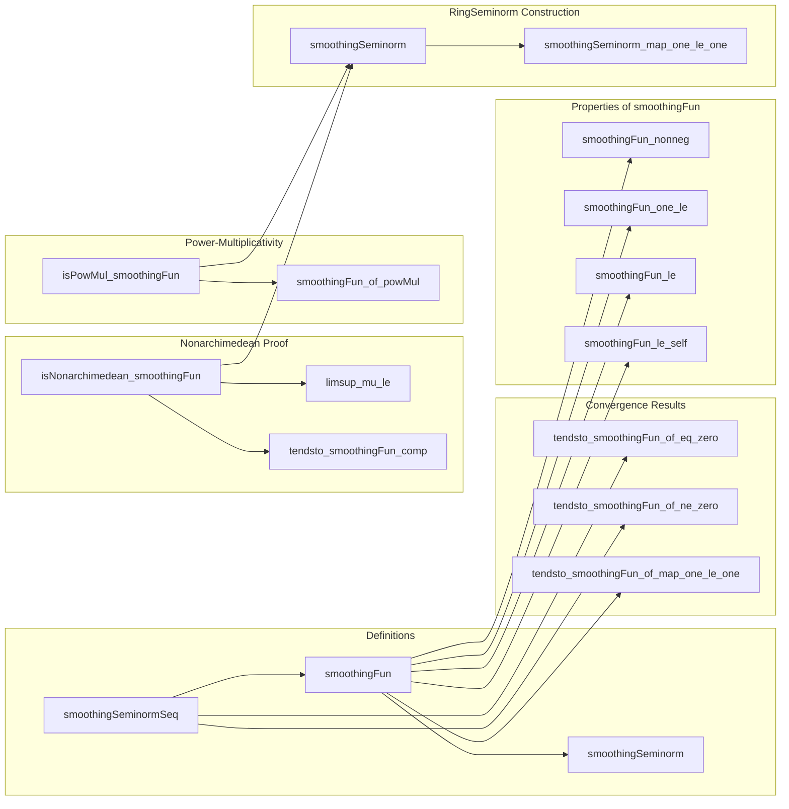

### Technical Brief: `SmoothingSeminorm.lean`

---

#### **1. Key Definitions & Theorems**

| Name | Type / Signature | Purpose |
|------|------------------|---------|
| `smoothingSeminormSeq μ x : ℕ → ℝ` | `n ↦ μ(x^n)^(1/n)` | Real-valued sequence used to approximate the smoothed seminorm. |
| `smoothingFun μ x : ℝ` | `iInf_{n : ℕ⁺} μ(x^n)^(1/n)` | The infimum (limit) of `smoothingSeminormSeq μ x`. |
| `smoothingSeminorm μ hμ1 hna : RingSeminorm R` | Constructed from `smoothingFun` under assumptions | A *ring seminorm* derived from a nonarchimedean seminorm `μ` with `μ(1) ≤ 1`. |
| `tendsto_smoothingFun_of_map_one_le_one` | `μ(1) ≤ 1 ⇒ smoothingSeminormSeq μ x ⟶ smoothingFun μ x` | Shows convergence of the sequence to the infimum under `μ(1) ≤ 1`. |
| `isNonarchimedean_smoothingFun` | `μ(1) ≤ 1 ∧ IsNonarchimedean μ ⇒ IsNonarchimedean (smoothingFun μ)` | Proves that `smoothingFun μ` preserves nonarchimedean property. |
| `isPowMul_smoothingFun` | `μ(1) ≤ 1 ⇒ IsPowMul (smoothingFun μ)` | Shows `smoothingFun μ` is *power-multiplicative*: `smoothingFun(x^m) = smoothingFun(x)^m`. |
| `smoothingFun_of_powMul` | If `μ` is power-multiplicative at `x`, then `smoothingFun μ x = μ x` | Shows agreement with original seminorm when `μ` is already power-multiplicative at `x`. |

---

#### **2. Naming Conventions**

- **Prefixes**:
  - `smoothing*`: All core definitions and results related to the smoothing operation.
  - `is*`: Properties like `isNonarchimedean`, `isPowMul`.
  - `tendsto_*`: Convergence statements involving filters.
- **Suffixes**:
  - `_seq`: Sequence version (`smoothingSeminormSeq`).
  - `_fun`: Function/infimum version (`smoothingFun`).
  - `_le`, `_eq`, `_ne`: Inequality/equality conditions (`smoothingFun_le`, `smoothingFun_one_le`, `tendsto_smoothingFun_of_eq_zero`).
- **Helper names**:
  - `mu`, `nu`: Auxiliary functions for indexing in nonarchimedean proof.
  - `hμ1`, `hna`: Assumption names for `μ(1) ≤ 1` and nonarchimedean property.

---

#### **3. Tactic Stack**

Frequently used tactics in this file:

| Tactic | Role |
|--------|------|
| `rw`, `simp`, `simp_rw` | Rewriting and simplification (especially with `rpow`, `pow`, `div`, `mul`). |
| `apply`, `exact`, `assumption` | Goal-directed proof steps. |
| `gcongr` | Congruence for inequalities with monotone functions (e.g., `rpow`). |
| `convert`, `congr'` | Equating goals up to definitional equality or filter equivalence. |
| `calc` | Chain of inequalities/equalities (used heavily in `tendsto_smoothingFun_of_ne_zero`). |
| `have`, `suffices`, `by_cases` | Intermediate lemma introduction and case splits. |
| `tendsto_*` lemmas | Applied to establish convergence (e.g., `tendsto_smoothingFun_of_map_one_le_one`). |
| `limsup_*` lemmas | For bounding limsup in nonarchimedean proof. |
| `exists_lt_of_ciInf_lt`, `ciInf_le`, `le_ciInf` | Manipulating infima over `PNat`. |
| `rpow_*` lemmas | Reasoning about real powers (monotonicity, continuity, algebraic laws). |
| `eventually_atTop`, `atTop` | Filter reasoning for sequences. |

---

#### **4. Proof Logic**

- **Structure**:
  - **Step 1**: Define the sequence `smoothingSeminormSeq` and show it's bounded below (by 0).
  - **Step 2**: Define `smoothingFun` as its infimum.
  - **Step 3**: Prove convergence (`tendsto_smoothingFun_*`) under `μ(1) ≤ 1`, distinguishing cases `μ(x) = 0` and `μ(x) ≠ 0`.
    - For `μ(x) ≠ 0`, use modular decomposition `n = m1 * q + r`, control error terms via `tendsto_smoothingFun_tendsto_aux`.
  - **Step 4**: Prove `smoothingFun` is a *ring seminorm*:
    - `map_zero'`: Uses convergence and `zero_pow`.
    - `add_le'`: Uses nonarchimedean property of `μ` and limsup estimates.
    - `mul_le'`: Uses convergence and submultiplicativity of `μ`.
    - `neg'`: Uses `neg_pow`.
  - **Step 5**: Prove `smoothingFun` is *nonarchimedean*:
    - For each `n`, pick `m ≤ n` such that `μ((x+y)^n)^(1/n) ≤ (μ(x^m) μ(y^{n−m}))^(1/n)`.
    - Extract a convergent subsequence of `m/n → a ∈ [0,1]`.
    - Bound limsup of each factor using `limsup_mu_le`, then combine.
  - **Step 6**: Prove *power-multiplicativity*:
    - Use convergence along subsequence `n ↦ m·n`, and algebraic identity:
      $$
      \mu(x^{m n})^{1/(m n)} = \mu(x^{m n})^{1/(m n)} = \mu(x^m)^{n/(m n)} = \mu(x^m)^{1/m}
      $$
      and pass to limit.

- **Key ideas**:
  - Subsequence extraction via boundedness in `[0,1]`.
  - Control of error terms via `rpow` continuity and modular arithmetic.
  - Use of limsup to handle non-convergent sequences.

---

#### **5. Imports**

| Module | Purpose |
|--------|---------|
| `Mathlib.Algebra.Order.GroupWithZero.Bounds` | Bounds, lower/upper bounds, `BddBelow`, etc. |
| `Mathlib.Analysis.Normed.Unbundled.RingSeminorm` | Definition and basic properties of ring seminorms. |
| `Mathlib.Analysis.SpecialFunctions.Pow.Continuity` | Continuity and monotonicity of `rpow`. |
| `Mathlib.Topology.MetricSpace.Sequences` | Convergence of sequences, `Tendsto`, `atTop`. |
| `Mathlib.Topology.UnitInterval` | Properties of `[0,1]`, boundedness, subsequences. |
| `Mathlib.Topology.Algebra.Order.LiminfLimsup` | `liminf`, `limsup`, limsup inequalities. |

---

#### **6. Mermaid Diagrams**

##### **Dependency Graph (High-Level)**

##### **Overview of File Structure**

---

#### **7. Mathematical Context**

This file formalizes a construction from *Non-Archimedean Analysis* (Bosch–Günzer–Remmert, Proposition 1.3.2/1):

> Given a nonarchimedean seminorm $ \mu $ on a commutative ring $ R $, the function  
> $$
x \mapsto \inf_{n \ge 1} \mu(x^n)^{1/n}
$$  
> defines a *power-multiplicative*, *nonarchimedean* ring seminorm.

This is a key step in constructing the *Gelfand transform* or *spectral seminorm* in nonarchimedean functional analysis.

---

#### **8. Tags**

- `smoothingSeminorm`
- `seminorm`
- `nonarchimedean`
- `power-multiplicative`
- `limsup`
- `subsequence`
- `rpow`
- `tendsto`

--- 

Let me know if you'd like a formalized summary in Lean syntax or a visualization of the proof tree for `isNonarchimedean_smoothingFun`.
