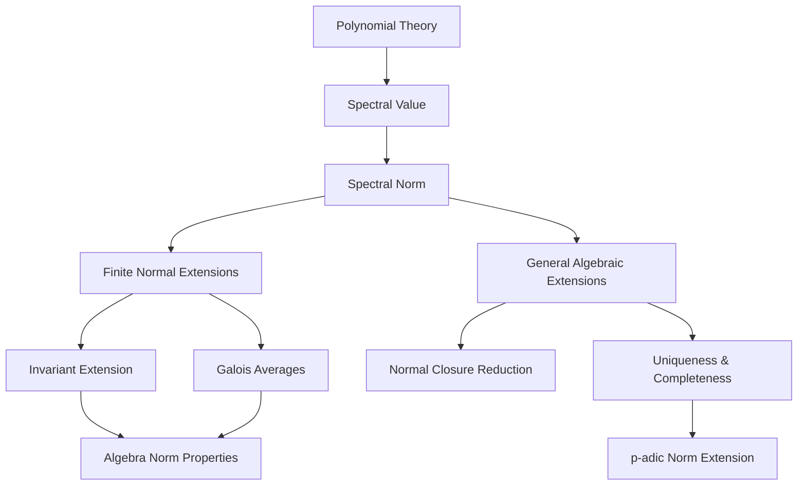
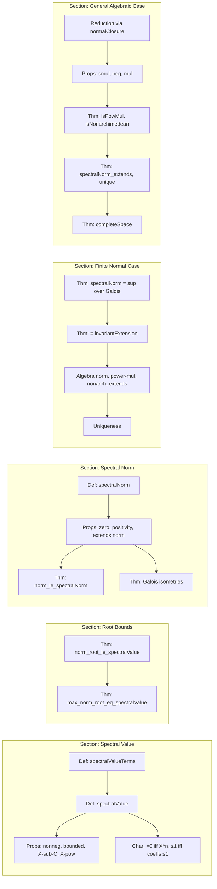

Here is the structured technical metadata extracted from `SpectralNorm.lean`:

---

### **1. Key Definitions & Theorems**

| Name | Type / Signature | Purpose |
|------|------------------|---------|
| `spectralValueTerms` | `R[X] → ℕ → ℝ` | Defines the sequence of terms used to compute the spectral value: $n \mapsto \|p_n\|^{1/(\deg p - n)}$ for $n < \deg p$, else $0$. |
| `spectralValue` | `R[X] → ℝ` | Supremum of `spectralValueTerms`; generalizes the norm of the largest root for monic split polynomials. |
| `spectralNorm` | `L → ℝ` | For $y \in L$, $|y|_{\text{sp}} := \text{spectralValue}(\minpoly_K(y))$. |
| `spectralAlgNorm` | `AlgebraNorm K L` | The spectral norm as a $K$-algebra norm (defined later in finite/normal case; generalized via `spectralMulAlgNorm`). |
| `spectralMulAlgNorm` | `IsPowMul (spectralNorm K L)` | Proves the spectral norm is power-multiplicative. |
| `norm_le_spectralNorm` | `f x ≤ spectralNorm K L x` | Any power-multiplicative, nonarchimedean $K$-algebra norm $f$ is bounded above by the spectral norm. |
| `spectralNorm_eq_of_equiv` | `σ : Gal(L/K) ⇒ spectralNorm x = spectralNorm (σ x)` | Galois automorphisms are isometries for the spectral norm. |
| `spectralNorm_eq_iSup_of_finiteDimensional_normal` | `spectralNorm x = ⨆σ, f(σ x)` | In finite normal extensions, spectral norm equals sup over Galois orbit under any such $f$. |
| `isPowMul_spectralNorm` | `IsPowMul (spectralNorm K L)` | Spectral norm is power-multiplicative (general case). |
| `isNonarchimedean_spectralNorm` | `IsNonarchimedean (spectralNorm K L)` | Spectral norm is nonarchimedean (general case). |
| `spectralNorm_extends` | `spectralNorm (algebraMap k) = ‖k‖` | Spectral norm extends the base norm. |
| `spectralNorm_unique` | `f = spectralNorm` | Uniqueness: any power-multiplicative $K$-algebra norm extending the base norm equals the spectral norm. |
| `spectralNorm.completeSpace` | `CompleteSpace L` | If $[L:K] < \infty$, then $L$ is complete under the spectral norm. |

---

### **2. Naming Conventions**

- **Prefixes**:
  - `spectralValue*`: for polynomial-level constructions (e.g., `spectralValueTerms`, `spectralValue`).
  - `spectralNorm*`: for element- or algebra-level constructions (e.g., `spectralNorm`, `spectralAlgNorm`, `spectralMulAlgNorm`).
  - `norm_*`: for comparisons with other norms (e.g., `norm_le_spectralNorm`).
  - `spectralNorm_*`: for properties (e.g., `spectralNorm_extends`, `spectralNorm_unique`).
- **Suffixes**:
  - `_of_*`: for specialized versions under extra assumptions (e.g., `spectralNorm_eq_iSup_of_finiteDimensional_normal`).
  - `_def`: for definitional lemmas (e.g., `spectralAlgNorm_of_finiteDimensional_normal_def`).
  - `_iff`: for biconditional characterizations (e.g., `spectralValue_le_one_iff`).
- **Function names**:
  - `mapAlg`, `aeval`, `minpoly`, `normalClosure`, `Gal`, `invariantExtension`, `spectralAlgNorm_of_finiteDimensional_normal`.

---

### **3. Tactic Stack**

Frequently used tactics in this file:

| Tactic | Usage |
|--------|-------|
| `simp` / `simp_rw` | Simplifying definitions (e.g., `minpoly`, `spectralValueTerms`, `algebraMap`). |
| `aesop` | Automated reasoning for order, positivity, and set-theoretic facts (e.g., boundedness, finite ranges). |
| `rw` / `congr_arg` | Rewriting using equalities (e.g., `minpoly.algebraMap_eq`, `spectralValue_X_sub_C`). |
| `apply` / `exact` | Applying lemmas or hypotheses. |
| `have` / `obtain` / `set` | Introducing intermediate results or definitions (e.g., `set p := minpoly K x`). |
| `apply le_antisymm` | Proving equality of reals via double inequality. |
| `rpow_*` lemmas | Reasoning about real powers (e.g., `rpow_le_rpow_iff`, `rpow_mul`). |
| `ext` / `funext` | Extensionality for functions/sets. |
| `split_ifs` | Handling `if`-expressions in definitions. |
| `convert` / `congr_arg` | Aligning expressions for equality proofs. |
| `rcases` / `cases'` | Decomposing existential or disjunctive hypotheses. |
| `gcongr` | For monotonicity in inequalities involving powers. |

---

### **4. Proof Logic**

The logical flow follows a structured progression:

1. **Polynomial-level analysis**:
   - Define `spectralValueTerms` and `spectralValue`.
   - Prove basic properties: nonnegativity, boundedness, behavior on monomials (`X^n`) and linear polynomials (`X - r`).
   - Characterize when `spectralValue p = 0` (for monic $p$) and when `spectralValue p ≤ 1`.

2. **Bounding roots**:
   - Prove `norm_root_le_spectralValue`: any root $x$ of monic $p \in K[X]$ satisfies $f(x) \le \text{spectralValue}(p)$ for $f$ power-multiplicative & nonarchimedean.
   - Prove `max_norm_root_eq_spectralValue`: if $p$ splits in $L$, then `spectralValue(p) = max_{roots} f(root)`.

3. **Define spectral norm**:
   - `spectralNorm y := spectralValue(minpoly y)`.
   - Prove basic properties: `spectralNorm_zero`, `spectralNorm_nonneg`, `spectralNorm_zero_lt`, etc.

4. **Finite & normal extensions**:
   - Use `invariantExtension` (from `InvariantExtension.lean`) to relate spectral norm to Galois averages.
   - Prove `spectralNorm_eq_iSup_of_finiteDimensional_normal`, `spectralNorm_eq_invariantExtension`, and derive algebra norm properties (`spectralAlgNorm_of_finiteDimensional_normal`, `isPowMul_spectralNorm_of_finiteDimensional_normal`, etc.).

5. **General algebraic extensions**:
   - Reduce to finite normal subextensions via `normalClosure`.
   - Prove `spectralNorm_extends`, `spectralNorm_neg`, `spectralNorm_smul`, `spectralNorm_mul`.
   - Prove full uniqueness and completeness results.

6. **Uniqueness & completeness**:
   - Use `spectralNorm_unique` (general case) to show any power-multiplicative extension equals the spectral norm.
   - Use finite-dimensionality + completeness of finite extensions to deduce `CompleteSpace L`.

---

### **5. Imports**

| Module | Purpose |
|--------|---------|
| `Mathlib.Analysis.Normed.Operator.BoundedLinearMaps` | Normed operator theory. |
| `Mathlib.Analysis.Normed.Unbundled.*` | Tools for seminorms, invariant extensions, power-multiplicativity. |
| `Mathlib.FieldTheory.IsAlgClosed.AlgebraicClosure` | Algebraic closures, embeddings. |
| `Mathlib.FieldTheory.Normal.Closure` | Normal closures, Galois groups. |
| `Mathlib.RingTheory.Polynomial.Vieta` | Vieta formulas, symmetric sums (used in `max_norm_root_eq_spectralValue`). |
| `Mathlib.Topology.Algebra.Module.FiniteDimension` | Finite-dimensional topology, completeness. |

---

### **6. Mermaid Diagrams**

#### **Dependency Graph (High-Level)**

#### **Overview of File Structure**

---

### **7. Tags & Keywords**

- `spectral`, `spectral norm`, `spectral value`
- `seminorm`, `norm`, `nonarchimedean`
- `power-multiplicative`, `algebra norm`
- `minimal polynomial`, `Galois group`, `invariant extension`
- `normal closure`, `algebraic closure`
- `p-adic norm`, `completion`, `finite-dimensional`

---

Let me know if you'd like a formalized dependency graph (e.g., Lean module imports), or a proof sketch of a specific theorem.
