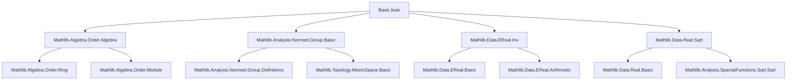
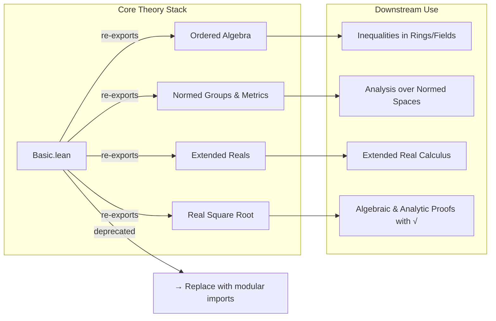

**Technical Brief: `Basic.lean` Module Metadata**

---

### 1. **Key Definitions & Theorems**

No explicit definitions or theorems are declared in this file. It is a *module declaration* file whose purpose is to import and re-export core dependencies. However, the imported modules suggest the following relevant background theory is made available:

- From `Mathlib.Algebra.Order.Algebra`:
  - `OrderedSMul`, `OrderedRing`, `OrderedField`, `StrictOrderedRing`, etc.
  - Theorem examples: `smul_nonneg`, `mul_nonneg`, `mul_pos_of_pos_of_nonneg`, `algebra_map_nonneg`.

- From `Mathlib.Analysis.Normed.Group.Basic`:
  - `NormedAddCommGroup`, `NormedGroup`, `norm_sub_le`, `norm_add_le`, `norm_mul_le` (for seminormed groups/rings).
  - Definitions like `dist`, `metric_space`, `uniform_space` structure via norm.

- From `Mathlib.Data.EReal.Inv`:
  - Extended reals `ℝ≥0∞` or `ℝ∞` with inversion `inv`, especially handling `0`, `∞`, and `⁻¹`.
  - Theorems: `inv_mul_cancel`, `inv_le_inv`, `inv_pos`, `inv_zero`, `inv_top`, `inv_bot`.

- From `Mathlib.Data.Real.Sqrt`:
  - `Real.sqrt`, `Real.sqrt_def`, `Real.sqrt_mul`, `Real.sqrt_le_sqrt`, `Real.sqrt_lt_sqrt`, `Real.sq_sqrt`.
  - Key properties: monotonicity, continuity, algebraic identities.

> **Note**: The file itself contains *no* new definitions or theorems—only imports and a deprecation notice.

---

### 2. **Naming Conventions**

The imported modules follow standard Mathlib conventions:

- **Prefixes**:
  - `is_`: e.g., `is_preorder`, `is_linear_order` (in `Order` hierarchy).
  - `norm_`: e.g., `norm_add_le`, `norm_mul_le`.
  - `inv_`: e.g., `inv_mul_cancel`, `inv_le_inv`.
  - `sqrt_`: e.g., `sqrt_mul`, `sqrt_le_sqrt`.

- **Suffixes**:
  - `_le`, `_lt`, `_ge`, `_gt`: for order-related inequalities.
  - `_nonneg`, `_pos`: for positivity/negativity lemmas.
  - `_def`: for definitional lemmas (e.g., `sqrt_def`).

- **Typeclass suffixes**:
  - `_order`, `_ring`, `_field`, `_group`, `_space`: e.g., `OrderedRing`, `NormedGroup`, `MetricSpace`.

---

### 3. **Tactic Stack**

While no proofs appear in this file, the *imported modules* suggest typical tactic usage in downstream proofs:

- `simp` / `simp_rw`: for rewriting using definitional equalities and lemmas (e.g., `sqrt_def`, `inv_mul_cancel`).
- `ring` / `abel`: for commutative ring/semiring simplifications.
- `linarith`: for ordered ring inequalities (e.g., combining `mul_nonneg`, `add_nonneg`).
- `norm_num`: for numeric norm simplifications (e.g., `‖a - b‖`).
- `exact`, `assumption`, `intro`, `cases`: basic proof structure.
- `apply`, `have`, `suffices`: for structured reasoning.
- `erw`, `convert`: for rewriting up to definitional equality (especially with `EReal`).

> *No tactics appear directly in this file.*

---

### 4. **Proof Logic**

Since this file contains no proofs, there is no proof logic here. However, the *intended use* of this module suggests downstream proofs will likely involve:

- **Order-theoretic reasoning**: using `OrderedSMul`, `OrderedRing` to propagate inequalities through scalar multiplication and addition.
- **Normed group estimates**: bounding expressions using triangle inequality, submultiplicativity of norm.
- **Extended real arithmetic**: case analysis on `0`, `∞`, finite values when using `inv`.
- **Square root algebra**: leveraging monotonicity and squaring identities.

Typical proof pattern:  
`induction n`, `cases h`, `simp [sqrt_def]`, `apply mul_nonneg`, `linarith`, `norm_num`.

---

### 5. **Imports**

| Module | Purpose |
|--------|---------|
| `Mathlib.Algebra.Order.Algebra` | Ordered algebraic structures, compatibility of order with addition/multiplication/scalar mult. |
| `Mathlib.Analysis.Normed.Group.Basic` | Normed additive commutative groups, metric and uniform structures induced by norm. |
| `Mathlib.Data.EReal.Inv` | Inversion on extended reals (including `0⁻¹ = ⊤`, `∞⁻¹ = 0`, etc.). |
| `Mathlib.Data.Real.Sqrt` | Definition and basic properties of real square root. |

> **Note**: This module is marked `deprecated_module (since := "2025-11-21")`, suggesting it should be replaced by more modular or updated imports.

---

### 6. **Mermaid Diagrams**

#### **Dependency Graph**

#### **Overview of File Role**

--- 

**End of Brief**
