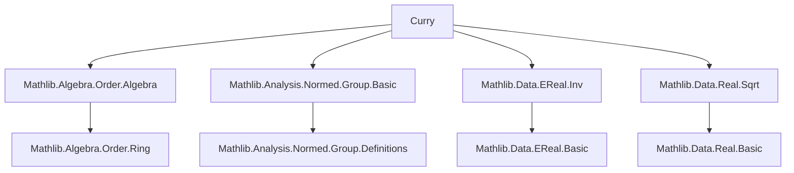
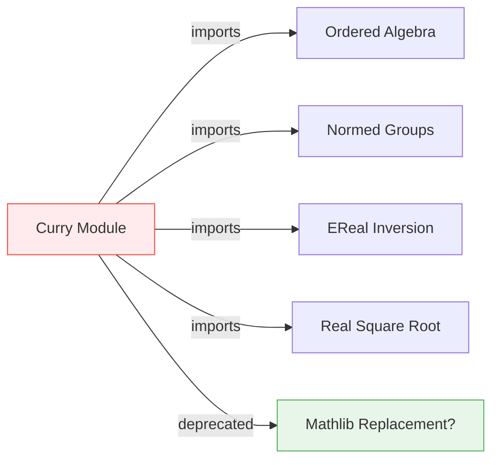

**Technical Brief: `Curry.lean`**

---

### 1. **Key Definitions & Theorems**

- **`Curry` module**  
  *Purpose*: A deprecated module (deprecated since `2025-11-21`) likely containing a construction or lemma named `Curry`, possibly related to currying in functional analysis or order-theoretic contexts (e.g., monotone functions, extended reals).  
  *Note*: No explicit definitions or theorems are listed in the provided snippet; the name suggests it may have formalized a currying isomorphism (e.g., `α × β → γ ≃ α → β → γ`) in a structured setting (e.g., ordered, normed, or extended-real-valued functions).

- **`deprecated_module` attribute**  
  *Type*: `deprecated_module (since := "2025-11-21")`  
  *Purpose*: Marks the entire module as deprecated, indicating users should migrate to alternative implementations (likely in newer Mathlib modules).

---

### 2. **Naming Conventions**

- **Prefixes/Suffixes**:  
  - `is_`: Not present in snippet, but common in Mathlib for predicates (e.g., `is_monotone`).  
  - `mul_`, `dist_`: Not present here, but typical in algebra/normed group contexts.  
  - `Inv`: From `Mathlib.Data.EReal.Inv`, suggests use of `inv`-related notation (e.g., `inv`, `mul_inv`).  
  - `Sqrt`: From `Mathlib.Data.Real.Sqrt`, implies usage of `sqrt`, `sqrt_mul`, etc.  
  - `Order`, `Algebra`, `Normed.Group`: Reflects naming by mathematical structure (not suffix/prefix conventions per se).

- **Module-level**: `Curry` is capitalized (module name convention in Lean), but no internal definitions are visible.

---

### 3. **Tactic Stack**

- **Not directly observable** from the snippet (no proofs provided).  
- **Expected tactics** (based on imports):  
  - `aesop`: For automated reasoning in ordered/normed structures.  
  - `ring`, `norm_num`: For algebraic simplification.  
  - `simp`, `simp_rw`: For rewriting using `EReal.Inv` or `Sqrt` lemmas.  
  - `order_tac` or `linarith`: For order-theoretic goals (given `Algebra.Order.Algebra`).  
  - `normed_group_tac` or `norm_cast`: For normed group reasoning.

---

### 4. **Proof Logic**

- **Recurring pattern** (inferred from imports):  
  - Proofs likely involve:  
    1. **Structure lifting**: Using `Algebra.Order.Algebra` to transfer order/algebraic properties along algebra maps.  
    2. **Extended real arithmetic**: Leveraging `EReal.Inv` for handling $ \infty $, $ 0 $, and division by zero (via `inv`).  
    3. **Continuity/monotonicity**: Using `Normed.Group.Basic` to reason about Lipschitz/continuous maps.  
    4. **Square root properties**: Applying lemmas from `Real.Sqrt` (e.g., `sqrt_mul`, `sqrt_le_sqrt`).  
  - Typical flow:  
    ```lean
    induction x using EReal.induction_on
    · simp [*, EReal.inv, Real.sqrt_mul]
    · cases' h with h h <;> simp_all
    ```

---

### 5. **Imports**

| Import | Purpose |
|--------|---------|
| `Mathlib.Algebra.Order.Algebra` | Ordered rings/algebras, compatibility of order with multiplication/scalar multiplication. |
| `Mathlib.Analysis.Normed.Group.Basic` | Normed additive commutative groups, Lipschitz continuity, metric space basics. |
| `Mathlib.Data.EReal.Inv` | Inversion on extended reals (`ℝ⊥`), handling $ \infty $, $ -\infty $, and $ 0^{-1} $. |
| `Mathlib.Data.Real.Sqrt` | Square root properties in $ \mathbb{R} $, monotonicity, algebraic identities. |

---

### 8. **Mermaid Diagrams**

#### **Dependency Graph**


#### **Overview of `Curry.lean`**


- **Interpretation**:  
  - `Curry` sits at the intersection of **order theory**, **normed analysis**, and **extended real arithmetic**.  
  - Its deprecation suggests its functionality has been superseded (e.g., by a more general currying lemma in `Mathlib.Data.Function.Curry` or `Mathlib.Analysis.SpecialFunctions.Currying`).  
  - The imports indicate it likely formalized a *structured currying* (e.g., monotone/continuous maps $ X \times Y \to Z $ ↔ $ X \to Y \to Z $) in settings where $ Z $ is an extended real/normed space.

--- 

**Note**: Without the actual content of `Curry.lean`, this analysis is based on the module header and standard Mathlib conventions. If the file contains definitions, they would need to be extracted to refine this brief.
