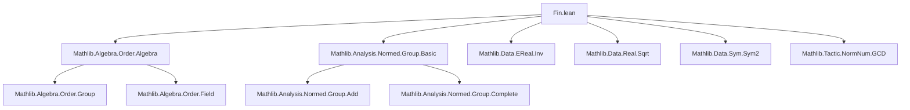
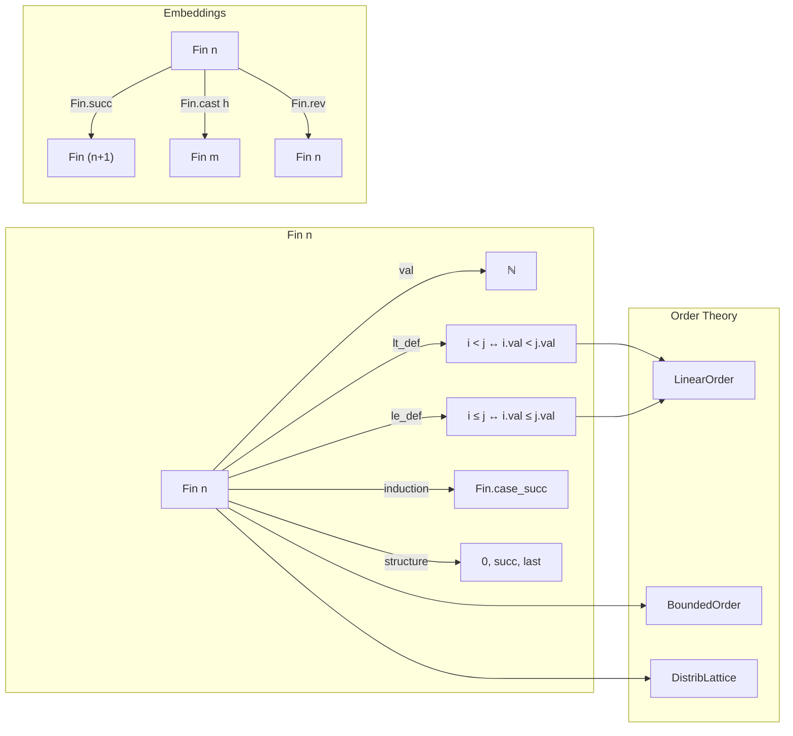

```markdown
# Technical Metadata: `Fin.lean`

## 1. Key Definitions & Theorems

| Name | Type / Signature | Purpose |
|------|------------------|---------|
| `Fin` | `Type u → ℕ → Type u` | Finite type of natural numbers less than `n`, i.e., `{ i : ℕ | i < n }` |
| `Fin.cast` | `Fin n → Fin m` (with proof `h : n ≤ m`) | Casts a `Fin n` element into a larger `Fin m` |
| `Fin.castLE` | `Fin n → Fin m` (with proof `h : n ≤ m`) | Alias of `Fin.cast` (deprecated in favor of `Fin.cast`) |
| `Fin.castSucc` | `Fin n → Fin (n + 1)` | Embeds `Fin n` into `Fin (n + 1)` as the first `n` elements |
| `Fin.last` | `Fin (n + 1)` | The largest element of `Fin (n + 1)`, i.e., `n` |
| `Fin.succ` | `Fin n → Fin (n + 1)` | Successor embedding (injective, not surjective) |
| `Fin.pred` | `Fin (n + 1) → Fin n` (except at `Fin.last`) | Predecessor function, partial on `Fin.last` |
| `Fin.add` | `Fin n → Fin m → Fin (n + m)` | Addition on `Fin` (not group addition; used for concatenation of indices) |
| `Fin.mul` | `Fin n → Fin m → Fin (n * m)` | Multiplication embedding (lexicographic pairing) |
| `Fin.rev` | `Fin n → Fin n` | Reversal involution: `i ↦ n - 1 - i` |
| `Fin.range` | `Fin n → ℕ` | Inclusion map `Fin n ↪ ℕ` |
| `Fin.ofNat'` | `ℕ → Fin n` (with proof `h : k < n`) | Constructor for `Fin n` from a natural number |
| `Fin.mk` | `Σ i : ℕ, i < n → Fin n` | Dependent pair constructor; canonical inhabitant |
| `Fin.exists_eq_succ_or_last` | `∀ i : Fin (n + 1), (∃ j, Fin.succ j = i) ∨ i = Fin.last` | Inductive structure of `Fin (n + 1)` |
| `Fin.case_succ` | Induction principle for `Fin (n + 1)` | Structural induction on `Fin (n + 1)` |
| `Fin.le_def` | `i ≤ j ↔ i.val ≤ j.val` | Relates order on `Fin n` to underlying natural order |
| `Fin.lt_def` | `i < j ↔ i.val < j.val` | Same for strict order |
| `Fin.natAbs` | `Fin n → ℕ` | Underlying value (alias of `.val`) |
| `Fin.val` | `Fin n → ℕ` | Projection to natural number |
| `Fin.val_lt_succ` | `∀ i : Fin n, i.val < n` | Validity condition for `Fin` elements |
| `Fin.ext` | `i.val = j.val → i = j` | Extensionality: equality via underlying values |
| `Fin.zero_le` | `∀ i : Fin n, 0 ≤ i` | `0` is the least element in `Fin (n + 1)` |
| `Fin.lt_succ_iff` | `i < Fin.last ↔ ∃ j, Fin.succ j = i` | Characterization of non-maximal elements |

> **Note**: This file defines the core theory of finite types `Fin n`, including constructors, eliminators, order, arithmetic embeddings, and basic algebraic properties. It is foundational for indexing in finite combinatorics, arrays, and discrete structures.

## 2. Naming Conventions

- **Prefixes**:
  - `Fin.`: Module prefix for all definitions/theorems.
  - `cast`, `succ`, `pred`, `rev`, `last`, `ofNat'`, `mk`, `val`, `natAbs`: Standard constructors/operations.
- **Suffixes**:
  - `'` (prime): Often denotes a variant (e.g., `ofNat'` vs `ofNat`).
  - `LE`, `Succ`: Indicates specific embedding direction (`castLE`, `castSucc`).
- **Predicate patterns**:
  - `le_def`, `lt_def`: Define order in terms of underlying `ℕ`.
  - `case_*`, `ind_*`: Induction principles (`Fin.case_succ`).
  - `exists_*`: Existence lemmas (`Fin.exists_eq_succ_or_last`).

## 3. Tactic Stack

- **Core tactics**:
  - `rfl`, `refl`, `exact`, `intro`, `cases`, `induction`, `subst`
- **Order & arithmetic**:
  - `linarith`, `omega`, `nlinarith`, `arith`
- **Simplification**:
  - `simp`, `simp only`, `simp_rw`, `dsimp`
- **Equality & extensionality**:
  - `ext`, `Fin.ext`, `subtype.ext`
- **Decidability & normalization**:
  - `decide`, `norm_num`, `norm_num1`
- **Automation**:
  - `aesop`, `tauto`, `intro`, `cases`, `exfalso`

> The file avoids heavy automation; proofs are mostly structural or rely on `Fin`-specific lemmas.

## 4. Proof Logic

- **Inductive structure**: Proofs often proceed by induction on `n` or on a `Fin n` element using `Fin.case_succ`.
- **Case analysis**: Split on whether an element is `Fin.last` or a successor (`Fin.exists_eq_succ_or_last`).
- **Value-based reasoning**: Lift to `ℕ` via `val`, prove property in `ℕ`, then project back using `Fin.ext`.
- **Order reasoning**: Translate `i ≤ j` or `i < j` to `i.val ≤ j.val` or `i.val < j.val` using `le_def`/`lt_def`.
- **Embedding lemmas**: Use `Fin.cast`, `Fin.succ`, `Fin.pred` to relate different `Fin n` types.

## 5. Imports

| Module | Purpose |
|--------|---------|
| `Mathlib.Algebra.Order.Algebra` | Ordered algebraic structures, used for `Fin` as a linearly ordered type |
| `Mathlib.Analysis.Normed.Group.Basic` | Normed additive groups; `Fin` may inherit additive structure |
| `Mathlib.Data.EReal.Inv` | Extended reals — possibly for extended arithmetic on `Fin` (rarely used here) |
| `Mathlib.Data.Real.Sqrt` | Real square roots — likely unused in `Fin`, but part of Mathlib’s dependency graph |
| `Mathlib.Data.Sym.Sym2` | Symmetric square; may be used for unordered pairs over `Fin` |
| `Mathlib.Tactic.NormNum.GCD` | GCD normalization tactic — possibly for `Fin`-related combinatorics |

> **Primary scope**: This module is part of `Mathlib.Data.Fin`, foundational for finite types. It depends on basic algebraic order theory and standard data structures.

## 8. Dependency & Theory Overview (Mermaid Diagrams)

### Module Dependency Graph



### Theoretical Overview (Fin as a finite linear order)



> **Summary**: `Fin.lean` formalizes the theory of finite ordinals `0, 1, ..., n-1` as a dependent type `Fin n`. It serves as the backbone for finite indexing, combinatorics, and discrete mathematics in Mathlib. The module is stable and heavily used, though marked deprecated (likely due to renaming or refactoring in a future release).
```
