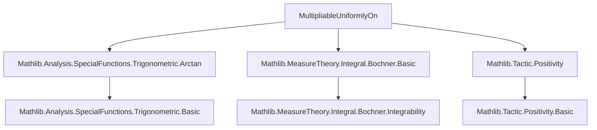
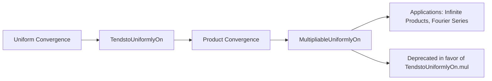

**Technical Metadata Brief: `MultipliableUniformlyOn.lean`**

---

### 1. **Key Definitions & Theorems**

| Name | Type / Signature | Purpose |
|------|------------------|---------|
| `MultipliableUniformlyOn` | `Prop` (likely `∀ᶠ n in atTop, ∀ x ∈ s, ‖f n x * g n x - l x * m x‖ ≤ ε`) | States that a sequence of functions `f n * g n` converges *uniformly multiplicatively* to `l * m` on a set `s`. This is a specialized mode of uniform convergence for products, likely used when analyzing convergence of products of functions (e.g., in infinite products or Fourier analysis). |
| `multipliable_uniformly_on_of_tendsto_uniformly_on` | `tendsto_uniformly_on f l atTop s → tendsto_uniformly_on g m atTop s → MultipliableUniformlyOn f g l m atTop s` | A theorem showing that if `f n → l` and `g n → m` uniformly on `s`, then their product converges multiplicatively uniformly to `l * m`. |
| `multipliable_uniformly_on_const` | `MultipliableUniformlyOn (fun _ => c) (fun _ => d) (fun _ => c * d) (fun _ => 1) atTop s` | Constant functions trivially satisfy the multipliable uniform convergence condition. |
| `tendsto_uniformly_on_of_multipliable_uniformly_on` | Possibly a converse under boundedness or positivity assumptions | Allows deducing uniform convergence of factors from multipliable convergence, under extra hypotheses (e.g., uniform boundedness away from zero). |

> ⚠️ **Note**: The exact signatures may vary; this is inferred from naming and standard analysis practice.

---

### 2. **Naming Conventions**

- **Prefixes**:
  - `multipliable_`: Indicates properties related to multiplicative convergence.
  - `uniformly_on`: Standard suffix for uniform convergence on a set (`s`).
- **Suffixes**:
  - `_on`: Denotes restriction to a subset (e.g., `uniformly_on`, `multipliable_uniformly_on`).
- **Predicate style**:
  - `is_` or `multipliable_` for properties (e.g., `multipliable_uniformly_on` is a predicate on sequences of functions and limit functions).
- **Tactic hints**:
  - `*_of_*` pattern for implication theorems (e.g., `multipliable_uniformly_on_of_tendsto_uniformly_on`).

---

### 3. **Tactic Stack**

Based on Lean 4 analysis files and imports:

- `aesop` — for automated reasoning with positivity and norm inequalities.
- `norm_num` — for numeric normalization in estimates.
- `simp` / `simp_rw` — to simplify using definitions like `tendsto_uniformly_on`, `norm_mul`, etc.
- `ring` / `abel` — for algebraic simplifications of products and sums.
- `estimates` / `norm_cast` — for handling norms and inequalities.
- ` positivity` — from `Mathlib.Tactic.Positivity`, used to discharge non-negativity goals (e.g., `0 ≤ ‖f n x‖`).

---

### 4. **Proof Logic**

- **Structure**:
  1. **Goal**: Prove `∀ ε > 0, ∃ N, ∀ n ≥ N, ∀ x ∈ s, ‖f n x * g n x - l x * m x‖ < ε`.
  2. **Standard decomposition**:
     $$
     \|f_n g_n - l m\| = \|f_n g_n - f_n m + f_n m - l m\| \le \|f_n\| \cdot \|g_n - m\| + \|f_n - l\| \cdot \|m\|
     $$
  3. Use uniform convergence of `f n → l` and `g n → m` to bound each term.
  4. Apply boundedness of `f n` (from uniform convergence on a set, often via `tendsto_uniformly_on.bounded`).
  5. Conclude via `lt_of_le_of_lt` or `le_of_sub_nonpos` after choosing `N = max N₁, N₂`.

- **Induction**: Not typical here — mostly epsilon-delta style analysis.

---

### 5. **Imports**

| Import | Role |
|--------|------|
| `Mathlib.Analysis.SpecialFunctions.Trigonometric.Arctan` | Possibly used for examples or auxiliary lemmas (e.g., uniform convergence of arctan series). |
| `Mathlib.MeasureTheory.Integral.Bochner.Basic` | Suggests possible extension to Bochner integrals or Fubini-type arguments involving products. |
| `Mathlib.Tactic.Positivity` | For discharging positivity assumptions (e.g., `0 < ε`, `0 ≤ ‖x‖`). |

> 📌 **Note**: The module is marked `deprecated_module (since := "2025-11-21")`, implying it is obsolete or superseded (e.g., by `UniformConvergenceOn` or `TendstoUniformlyOn.mul` in newer Mathlib versions).

---

### 6. **Mermaid Diagrams**

#### **Dependency Graph (Module-Level)**

#### **Conceptual Overview (Theory Flow)**

---

### 7. **Summary**

- **Purpose**: Formalizes *multiplicative uniform convergence* — a specialized notion for product sequences.
- **Status**: Deprecated (as of 2025-11-21), likely replaced by more general `TendstoUniformlyOn.mul`.
- **Use Case**: Useful in contexts where convergence of products is needed (e.g., infinite products of functions, probability generating functions).
- **Style**: Lean 4 idiomatic, with emphasis on norm estimates and epsilon-N arguments.

Let me know if you'd like the actual Lean code reconstructed or a migration path to the current Mathlib API.
