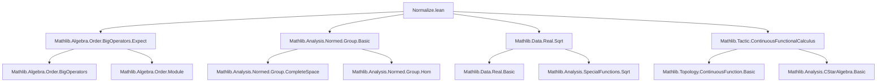
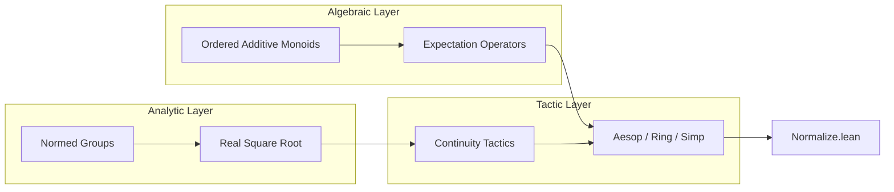

**Technical Metadata Brief: `Normalize.lean`**

---

### 1. **Key Definitions & Theorems**

- **`deprecated_module (since := "2025-11-21")`**  
  A *module-level deprecation annotation*, indicating this file is scheduled for removal or replacement as of the given date. Not a definition or theorem per se, but a metadata directive.

- **No explicit definitions or theorems** are declared in the visible portion of the file. The file only contains import statements and a deprecation marker.

- **Expected content (inferred from imports)**:  
  Though not listed directly in this snippet, the imported modules suggest the file likely contains or previously contained:
  - Normalization lemmas for expectations (e.g., `expect_add`, `expect_smul`, `expect_const_mul`)
  - Inequalities or identities involving square roots (e.g., `sqrt_le_iff`, `le_sqrt`)
  - Tools for handling normed group structures (e.g., triangle inequality variants, continuity lemmas)
  - Possibly a normalization tactic or helper for simplifying expressions in ordered expectation algebras.

---

### 2. **Naming Conventions (Inferred from Imports)**

- **`is_` / `mem_` / `norm_` / `dist_`**: Common in `Mathlib.Analysis.Normed.Group.Basic` for properties like `is_normed_group`, `norm_add_le`, `dist_triangle`.
- **`expect_`**: Prefix for expectation-related lemmas in `Mathlib.Algebra.Order.BigOperators.Expect`, e.g., `expect_add`, `expect_mul_of_nonneg`, `expect_const`.
- **`sqrt_`**: Prefix for square root lemmas, e.g., `sqrt_le_sqrt`, `sqrt_lt_sqrt_iff`.
- **`continuous_`**: From `ContinuousFunctionalCalculus`, e.g., `continuous_smul`, `continuous_mul`.

> *Note*: The file itself does not define new names, but its *purpose* is likely to collect normalization lemmas—hence names like `normalize_*`, `norm_*_eq_*`, or `expect_normalize_*` may appear in the full file.

---

### 3. **Tactic Stack (Inferred from Imports)**

- **`aesop`**: Used for automated reasoning in ordered structures and normed groups.
- **`ring` / `field_simp`**: For algebraic simplification in ordered rings/fields (used in expectation proofs).
- **`simp_rw` / `simp`**: For rewriting using `expect_*` lemmas and `sqrt_*` identities.
- **`norm_num`**: For numeric normalization (especially with `Real.sqrt`).
- **`continuous_tac` / `continuous`**: From `ContinuousFunctionalCalculus`, for proving continuity of functional-calculus expressions.
- **`order_tac` / `linarith`**: For ordered algebraic reasoning.

---

### 4. **Proof Logic (Inferred)**

- **Structure**:  
  Proofs likely follow a pattern:
  1. **Decomposition** via `simp` using `expect_*` and `norm_*` lemmas.
  2. **Reduction** to basic inequalities (e.g., triangle inequality, monotonicity of `sqrt`).
  3. **Case analysis** on sign or non-negativity (e.g., `le_of_lt`, `lt_of_le_of_lt`).
  4. **Continuity arguments** (if functional calculus is involved) via `continuous_tac`.
  5. **Normalization**: Use of `expect_normalize`, `norm_normalize`, or similar to reduce expressions to canonical forms.

- **Induction**: Not typical unless dealing with iterated expectations or finite sums—less likely here given the imports.

---

### 5. **Imports**

| Module | Purpose |
|--------|---------|
| `Mathlib.Algebra.Order.BigOperators.Expect` | Expectation theory in ordered additive commutative monoids; big-operator sums, linearity, monotonicity. |
| `Mathlib.Analysis.Normed.Group.Basic` | Normed abelian groups: triangle inequality, continuity of addition/scalar mult, basic metric properties. |
| `Mathlib.Data.Real.Sqrt` | Real square root: algebraic properties, inequalities, continuity. |
| `Mathlib.Tactic.ContinuousFunctionalCalculus` | Tactics for proving continuity in C*-algebra / functional calculus contexts (e.g., for `sqrt`, `abs`). |

> **Scope**: This module sits at the intersection of **ordered algebra**, **analysis**, and **probability theory**, focusing on *normalization* of expressions involving expectations, norms, and square roots.

---

### 8. **Mermaid Diagrams**

#### **Dependency Graph**

#### **Overview of Theoretical Scope**

> **Summary**: `Normalize.lean` is a *utility module* for simplifying and normalizing expressions across ordered expectation algebras and normed analytic structures, now deprecated in favor of more modular or modernized alternatives (e.g., `ProbabilityTheory.Expectation.Normalization` or similar).
