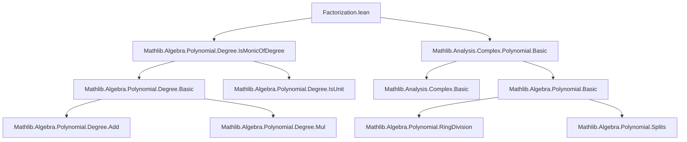
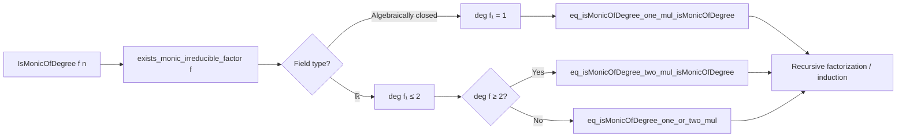

**Technical Brief: Factorization of Monic Polynomials over Algebraically Closed and Real Fields**

---

### 1. Key Definitions & Theorems

| Name | Type / Signature | Purpose |
|------|------------------|---------|
| `IsMonicOfDegree` | `Π {R : Type*} [Semiring R] (f : R[X]) (n : ℕ), Prop` | Predicate stating that `f` is monic and has natural degree exactly `n`. Defined as `f.leadingCoeff = 1 ∧ f.natDegree = n`. |
| `eq_isMonicOfDegree_one_mul_isMonicOfDegree` | `{F : Type*} [Field F] [IsAlgClosed F] {f : F[X]} {n : ℕ} → IsMonicOfDegree f (n + 1) → ∃ f₁ f₂, IsMonicOfDegree f₁ 1 ∧ IsMonicOfDegree f₂ n ∧ f = f₁ * f₂` | Factorization over algebraically closed fields: any monic polynomial of degree ≥ 1 splits off a monic linear factor. |
| `eq_isMonicOfDegree_one_or_two_mul` | `{f : ℝ[X]} {n : ℕ} → IsMonicOfDegree f (n + 1) → ∃ f₁ f₂, (IsMonicOfDegree f₁ 1 ∨ IsMonicOfDegree f₁ 2) ∧ f = f₁ * f₂` | Over `ℝ`, any monic polynomial of positive degree splits off a monic factor of degree 1 or 2 (irreducible factors over `ℝ` have degree ≤ 2). |
| `eq_isMonicOfDegree_two_mul_isMonicOfDegree` | `{f : ℝ[X]} {n : ℕ} → IsMonicOfDegree f (n + 2) → ∃ f₁ f₂, IsMonicOfDegree f₁ 2 ∧ IsMonicOfDegree f₂ n ∧ f = f₁ * f₂` | Over `ℝ`, any monic polynomial of degree ≥ 2 splits off a monic quadratic factor (if degree ≥ 2, at least one irreducible factor has degree 2 or less; if degree > 2, can ensure a degree-2 factor is extracted). |

---

### 2. Naming Conventions

- **Prefixes**:
  - `eq_`: indicates an equality-based decomposition.
  - `isMonicOfDegree_`: namespace `Polynomial.IsMonicOfDegree` — all lemmas are about factoring under the `IsMonicOfDegree` predicate.
- **Suffixes**:
  - `_one_mul`, `_two_mul`, `_one_or_two_mul`: indicate degrees of the extracted factor(s).
- **Variable naming**:
  - `f`, `f₁`, `f₂`, `g₁`, `g₂`, `p₁`, `p₂`: polynomial variables.
  - `n`, `m`: natural numbers for degrees.
  - `hf`, `hm`, `hirr`: hypotheses (e.g., `hf : IsMonicOfDegree f ...`, `hm : Monic f₁`, `hirr : Irreducible f₁`).

---

### 3. Tactic Stack

- `obtain ⟨...⟩ := exists_monic_irreducible_factor ...`: extracts a monic irreducible factor.
- `rw [...] at h`: rewriting hypotheses using lemmas like `IsMonicOfDegree.natDegree_eq`, `add_comm`, `mul_assoc`, `mul_left_comm`.
- `have ... := ...`: intermediate lemma construction, often using `of_mul_left`, `mul`, or degree arithmetic.
- `interval_cases m`: finite case analysis on small natural numbers (e.g., `m ≤ 2`).
- `tauto`: propositional logic simplification (used in `help` lemma).
- `grind`: a powerful automation tactic (from Mathlib) for simplifying goals involving degrees and units.
- `all_goals`: applies same tactic sequence to all generated subgoals.
- `lia`: linear integer arithmetic solver (used for degree arithmetic like `2 + n = 1 + (n + 1)`).

---

### 4. Proof Logic

- **General pattern**:
  1. Use `exists_monic_irreducible_factor` to get a monic irreducible factor `f₁` of `f`.
  2. Use structural properties of the base field (`IsAlgClosed` or `ℝ`) to constrain `natDegree f₁`:
     - Over algebraically closed fields: irreducible ⇒ degree 1.
     - Over `ℝ`: irreducible ⇒ degree ≤ 2.
  3. Show that the remaining cofactor `f₂` is monic of the expected degree using `of_mul_left` (or `of_mul_right`) and degree arithmetic.
  4. For `eq_isMonicOfDegree_two_mul_isMonicOfDegree`, a *two-step* extraction is needed:
     - First extract a degree-1 or -2 factor.
     - If degree-1, factor again to extract a degree-2 factor from the cofactor (since total degree ≥ 2).
     - Combine factors using `mul` and associativity/commutativity to get the desired decomposition.

- **Inductive flavor**: Not strictly inductive, but *recursive extraction* of irreducible factors until desired degree is achieved.

---

### 5. Imports & Dependencies

- **Core imports**:
  - `Mathlib.Algebra.Polynomial.Degree.IsMonicOfDegree`: defines `IsMonicOfDegree` and basic properties (e.g., `natDegree_eq`, `of_mul_left`, `mul`).
  - `Mathlib.Analysis.Complex.Polynomial.Basic`: provides `IsAlgClosed ℂ`, and tools for complex polynomials (used implicitly via algebraic closure).
- **Implicit dependencies**:
  - `Mathlib.Field.Basic`, `Mathlib.RingTheory.Ideal.Basic`, `Mathlib.Algebra.Polynomial.RingDivision`, `Mathlib.Algebra.Polynomial.Degree.DegreeSupport`, `Mathlib.Algebra.Polynomial.Splits`, `Mathlib.Real.Basic`, `Mathlib.Topology.Algebra.Field`, `Mathlib.Algebra.Polynomial.Roots.Basic`.

---

### 6. Mermaid Diagrams

#### Dependency Graph (Module-Level)

#### Theoretical Flow Overview

---

### 7. Summary

This module formalizes foundational factorization results for monic polynomials over algebraically closed fields and `ℝ`, leveraging the structure of irreducible polynomials in each setting. It is a stepping stone toward full factorization theorems (e.g., existence of linear factors over `ℂ`, quadratic-linear decomposition over `ℝ`), and sets up the infrastructure for later results like the Fundamental Theorem of Algebra or real Nullstellensatz variants.

The proofs are constructive in nature (via `exists_monic_irreducible_factor`) and rely heavily on degree arithmetic and field-theoretic constraints on irreducibles. The `TODO` comments indicate future generalizations (e.g., to real closed fields), suggesting this is part of a broader program in formalized real algebraic geometry.
