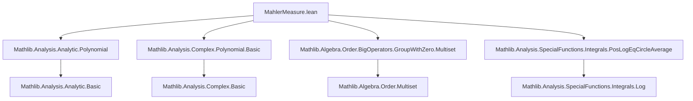

### Technical Brief: Mahler Measure in Lean 4 (`MahlerMeasure.lean`)

---

#### **1. Key Definitions & Theorems**

| Name | Type / Signature | Purpose |
|------|------------------|---------|
| `logMahlerMeasure` | `p : ℂ[X] → ℝ` | Logarithmic Mahler measure: $(2\pi)^{-1} \int_0^{2\pi} \log \|p(e^{ix})\| \, dx$ |
| `mahlerMeasure` | `p : ℂ[X] → ℝ` | Exponential Mahler measure: $\exp(\text{logMahlerMeasure}(p))$ if $p \ne 0$, else $0$ |
| `logMahlerMeasure_zero` | `0.logMahlerMeasure = 0` | Vanishing on zero polynomial |
| `logMahlerMeasure_one` | `1.logMahlerMeasure = 0` | Vanishing on constant polynomial $1$ |
| `logMahlerMeasure_const` | `(C z).logMahlerMeasure = log ‖z‖` | Log Mahler measure of constant polynomial |
| `logMahlerMeasure_X` | `X.logMahlerMeasure = 0` | Log Mahler measure of indeterminate |
| `logMahlerMeasure_monomial` | `(monomial n z).logMahlerMeasure = log ‖z‖` | Log Mahler measure of monomial |
| `mahlerMeasure_mul` | `(p * q).mahlerMeasure = p.mahlerMeasure * q.mahlerMeasure` | Multiplicativity of Mahler measure |
| `logMahlerMeasure_mul_eq_add_logMahlerMeasure` | `p * q ≠ 0 ⇒ logMahlerMeasure(p*q) = logMahlerMeasure p + logMahlerMeasure q` | Additivity of log Mahler measure under nonzero product |
| `logMahlerMeasure_X_sub_C` | `(X - C z).logMahlerMeasure = log⁺ ‖z‖` | Log Mahler measure of linear polynomial |
| `mahlerMeasure_X_sub_C` | `(X - C z).mahlerMeasure = max 1 ‖z‖` | Mahler measure of linear polynomial |
| `logMahlerMeasure_eq_log_leadingCoeff_add_sum_log_roots` | `logMahlerMeasure p = log ‖lc(p)‖ + Σ_{a ∈ roots(p)} log⁺ ‖a‖` | Root decomposition of log Mahler measure |
| `mahlerMeasure_eq_leadingCoeff_mul_prod_roots` | `mahlerMeasure p = ‖lc(p)‖ · Π_{a ∈ roots(p)} max(1, ‖a‖)` | Root decomposition of Mahler measure |
| `mahlerMeasure_le_sum_norm_coeff` | `mahlerMeasure p ≤ Σ ‖coeffs(p)‖` | Upper bound by coefficient norm sum |
| `norm_coeff_le_choose_mul_mahlerMeasure` | `‖p.coeff n‖ ≤ (natDegree p).choose n · mahlerMeasure p` | Coefficient bound via Mahler measure |

---

#### **2. Naming Conventions**

- **Prefixes**:
  - `logMahlerMeasure_`: for properties of the *logarithmic* Mahler measure.
  - `mahlerMeasure_`: for properties of the *exponential* Mahler measure.
  - `log_`, `exp_`, `norm_`, `coeff_`, `leadingCoeff_`, `roots_`, `prod_`, `sum_`: standard Mathlib prefixes.
- **Suffixes**:
  - `_def`: definition lemmas (e.g., `logMahlerMeasure_def`).
  - `_of_degree_eq_one`, `_of_ne_zero`: conditional simplifications.
  - `_mul`, `_add`, `_sub`: structural behavior (multiplicativity, additivity, etc.).
- **Special patterns**:
  - `X_sub_C`, `X_add_C`, `C_mul_X_add_C`: canonical forms for degree-1 polynomials.
  - `posLog_eq_log_max_one`: connects `log⁺` with `max(1, ·)`.

---

#### **3. Tactic Stack**

| Tactic | Frequency | Role |
|--------|-----------|------|
| `simp` / `simp_all` | Very high | Simplification using `@[simp]` lemmas, especially for constants, zero, one, linear polynomials |
| `rw` | High | Rewriting using definitions and theorems (e.g., `logMahlerMeasure_def`, `mahlerMeasure_def_of_ne_zero`) |
| `by_cases` | High | Splitting on whether $p = 0$ or $p \ne 0$ |
| `congr` | Medium | Congruence steps for integrals, sums, products |
| `gcongr` | Medium | Generalized congruence for inequalities (e.g., bounding sums/products) |
| `apply_fun` | Medium | Applying monotone functions (e.g., `exp`) to equalities |
| `intervalIntegral.integral_mono_ae_restrict` | Low | Integral comparison for Mahler measure upper bounds |
| `grind` | Medium | Automated simplification for multiset/product/sum manipulations |
| `norm_cast` | Medium | Lifting inequalities from `ℝ≥0` to `ℝ` |
| `aesop` | Not present | Not used in this file |
| `ring` | Not present | Not used (no polynomial ring reasoning needed beyond `simp`-friendly algebra) |

---

#### **4. Proof Logic**

- **Structure**:
  - **Case analysis** on $p = 0$ or $p \ne 0$ is pervasive.
  - **Induction** on multiset (for `prod_mahlerMeasure_eq_mahlerMeasure_prod`).
  - **Factorization** via `IsAlgClosed.splits` (algebraic closure of ℂ) to reduce to linear factors.
  - **Logarithmic linearization**: use `logMahlerMeasure_mul_eq_add_logMahlerMeasure` to reduce multiplicative properties to additive ones.
  - **Root decomposition**: express Mahler measure in terms of roots outside unit disk via `log⁺` and `max(1, ·)`.
  - **Estimates**: use integral monotonicity and coefficient bounds (e.g., `norm_coeff_le_choose_mul_mahlerMeasure` via symmetric sums over roots).

- **Typical flow**:
  1. Reduce to nonzero case via `by_cases`.
  2. Use `logMahlerMeasure_eq_log_MahlerMeasure` to switch between log and exponential forms.
  3. Factor polynomial using `splits_iff_card_roots`.
  4. Apply multiplicativity (`mahlerMeasure_mul`, `logMahlerMeasure_mul_eq_add_logMahlerMeasure`).
  5. Simplify using lemmas for linear factors (`logMahlerMeasure_X_sub_C`, `mahlerMeasure_X_sub_C`).
  6. Reassemble via `exp_add`, `exp_log`, `prod_multiset_map`, etc.

---

#### **5. Imports**

| Module | Purpose |
|--------|---------|
| `Mathlib.Analysis.Analytic.Polynomial` | Analyticity of polynomial evaluation, meromorphic behavior |
| `Mathlib.Analysis.Complex.Polynomial.Basic` | Basic algebraic/analytic facts about complex polynomials |
| `Mathlib.Algebra.Order.BigOperators.GroupWithZero.Multiset` | Multiset products/sums, especially with `max`, `norm`, `log⁺` |
| `Mathlib.Analysis.SpecialFunctions.Integrals.PosLogEqCircleAverage` | Key lemma: $\log^+|z| = \frac{1}{2\pi} \int_0^{2\pi} \log|e^{i\theta} - z| d\theta$ |

---

#### **8. Mermaid Diagrams**

##### **Dependency Graph (Top-Level)**



##### **Conceptual Overview of Theory**

```mermaid
flowchart LR
  subgraph Definitions
    A[logMahlerMeasure] --> B[mahlerMeasure]
  end

  subgraph Core Properties
    B --> C[Multiplicativity mahlerMeasure_mul]
    A --> D[Additivity logMahlerMeasure_mul_eq_add_logMahlerMeasure]
  end

  subgraph Linear Case
    E[X - C z] --> F[logMahlerMeasure_X_sub_C = log⁺‖z‖]
    E --> G[mahlerMeasure_X_sub_C = max(1, ‖z‖)]
  end

  subgraph General Case
    H[Factorization via IsAlgClosed.splits] --> I[logMahlerMeasure = log|lc| + Σ log⁺|roots|]
    H --> J[mahlerMeasure = |lc| · Π max(1, |roots|)]
  end

  subgraph Estimates
    K[coeff bounds] --> L[mahlerMeasure_le_sum_norm_coeff]
    M[coeff ≤ choose × mahlerMeasure] --> L
  end

  A --> D
  D --> I
  G --> J
```

##### **Proof Strategy Flow (Example: `mahlerMeasure_mul`)**

```mermaid
flowchart TD
  Start[Start: (p*q).mahlerMeasure] --> Case[by_cases hpq: p*q = 0]
  Case -->|hpq| Zero[→ 0 = 0 * 0]
  Case -->|¬hpq| Split[→ p ≠ 0 ∧ q ≠ 0]
  Split --> Def[mahlerMeasure_def_of_ne_zero]
  Def --> LogExp[exp(logMahlerMeasure(p*q))]
  LogExp --> Add[logMahlerMeasure(p*q) = logMahlerMeasure p + logMahlerMeasure q]
  Add --> ExpAdd[exp(a + b) = exp(a) * exp(b)]
  ExpAdd --> Final[p.mahlerMeasure * q.mahlerMeasure]
```

---

This file formalizes a classical result in Diophantine geometry and complex analysis: the Mahler measure is multiplicative and admits a clean factorization in terms of roots and leading coefficient. It leverages the algebraic closure of ℂ and deep integral identities (e.g., Poisson–Jensen / Jensen’s formula), all formalized in Lean 4 using `Mathlib`’s robust analysis and algebra infrastructure.
