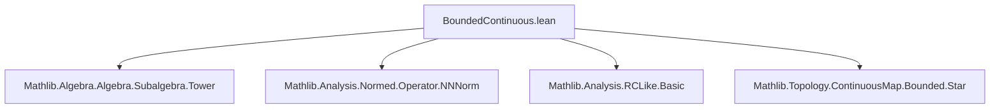

### Technical Brief: `BoundedContinuous.lean` (RCLike Section)

---

#### **1. Key Definitions & Theorems**

| Name | Type / Signature | Purpose |
|------|------------------|---------|
| `restrict_toContinuousMap_eq_toContinuousMapStar_restrict` | `theorem` | Establishes a commutativity diagram between two ways of passing from a `StarSubalgebra` of bounded continuous $𝕜$-valued functions to a real algebra of continuous functions: via restriction of scalars before/after applying `toContinuousMapₐ` or `toContinuousMapStarₐ`. |

- **`restrictScalars ℝ`**: Restricts scalars from `𝕜` to `ℝ` along `ofRealAm : ℝ → 𝕜`.
- **`comap` / `map`**: Induced maps on subalgebras along algebra homomorphisms.
- **`toContinuousMapₐ ℝ`**: The algebra homomorphism from bounded continuous $𝕜$-valued functions to continuous $ℝ$-valued functions, induced by the real part map `reCLM`.
- **`toContinuousMapStarₐ 𝕜`**: The star algebra homomorphism from bounded continuous $𝕜$-valued functions to bounded continuous $𝕜$-valued functions with conjugation (i.e., the star operation).
- **`AlgHom.compLeftContinuousBounded` / `compLeftContinuous`**: Precomposition with a Lipschitz/continuous map.

---

#### **2. Naming Conventions**

- **Prefixes**:
  - `restrictScalars_`: For scalar restriction functors.
  - `comap` / `map`: Standard categorical image/preimage notation for subalgebras.
  - `toContinuousMapₐ`: “Algebraic” continuous map construction.
  - `ofRealAm`: The canonical algebra map $ℝ → 𝕜$ (used in scalar restriction).
- **Suffixes**:
  - `_apply_apply`: For nested function application in proofs (e.g., `toContinuousMapStarₐ_apply_apply`).
  - `_lipschitz`: For Lipschitz constants or proofs of Lipschitz continuity.

---

#### **3. Tactic Stack**

- **`ext`**: Extensionality (function equality).
- **`simp only [...]`**: Simplification using explicit lemmas (subalgebra membership, application of algebra homs).
- **`constructor`**: For biconditional proofs (`↔`).
- **`use`**: Existential introduction.
- **`rwa [...]`**: Rewrite + assumption.
- **`exact`**: Direct proof term application.
- **`refine`**: Partial proof term with holes (`?_`).
- **`have`**: Introduce intermediate hypotheses.

No heavy automation (e.g., `aesop`, `linarith`) — proof is mostly manual, leveraging algebraic and topological structure.

---

#### **4. Proof Logic**

1. **Goal**: Show equality of two subalgebras of continuous real-valued functions.
2. **Step 1**: Apply `ext g` to reduce to pointwise equality of functions $g$.
3. **Step 2**: Simplify membership conditions using `simp only [...]` with lemmas about `map`, `comap`, `restrictScalars`.
4. **Step 3**: Prove both directions:
   - **(→)**: Given $g$ in the left-hand side, construct $x$ in the right-hand side using precomposition with `ofRealAm`.
   - **(←)**: Given $g$ in the right-hand side, construct $x$ as $g \circ \text{reCLM}$, and verify it lies in the original subalgebra using `hg_apply` and algebraic simplifications.
5. **Key Lemma Used**: `h_comp_eq` shows that precomposing with `reCLM` and then applying `ofRealAm` recovers the original function — relies on `DfunLike.congr_fun` and algebraic properties of `reCLM` and `ofRealAm`.

---

#### **5. Imports & Dependencies**

| Import | Role |
|--------|------|
| `Mathlib.Algebra.Algebra.Subalgebra.Tower` | For `restrictScalars`, `map`, `comap`, and tower laws for subalgebras. |
| `Mathlib.Analysis.Normed.Operator.NNNorm` | For bounded continuous function space structure (`→ᵇ`). |
| `Mathlib.Analysis.RCLike.Basic` | Defines `RCLike` fields (complex-like numbers), `reCLM`, `ofRealAm`, etc. |
| `Mathlib.Topology.ContinuousMap.Bounded.Star` | Star structure on bounded continuous functions (`StarSubalgebra`, `toContinuousMapStarₐ`). |

---

#### **6. Mermaid Diagrams**

##### **Dependency Graph (Module Level)**



##### **Conceptual Flow Diagram (Theorem Statement)**

```mermaid
graph LR
  A[StarSubalgebra 𝕜 (E →ᵇ 𝕜)] -->|restrictScalars ℝ| B[(A.restrictScalars ℝ)]
  A -->|map (toContinuousMapStarₐ 𝕜)| C[A.map (toContinuousMapStarₐ 𝕜)]
  B -->|map (compLeftContinuous ℝ ofRealAm)| D[ContinuousMap ℝ C]
  C -->|restrictScalars ℝ| E[(A.map ...).restrictScalars ℝ]
  E -->|comap (ofRealAm.compLeftContinuous ...)| D
  A -->|restrictScalars ℝ| B
  B -->|comap (compLeftContinuousBounded ...)| F[ContinuousMap ℝ (E →ᵇ 𝕜)]
  A -->|map (toContinuousMapₐ ℝ)| G[A.map (toContinuousMapₐ ℝ)]
  G -->|restrictScalars ℝ| H[(A.map ...).restrictScalars ℝ]
  H -->|comap (ofRealAm.compLeftContinuous ...)| F
```

##### **Overview of Theorem’s Role in Theory**

- **Context**: Bounded continuous functions with values in an `RCLike` field (e.g., `ℂ`) form a `StarAlgebra` over `𝕜`.
- **Goal**: Understand how scalar restriction $𝕜 \to ℝ$ interacts with the forgetful functor to real-valued continuous functions.
- **Significance**: Enables transfer of real-algebraic constructions (e.g., real spectra, real Banach algebras) from complex-valued bounded continuous functions — foundational for Gelfand duality over `ℝ` in the presence of complex scalars.

--- 

Let me know if you'd like a formalized dependency graph (e.g., for `leanproject`), or a higher-level summary for documentation.
