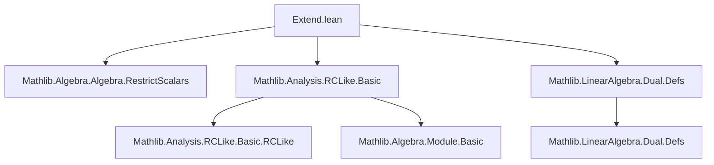

### Technical Brief: `Extend.lean` — Extension of Real-Linear Functionals to Complex- or Real-Linear Ones

---

#### **1. Key Definitions & Theorems**

| Name | Type / Signature | Purpose |
|------|------------------|---------|
| `extendTo𝕜'` | `fr : Dual ℝ F → Dual 𝕜 F` | Extends an $\mathbb{R}$-linear functional on $F$ to a $\mathbb{K}$-linear functional (where $\mathbb{K} = \mathbb{R}$ or $\mathbb{C}$), assuming `IsScalarTower ℝ 𝕜 F`. |
| `extendTo𝕜` | `fr : Dual ℝ (RestrictScalars ℝ 𝕜 F) → Dual 𝕜 F` | Same as above, but formulated using `RestrictScalars`, avoiding the need for `IsScalarTower`. |
| `extendTo𝕜'_apply` | `fr.extendTo𝕜' x = fr x - I * fr(I • x)` | Explicit formula for the extension. |
| `extendTo𝕜'_apply_re` | `re (fr.extendTo𝕜' x) = fr x` | Real part of the extension recovers the original functional. |
| `norm_extendTo𝕜'_apply_sq` | `‖fr.extendTo𝕜' x‖² = fr(conj(fr.extendTo𝕜' x) • x)` | Quadratic norm identity crucial for proving isometry (used in later normed module files). |
| `extendTo𝕜'_apply` (for `ContinuousLinearMap`) | Same as above, but for continuous linear maps. | Ensures continuity via `fun_prop`. |
| `extendTo𝕜'` (for `ContinuousLinearMap`) | `fr : StrongDual ℝ F → StrongDual 𝕜 F` | Continuous extension of bounded real-linear functionals. |

> **Note**: All definitions are *noncomputable*, as they rely on classical logic (e.g., via `I` and complex conjugation).

---

#### **2. Naming Conventions**

- **Suffixes**:
  - `'` (prime): Definitions operating under `IsScalarTower ℝ 𝕜 F`.
  - No prime: Definitions using `RestrictScalars ℝ 𝕜 F`, more flexible for typeclass inference.
- **Prefixes**:
  - `extendTo𝕜`: Main extension operator.
  - `extendTo𝕜_apply`: Application lemma.
  - `norm_...`: Norm-related identities.
- **Variables**:
  - `fr`: Real-linear input functional.
  - `fc`: Hypothetical complex-linear output (used internally in `extendTo𝕜'`).
  - `x`: Argument in the module $F$.

---

#### **3. Tactic Stack**

| Tactic | Usage |
|--------|-------|
| `simp only [...]` | Simplify using explicit lemmas (e.g., `map_add`, `smul_add`, `mul_sub`). |
| `abel` | Prove additive group equalities (e.g., additivity of `fc`). |
| `rw [...]` | Rewrite using definitions and algebraic laws (e.g., `← re_add_im c`, `← smul_smul`). |
| `simp` | Prove `re`-identities (`extendTo𝕜'_apply_re`). |
| `fun_prop` | Prove continuity in `ContinuousLinearMap.extendTo𝕜'`. |
| `calc` + `rw` | Chain equalities for norm identities (`norm_extendTo𝕜'_apply_sq`). |

---

#### **4. Proof Logic**

- **Structure**: All proofs follow a *constructive verification* pattern:
  1. Define candidate function `fc x = fr x - I * fr(I • x)`.
  2. Prove **additivity** (`add`).
  3. Prove **$\mathbb{R}$-homogeneity** (`smul_ℝ`).
  4. Prove **$I$-homogeneity** (`smul_I`) — uses `RCLike` axioms (`I_mul_I_ax`).
  5. Combine to prove full **$\mathbb{K}$-homogeneity** (`smul_𝕜`).
  6. Conclude linearity via `LinearMap.mk`.
- **Norm identities**:
  - Use `RCLike.conj_mul`, `ofReal_re`, and `map_smul` to relate norm squared to the original functional.
  - Crucially, rely on `extendTo𝕜'_apply_re` to simplify `re (fc x)`.

---

#### **5. Imports & Dependencies**

| Module | Role |
|--------|------|
| `Mathlib.Algebra.Algebra.RestrictScalars` | Provides `RestrictScalars`, enabling base-field restriction. |
| `Mathlib.Analysis.RCLike.Basic` | Defines `RCLike 𝕜`, abstracting $\mathbb{R}$ or $\mathbb{C}$ with conjugation, `re`, `im`, `I`, etc. |
| `Mathlib.LinearAlgebra.Dual.Defs` | Provides `Dual`, `StrongDual`, and basic linear map infrastructure. |

> **No normed module theory** (e.g., operator norm) is imported here — this file is intentionally *pre-normed*, to avoid circular dependencies.

---

#### **6. Mermaid Diagrams**

##### **Dependency Graph (Top-Level Imports)**



##### **Module Overview & Theory Flow**

```mermaid
graph LR
  subgraph Theory
    A[Real-linear functional fr] --> B[Define fc x = fr x - I·fr(I·x)]
    B --> C{Verify ℂ-linearity?}
    C -->|Yes| D[LinearMap.extendTo𝕜']
    C -->|Yes| E[ContinuousLinearMap.extendTo𝕜']
    D --> F[Norm identity: ‖fc x‖² = fr(conj(fc x)·x)]
    F --> G[Mathlib/Analysis/Normed/Module/RCLike/Extend.lean]
  end

  subgraph Implementation
    D --> H[extendTo𝕜 (via RestrictScalars)]
    E --> I[extendTo𝕜 (via RestrictScalars)]
  end

  G --> J[Isometric extension theorem]
```

##### **Data Flow for `extendTo𝕜`**

```mermaid
flowchart LR
  fr[Dual ℝ (RestrictScalars ℝ 𝕜 F)] --> extend[extendTo𝕜]
  extend --> fc[Dual 𝕜 F]
  fc --> apply[apply x]
  apply --> result[(fr x) - I·(fr(I·x))]
```

---

#### **7. Summary**

This file provides a *uniform*, *elementary* construction of complex (or real) linear extensions of real-linear functionals, using only `RCLike` structure. It avoids heavy normed-space machinery, deferring norm estimates (e.g., isometry) to a companion file (`RCLike/Extend.lean`). The design separates *existence* (via explicit formula) from *norm behavior*, enabling modular development in functional analysis and representation theory.

The use of `RestrictScalars` over `IsScalarTower` reflects Lean’s preference for explicit coercion paths in dependent type theory, improving typeclass inference robustness.
