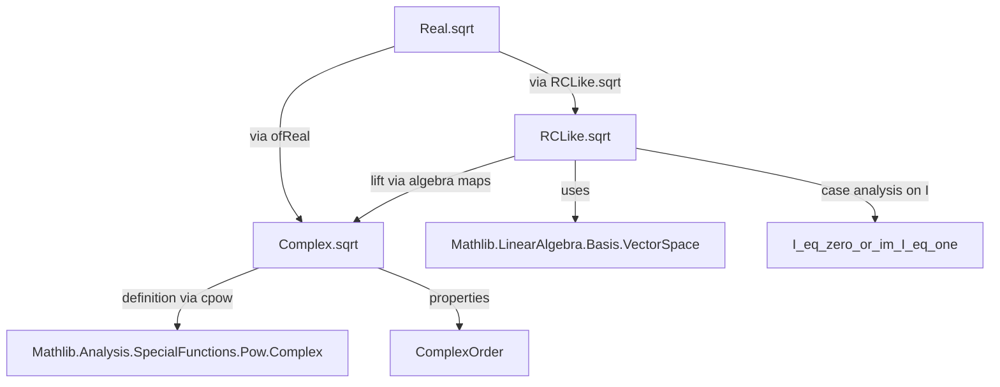
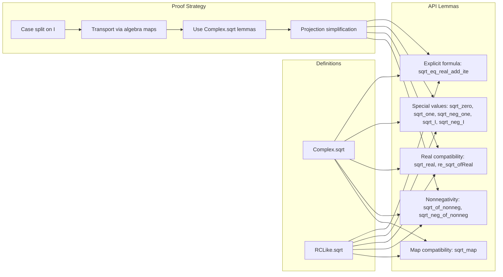

**Technical Brief: `Sqrt.lean` (Lean 4 Formalization)**  
*Domain: Real/Complex Analysis in `RCLike` Structures*  
*Author: Monica Omar (2026)*  
*License: Apache 2.0*

---

### 1. KEY DEFINITIONS & THEOREMS

| Name | Type / Signature | Purpose |
|------|------------------|---------|
| `Complex.sqrt` | `ℂ → ℂ` | Defines complex square root via exponentiation: $ a \mapsto a^{1/2} $ |
| `RCLike.sqrt` | `𝕜 → 𝕜` (for `[RCLike 𝕜]`) | Lifts `Complex.sqrt` to any `RCLike` field via algebra maps |
| `Complex.sqrt_eq_real_add_ite` | `a.sqrt = √((‖a‖ + a.re)/2) + (if 0 ≤ a.im then 1 else -1) * √((‖a‖ - a.re)/2) * I` | Explicit real-imag decomposition of complex sqrt |
| `RCLike.sqrt_eq_ite` | `sqrt a = if im I = 1 then … else √(re a)` | Case analysis on whether `I` maps to complex `I` or zero |
| `RCLike.sqrt_eq_real_add_ite` | Same form as complex case, but for `𝕜` | Generalizes the explicit formula to `RCLike` |
| `Complex.re_sqrt_ofReal` | `re (sqrt (a : ℂ)) = √a` | Real part of sqrt of a real (viewed in ℂ) is the usual real sqrt |
| `RCLike.sqrt_real` | `sqrt a = √a` for `a : ℝ` | Compatibility of `RCLike.sqrt` with real sqrt |
| `RCLike.sqrt_complex` | `sqrt a = a.sqrt` for `a : ℂ` | `RCLike.sqrt` on `𝕜 = ℂ` coincides with `Complex.sqrt` |
| `Complex.sqrt_of_nonneg` | `0 ≤ a → a.sqrt = √a.re` | For nonnegative complex numbers, sqrt is real and equals sqrt of real part |
| `RCLike.sqrt_of_nonneg` | `0 ≤ a → sqrt a = √(re a)` | Same for `RCLike` |
| `Complex.sqrt_neg_of_nonneg` | `0 ≤ a → (-a).sqrt = I * a.sqrt` | Square root of negative of nonnegative complex |
| `RCLike.sqrt_neg_of_nonneg` | `0 ≤ a → sqrt (-a) = I * sqrt a` | Same for `RCLike` |
| `Complex.sqrt_neg_one` | `sqrt (-1) = I` | Standard identity |
| `RCLike.sqrt_neg_one` | `sqrt (-1) = (I : 𝕜)` | Same in `RCLike` |
| `Complex.sqrt_I` | `sqrt I = √2⁻¹ * (1 + I)` | Exact value of sqrt of imaginary unit |
| `Complex.sqrt_neg_I` | `sqrt (-I) = √2⁻¹ * (1 - I)` | Exact value of sqrt of negative imaginary unit |
| `RCLike.sqrt_I` / `RCLike.sqrt_neg_I` | Analogous formulas for `𝕜` | Generalized to `RCLike`, with sign depending on `I` embedding |

---

### 2. NAMING CONVENTIONS

- **Prefixes**:
  - `Complex.` / `RCLike.` — disambiguates overloads (e.g., `Complex.sqrt`, `RCLike.sqrt`)
  - `re_`, `im_`, `norm_`, `abs_` — standard real/imag/norm projections
- **Suffixes**:
  - `_eq_ite` — formulas defined piecewise via `if ... then ... else ...`
  - `_of_nonneg` — properties under nonnegativity assumption
  - `_neg_of_nonneg` — behavior on negatives of nonnegative elements
  - `_map` — compatibility with algebra maps between `RCLike` structures
- **Other**:
  - `sqrt_zero`, `sqrt_one`, `sqrt_real`, `sqrt_complex`, `sqrt_I`, `sqrt_neg_I`, `sqrt_neg_one` — canonical special values

---

### 3. TACTIC STACK

Frequent tactics used in proofs:

| Tactic | Role |
|--------|------|
| `simp` / `simp only` / `simp_rw` | Simplification using lemmas, especially `@[simp]` theorems |
| `rw` | Rewriting using equalities (e.g., definitions, lemmas) |
| `split_ifs` | Eliminates `if ... then ... else ...` by case analysis |
| `aesop` | Automated reasoning (especially for algebraic simplifications, `RCLike` structure facts) |
| `grind` | Custom tactic (likely from `Mathlib`) for grinding through algebraic identities, especially with `I`, `re`, `im`, `norm` |
| `obtain (h | h) := ...` | Case analysis on disjunctions (e.g., `I_eq_zero_or_im_I_eq_one`) |
| `by_cases!` | Case split on decidable propositions, with simplification |
| `have := ...` | Introduces intermediate facts (often structural lemmas) |
| `simp_all only [...]` | Simplify all hypotheses and goals using specified lemmas |

---

### 4. PROOF LOGIC

**General proof strategy**:

1. **Case analysis on `I` embedding**:
   - Use `I_eq_zero_or_im_I_eq_one` to split into:
     - `I = 0` (real-only case, `𝕜 ≅ ℝ`)
     - `im I = 1` (complex-like case, `𝕜` contains a copy of `ℂ`)
2. **Reduce to `Complex.sqrt`**:
   - Use algebra maps (`map`, `complexRingEquiv`) to transport between `𝕜` and `ℂ`
3. **Apply explicit formulas**:
   - Use `Complex.sqrt_eq_real_add_ite` or `Complex.sqrt_of_nonneg` as needed
4. **Simplify projections**:
   - Use lemmas like `re_add_im`, `re_sqrt_ofReal`, `im_eq_zero`, `norm_real`
5. **Algebraic verification**:
   - Use `grind`, `aesop`, and `simp` to verify identities involving `√`, `I`, `re`, `im`, `norm`

**Typical flow** for `RCLike.sqrt_*` lemmas:
- `rw [sqrt, Complex.sqrt_eq_*]`
- `obtain (h | h) := I_eq_zero_or_im_I_eq_one`
- `· simp [h, ...]` (complex case)
- `rw [sqrt_eq_ite, dif_pos h, ...]` (real case)
- `simp_all` + `grind` to finish

---

### 5. IMPORTS & DEPENDENCIES

| Module | Role |
|--------|------|
| `Mathlib.Analysis.SpecialFunctions.Pow.Complex` | Defines complex exponentiation (`cpow`), especially `a ^ (2⁻¹ : ℂ)` |
| `Mathlib.Analysis.SpecialFunctions.Pow.Real` | Real power function, real sqrt (`√`), `ofReal`, etc. |
| `Mathlib.LinearAlgebra.Basis.VectorSpace` | Used for algebra map properties, especially `map`, `algebraMap`, and ring/field extensions |
| `ComplexOrder` (open) | Provides order-theoretic tools for `RCLike`, e.g., `nonneg_iff_exists_ofReal`, `norm`, `re`, `im` |

**Key abstractions used**:
- `RCLike` — a typeclass unifying `ℝ`, `ℂ`, and other real-closed-like fields with an embedding of `ℂ` or `ℝ`
- `map 𝕜 𝕜'` — algebra map between `RCLike` structures
- `complexRingEquiv h` — ring isomorphism when `I` maps to complex `I`
- `re`, `im`, `norm`, `ofReal`, `I` — standard projections and constants

---

### 6. MERMAID DIAGRAMS

#### Dependency Graph (High-Level)

#### Overview of `Sqrt.lean` Structure

---

### 7. THEORY CONTEXT

- **Goal**: Provide a unified square root API for both `ℂ` and abstract `RCLike` fields (e.g., `ℝ`, `ℂ`, or extensions).
- **Key insight**: `RCLike` structures either embed `ℝ` (if `I = 0`) or `ℂ` (if `I ≠ 0`), so proofs split accordingly.
- **Design choice**: Use `noncomputable def` for `sqrt`, relying on classical analysis (via `cpow`), not constructive algorithms.
- **API completeness**: Covers:
  - Evaluation at 0, 1, −1, `I`, `−I`
  - Real/imag parts
  - Behavior under algebra maps
  - Nonnegativity and sign rules

---

Let me know if you'd like a **dependency graph of `RCLike` typeclass instances** or a **proof outline for `Complex.sqrt_I`**.
