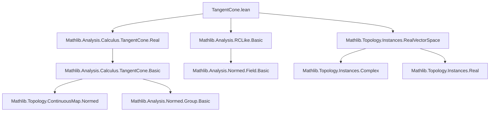
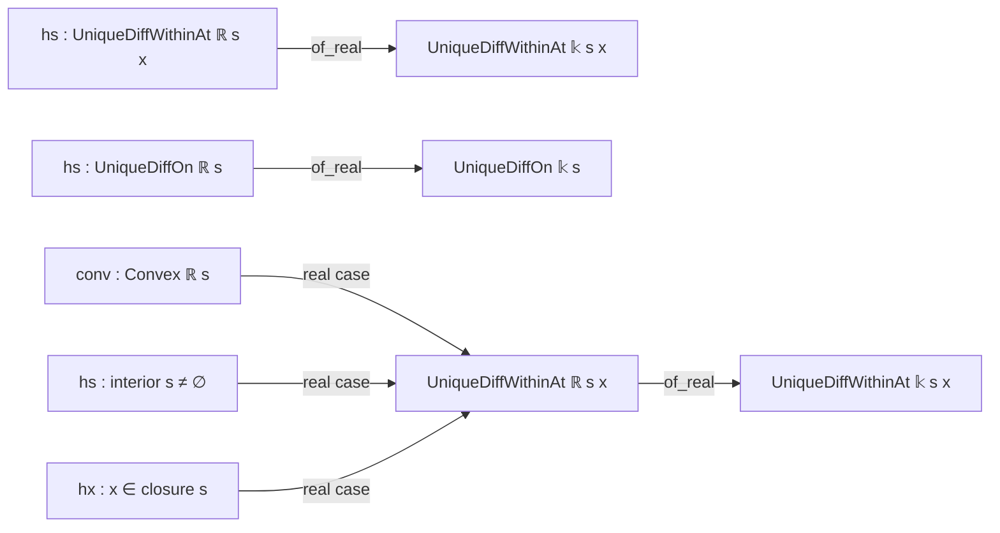

**Technical Brief: `TangentCone.lean` (Lean 4)**  
*Domain: Analysis on normed vector spaces over real-closed-like fields*  
*Author: Sébastien Gouëzel (2025)*  
*License: Apache 2.0*

---

### 1. KEY DEFINITIONS & THEOREMS

| Name | Type / Signature | Purpose |
|------|------------------|---------|
| `tangentConeAt` | `tangentConeAt (𝕜 : Type _) [NontriviallyNormedField 𝕜] (s : Set E) (x : E)` | Defines the tangent cone to a set `s` at a point `x`, depending on the scalar field `𝕜`. |
| `UniqueDiffWithinAt` | `UniqueDiffWithinAt 𝕜 s x` | States that `s` is a *set of unique differentiability* at `x` with respect to field `𝕜`. |
| `UniqueDiffOn` | `UniqueDiffOn 𝕜 s` | States that `s` is a set of unique differentiability *everywhere within* `s` (w.r.t. `𝕜`). |
| `tangentConeAt_real_subset_isRCLikeNormedField` | `tangentConeAt ℝ s x ⊆ tangentConeAt 𝕜 s x` | Shows inclusion of real tangent cone into tangent cone over any `IsRCLikeNormedField` `𝕜`. |
| `UniqueDiffWithinAt.of_real` | `UniqueDiffWithinAt ℝ s x → UniqueDiffWithinAt 𝕜 s x` | Lifts unique differentiability from `ℝ` to any `IsRCLikeNormedField` `𝕜`. |
| `UniqueDiffOn.of_real` | `UniqueDiffOn ℝ s → UniqueDiffOn 𝕜 s` | Lifts global unique differentiability from `ℝ` to `𝕜`. |
| `uniqueDiffWithinAt_convex_of_isRCLikeNormedField` | `Convex ℝ s → (interior s).Nonempty → x ∈ closure s → UniqueDiffWithinAt 𝕜 s x` | Extends the classical result (convex + nonempty interior ⇒ unique differentiability) to any `IsRCLikeNormedField`. |
| `uniqueDiffOn_convex_of_isRCLikeNormedField` | `Convex ℝ s → (interior s).Nonempty → UniqueDiffOn 𝕜 s` | Global version of the above. |

---

### 2. NAMING CONVENTIONS

- **Field-genericity**: Suffixes like `_of_isRCLikeNormedField` indicate generalization from `ℝ` to arbitrary `IsRCLikeNormedField`.
- **Lifting lemmas**: Prefix `of_` (e.g., `of_real`) denotes a direction of implication: from `ℝ`-structure to `𝕜`-structure.
- **Monotonicity/Inclusion**: `mono_field` is used internally to derive field-monotone behavior of tangent cones.
- **Convexity + interior**: `uniqueDiffWithinAt_convex_…` and `uniqueDiffOn_convex_…` follow standard naming for convex-domain results.

---

### 3. TACTIC STACK

- `letI := h𝕜.rclike`: Introduces instance `IsRCLike` from `h𝕜`.
- `exact …`: Direct proof steps using previously established lemmas (`tangentConeAt_mono_field`, `hs.mono_field`).
- `fun x hx ↦ …`: Standard lambda abstraction for `UniqueDiffOn` proofs (pointwise argument).
- Implicit use of `rclike` structure to bridge `ℝ` and `𝕜`.

No heavy automation (e.g., `aesop`, `ring`, `simp`) is used—proofs are largely *structural* and rely on library lemmas.

---

### 4. PROOF LOGIC

- **Field monotonicity**: The core idea is that the tangent cone (and hence differentiability structure) *increases* when extending scalars from `ℝ` to a larger field `𝕜` satisfying `IsRCLikeNormedField`.
- **Lifting principle**:  
  - `UniqueDiffWithinAt` and `UniqueDiffOn` are *monotone* in the field: if a set is uniquely differentiable over `ℝ`, it remains so over any `IsRCLikeNormedField` `𝕜`.  
  - This is formalized via `mono_field` lemmas for tangent cones and differentiability.
- **Convex case**: Uses known real result (`uniqueDiffWithinAt_convex`, `uniqueDiffOn_convex`) and lifts it using `of_real`.

---

### 5. IMPORTS & DEPENDENCIES

| Module | Role |
|--------|------|
| `Mathlib.Analysis.RCLike.Basic` | Provides `IsRCLikeNormedField`, `rclike`, and basic properties. |
| `Mathlib.Topology.Instances.RealVectorSpace` | Ensures compatibility of `ℝ`- and `𝕜`-vector space structures. |
| `Mathlib.Analysis.Calculus.TangentCone.Real` | Defines tangent cones over `ℝ`, and contains `tangentConeAt_mono_field`, `uniqueDiffWithinAt_convex`, etc. |

---

### 6. DEPENDENCY & THEORY OVERVIEW (Mermaid Diagrams)

#### A. Module Dependency Graph



#### B. Theoretical Flow (Key Concepts)

```mermaid
flowchart LR
  Real[Tangent cone over ℝ] -->|mono_field| Complex[Tangent cone over ℂ / 𝕜]
  Real -->|UniqueDiffWithinAt.of_real| Complex[UniqueDiffWithinAt over 𝕜]
  Convex[Convex s, int(s) ≠ ∅] -->|Real theory| Real
  Convex -->|Lift| Complex
  Complex -->|Application| PDEs[PDEs, geometric analysis]
```

#### C. Logical Structure of Main Theorems



---

### 7. SUMMARY

This module formalizes a *field extension principle* for unique differentiability: if a set is uniquely differentiable over `ℝ`, it remains so over any `IsRCLikeNormedField` `𝕜` (e.g., `ℂ`). It leverages monotonicity of tangent cones under field extension and applies it to convex sets with nonempty interior—a key class of sets where unique differentiability is known over `ℝ`. The formalization is concise, relying on existing `Mathlib` infrastructure for normed spaces and calculus.
