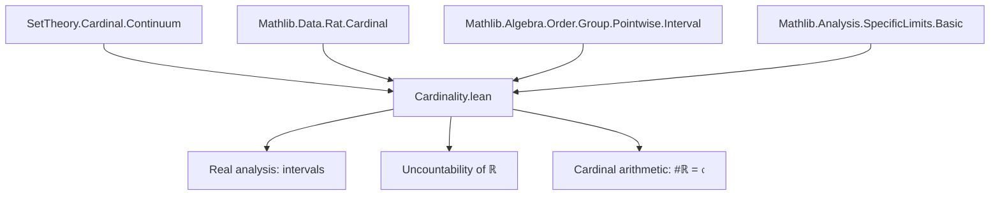
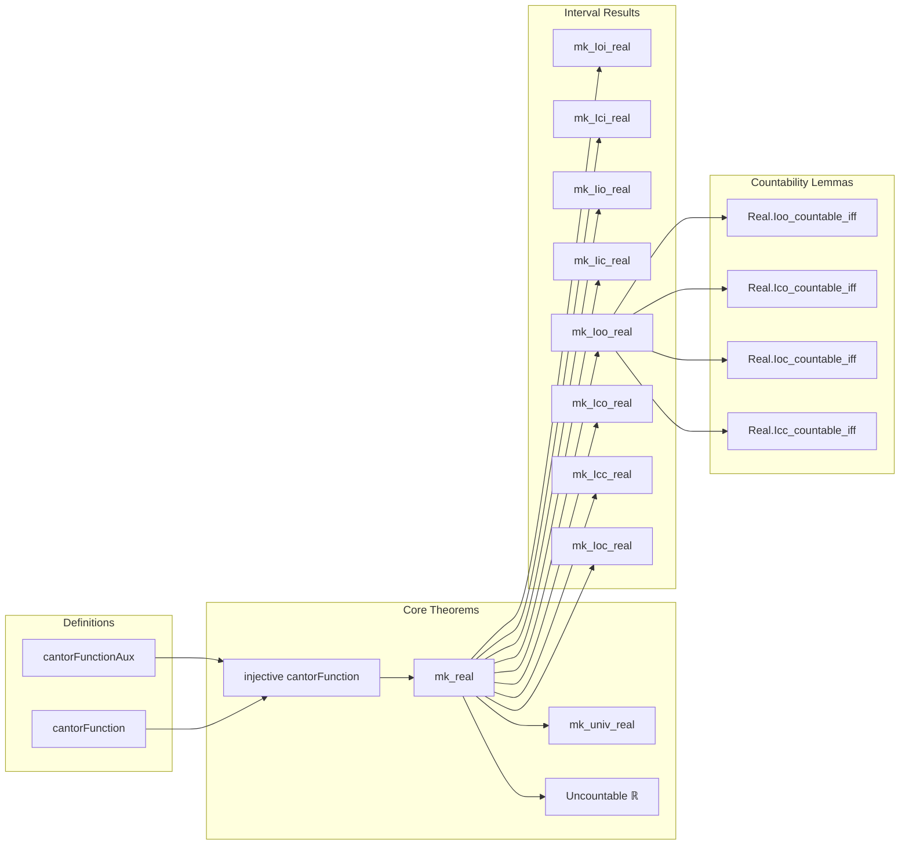

### Technical Brief: Cardinality of the Reals in Lean 4 (Mathlib)

---

#### **1. Key Definitions & Theorems**

| Name | Type / Signature | Purpose |
|------|------------------|---------|
| `cantorFunctionAux` | `ℝ → (ℕ → Bool) → ℕ → ℝ` | Helper term: `c^n` if `f n = true`, else `0`. Used to build the Cantor function sum. |
| `cantorFunction` | `ℝ → (ℕ → Bool) → ℝ` | Main function: `∑' n, f n * c^n`, interpreting `true ↦ 1`, `false ↦ 0`. |
| `mk_real` | `#ℝ = 𝔠` | Core theorem: cardinality of reals equals continuum. |
| `mk_univ_real` | `#(Set.univ : Set ℝ) = 𝔠` | Cardinality of the universal set of reals. |
| `cantorFunction_injective` | `0 < c → c < 1/2 → Function.Injective (cantorFunction c)` | Injectivity of Cantor function (key for lower bound `𝔠 ≤ #ℝ`). |
| `increasing_cantorFunction` | Lexicographic-like monotonicity condition | Used in proof of injectivity. |
| `mk_Ixy_real` (8 variants) | e.g., `mk_Ioi_real`, `mk_Icc_real`, etc. | All nontrivial intervals have cardinality `𝔠`. |
| `Real.Ioo_countable_iff`, etc. | `(Ioo x y).Countable ↔ y ≤ x` | Characterization of countability of intervals. |
| `not_countable_real` | `¬(Set.univ : Set ℝ).Countable` | Cantor’s diagonal argument formalized: reals are uncountable. |

---

#### **2. Naming Conventions**

- **Prefixes**:
  - `mk_`: denotes cardinality of a set (`#X = ...`).
  - `cantorFunctionAux`, `cantorFunction`: related to Cantor’s construction.
  - `Ixy_`: interval notation (`Ioi` = `(a, ∞)`, `Iic` = `(-∞, a]`, etc.).
- **Suffixes**:
  - `_real`: indicates result applies specifically to reals.
  - `_iff`: equivalence (↔) statements.
- **Variables**:
  - `f g : ℕ → Bool`: binary sequences.
  - `c : ℝ`: base for geometric series (often `1/3`).
  - `a b : ℝ`: interval endpoints.

---

#### **3. Tactic Stack**

Frequently used tactics in this file:

| Tactic | Role |
|--------|------|
| `rw` / `grw` | Rewriting using equalities, especially interval identities and cardinal arithmetic. |
| `simp` / `simp only` | Simplification using `@[simp]` lemmas (e.g., `cantorFunctionAux_true`, `mk_Ioo_real`). |
| `exact`, `apply`, `convert` | Goal-directed proof construction, especially for cardinal inequalities. |
| `cases` | Case analysis on `Bool` values (`f n = true/false`) or inequalities. |
| `induction` | Induction on `n` in `increasing_cantorFunction`. |
| `gcongr` | Congruence for monotone functions (used in inductive step). |
| `norm_num` | Numerical normalization (e.g., verifying `1/3 < 1/2`). |
| `convert` + `simp` | For equational reasoning with definitional equality (e.g., `mk_univ`). |
| `contrapose!` | Logical contrapositive + simplification (e.g., countability lemmas). |
| `apply _root_.*` | Use of base library lemmas (e.g., `lt_of_lt_of_le`, `ne_of_lt`). |

---

#### **4. Proof Logic**

**Overall Strategy**:

1. **Upper bound (`#ℝ ≤ 𝔠`)**:
   - Use that each real is a limit of a Cauchy sequence over `ℚ`.
   - `#ℝ ≤ #(ℚ^ℕ) = ℵ₀^ℵ₀ = 𝔠`.

2. **Lower bound (`#ℝ ≥ 𝔠`)**:
   - Define injection `f ↦ Σ f n · c^n` for `c ∈ (0, 1/2)`.
   - Prove injectivity via `increasing_cantorFunction` (lexicographic monotonicity).
   - Use `#({0,1}^ℕ) = 2^ℵ₀ = 𝔠`.

3. **Interval results**:
   - Use bijections (e.g., `x ↦ a + a - x`, `x ↦ x - a`, `x ↦ 1/x`) to reduce to known cases.
   - Combine with `mk_real` and monotonicity of cardinality under inclusion.

4. **Countability characterizations**:
   - Use `mk_Ixy_real` + `aleph0_lt_continuum` to derive `↔ y ≤ x`.

**Inductive proof pattern**:
- In `increasing_cantorFunction`, induction on `n` with careful handling of first differing index.
- Base case uses extremal sequences (`f_max`, `g_min`) and geometric series sum.
- Inductive step uses `cantorFunction_succ` to reduce to smaller `n`.

---

#### **5. Imports**

| Module | Purpose |
|--------|---------|
| `Mathlib.Algebra.Order.Group.Pointwise.Interval` | Interval arithmetic and order-theoretic facts. |
| `Mathlib.Analysis.SpecificLimits.Basic` | Convergence, geometric series, limits used in summability. |
| `Mathlib.Data.Rat.Cardinal` | Cardinal arithmetic for `ℚ`, e.g., `#ℚ = ℵ₀`. |
| `Mathlib.SetTheory/Cardinal/Continuum` | Definition of `𝔠 = 2^ℵ₀`, basic continuum arithmetic. |

---

#### **6. Mermaid Diagrams**

##### **Dependency Graph (High-Level)**

##### **Overview of File Structure**

---

#### **7. Summary**

This file formalizes the classical result that the cardinality of the real numbers is the continuum (`#ℝ = 𝔠`). It constructs an explicit injection from binary sequences to reals (Cantor’s original idea), proves its injectivity using lexicographic monotonicity, and combines it with a standard upper bound via Cauchy sequences over `ℚ`. It then extends this to all intervals, showing that any nontrivial interval in `ℝ` has size `𝔠`. The formalization is highly structured, leveraging Lean’s cardinal arithmetic infrastructure and interval theory, and concludes with clean characterizations of countability for intervals.

--- 

Let me know if you'd like a formalized dependency graph (e.g., `.lean` file-level), or a tactic trace for `mk_real`.
