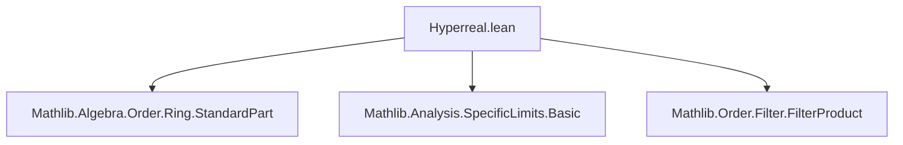
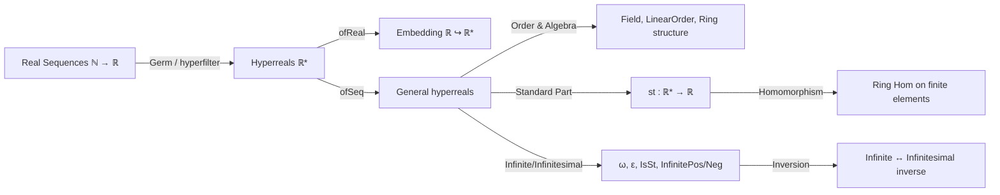

### Technical Brief: `Hyperreal.lean`

---

#### **1. Key Definitions & Theorems**

| Name | Type / Signature | Purpose |
|------|------------------|---------|
| `Hyperreal` | `Type := Germ (hyperfilter ℕ : Filter ℕ) ℝ` | Defines the hyperreals as germs of real-valued sequences modulo the hyperfilter (ultrafilter extending cofinite filter). |
| `ofReal` / `↑` | `ℝ → ℝ*` | Canonical embedding of reals into hyperreals via constant sequences. |
| `ofSeq` | `(ℕ → ℝ) → ℝ*` | Maps a real sequence to its equivalence class (germ) in `ℝ*`. |
| `omega` / `ω` | `ℝ*` | Infinite hyperreal: class of `n ↦ n`. |
| `epsilon` / `ε` | `ℝ*` | Infinitesimal: class of `n ↦ 1/n`. |
| `IsSt` | `ℝ* → ℝ → Prop` | Predicate: “`x` is infinitely close to `r`”. |
| `st` | `ℝ* → ℝ` | Standard part function: returns the unique real infinitely close to a *finite* hyperreal. |
| `Infinitesimal` | `ℝ* → Prop` | `x` is infinitesimal iff `IsSt x 0`. |
| `Infinite`, `InfinitePos`, `InfiniteNeg` | `ℝ* → Prop` | Classify infinite, positive-infinite, and negative-infinite hyperreals. |
| `tendsto_iff_forall` | `x.Tendsto (𝓝 r) ↔ (∀ s < r, s ≤ x) ∧ (∀ s > r, x ≤ s)` | Characterizes convergence in `ℝ*` via order bounds. |
| `st_add`, `st_mul`, `st_neg`, `st_inv` | `st(x + y) = st x + st y`, etc. | `st` is a ring homomorphism on finite hyperreals. |
| `infinite_iff_infinitesimal_inv` | `x ≠ 0 → (Infinite x ↔ Infinitesimal x⁻¹)` | Links infinitesimals and infinities via inversion. |
| `isSt_iff_tendsto` | `IsSt x r ↔ x.Tendsto (𝓝 r)` | Connects standard part with topological convergence. |
| `tendsto_atTop_iff`, `tendsto_atBot_iff` | `x.Tendsto atTop ↔ 0 < x ∧ mk x < 0`, etc. | Characterizes divergence to ±∞ via `mk` (the map to the Archimedean hull). |

---

#### **2. Naming Conventions**

- **Prefixes**:
  - `coe_`: properties of the embedding `ℝ → ℝ*`.
  - `ofSeq_`: properties of sequence-induced hyperreals.
  - `isSt_`, `infinitesimal_`, `infinite_`, `st_`: standard part / infinitesimal / infinite-related lemmas.
  - `archimedeanClassMk_`: properties of the canonical map `mk : ℝ* → ℝ̅` to the Archimedean hull.
- **Suffixes**:
  - `_real`: when applied to real inputs (e.g., `isSt_refl_real`, `infinitesimal_real_iff`).
  - `__iff_`: biconditional characterizations (e.g., `infinitePos_iff_infinite_and_pos`).
  - `_of_`: implications or conditions (e.g., `lt_of_st_lt`, `infinite_of_infinitesimal_inv`).
- **Notation**:
  - `ℝ*` for `Hyperreal`.
  - `ω`, `ε` for canonical infinite/infinitesimal elements.
  - `↑x` for `ofReal x`.

---

#### **3. Tactic Stack**

Frequent tactics used:
- `simp`, `rw`, `refine`, `exact`, `intro`, `cases`
- `aesop` (for order reasoning, e.g., `lt_trans`, `le_of_not_gt`)
- `ring`, `linarith`, `grw` (for algebraic simplification)
- `filter_upwards`, `eventually_and`, `eventually_mem` (for filter reasoning)
- `csSup_le`, `le_csSup`, `exists_between`, `exists_gt`, `exists_lt` (for real analysis lemmas)
- `Classical.choose_spec`, ` Classical.em`, `mt`, `not_or.mp`, `not_and.mp` (for classical reasoning)
- `tendsto.comp`, `tendsto_const_nhds`, `tendsto_atTop_atTop.mp` (for convergence arguments)

---

#### **4. Proof Logic**

- **Inductive/constructive structure**: Most proofs proceed by:
  1. Representing a hyperreal as `ofSeq f` (using `ofSeq_surjective`).
  2. Translating order/limit statements via `ofSeq_lt_ofSeq`, `ofSeq_le_ofSeq`, or `isSt_ofSeq_iff_tendsto`.
  3. Reducing to filter/eventual statements on `ℕ` (e.g., `∀ᶠ n in hyperfilter`, `eventually_atTop`).
  4. Applying real analysis lemmas (`exists_between`, `exists_gt`, `tendsto_atTop`, etc.).
  5. Reassembling via `Germ.coe_lt`, `Germ.const_le_iff`, or `stdPart_eq`.

- **Common patterns**:
  - *Standard part uniqueness*: via `IsSt.unique`.
  - *Infinite ↔ not finite*: via `exists_st_iff_not_infinite`, `infinite_iff_not_exists_st`.
  - *Infinitesimal ↔ inverse infinite*: via `infinite_iff_infinitesimal_inv`.
  - *Order convergence ↔ bounds*: via `tendsto_iff_forall`.

---

#### **5. Imports & Dependencies**

| Module | Role |
|--------|------|
| `Mathlib.Algebra.Order.Ring.StandardPart` | Defines `stdPart`, `mk`, `IsSt` in general ordered Archimedean contexts. |
| `Mathlib.Analysis.SpecificLimits.Basic` | Provides `tendsto`, `atTop`, `atBot`, `nhds`, `Ioo`-basis lemmas. |
| `Mathlib.Order.Filter.FilterProduct` | Used for product filters (e.g., in `prodMk_nhds`). |
| `Germ`, `hyperfilter`, `ArchimedeanClass` | Core infrastructure for ultraproduct construction and Archimedean comparison. |

---

#### **6. Mermaid Diagrams**

##### **Dependency Graph (Module-Level)**



##### **Overview of Theory Structure**



##### **Key Logical Flow (Example: `st_add`)**

```mermaid
flowchart LR
  A[¬Infinite x, ¬Infinite y] --> B[∃r, IsSt x r; ∃s, IsSt y r]
  B --> C[x + y finite: ¬Infinite (x + y)]
  C --> D[IsSt (x + y) (r + s)]
  D --> E[st(x + y) = r + s = st x + st y]
```

---

#### **7. Notable Design Choices**

- **Noncomputable `mk`**: The map to the Archimedean hull (`mk : ℝ* → ℝ̅`) is noncomputable due to ultrafilter choice.
- **No `deriving Inhabited`**: Post-2025-05-07 Lean change forced removal of `deriving`; `Inhabited` must be defined manually (not shown here).
- **Classical choice**: `st` uses `Classical.choose` to pick the standard part when it exists.
- **Ultraproduct via `Germ`**: Avoids explicit quotient construction; uses `Germ` over `hyperfilter`, leveraging Mathlib’s filter-based ultraproduct interface.

---

#### **8. Open Issues / Deprecations**

- Several lemmas marked `deprecated` (e.g., `lt_of_tendsto_zero_of_pos`) in favor of `archimedeanClassMk_pos_of_tendsto`.
- `set_option linter.deprecated false` used to suppress warnings during transition.

--- 

This file forms the foundational theory of hyperreal numbers in Mathlib, enabling nonstandard analysis within Lean.
