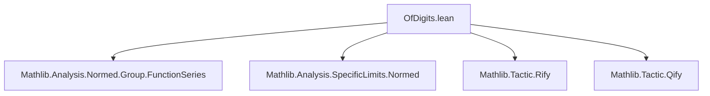
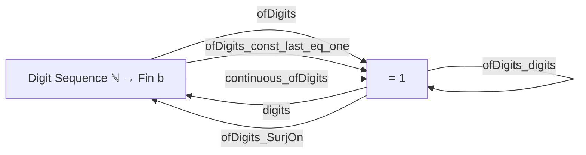

### Technical Brief: `OfDigits.lean`

---

#### **1. Key Definitions & Theorems**

| Name | Type / Signature | Purpose |
|------|------------------|---------|
| `ofDigitsTerm` | `{b : ℕ} → (ℕ → Fin b) → ℕ → ℝ` | Computes the $i$-th term $d_i / b^{i+1}$ of the positional expansion. |
| `ofDigits` | `{b : ℕ} → (ℕ → Fin b) → ℝ` | Returns the real number $\sum_{i=0}^\infty d_i / b^{i+1} = 0.d_0 d_1 d_2 \dots$ in base $b$. |
| `digits` | `x : ℝ → b : ℕ [NeZero b] → ℕ → Fin b` | Extracts the base-$b$ digit sequence of $x \in [0,1)$. |
| `ofDigits_digits` | `1 < b → x ∈ [0,1) → ofDigits (digits x b) = x` | Fundamental correctness: decoding digits recovers the original real. |
| `ofDigits_const_last_eq_one` | `ofDigits (λ _, Fin.last b) = 1` | Generalizes $0.\overline{(b-1)} = 1$ (e.g., $0.\overline{9} = 1$). |
| `ofDigits_SurjOn` | `1 < b → \text{SurjOn } \texttt{ofDigits} \text{ univ } [0,1]` | Every $x \in [0,1]$ has a base-$b$ expansion (allowing repeating representations). |
| `continuous_ofDigits` | `Continuous (@ofDigits b)` | The map from digit sequences (with product topology) to reals is continuous. |

---

#### **2. Naming Conventions**

- **Prefixes**:
  - `ofDigits*`: related to constructing reals from digit sequences.
  - `digits*`: related to extracting digit sequences from reals.
  - `ofDigitsTerm*`: auxiliary term-level lemmas.
- **Suffixes**:
  - `_nonneg`, `_le`, `_eq`, `_mul`, `_inv`, `_pow`: standard Lean mathlib conventions for inequality/equality/structure lemmas.
  - `_sum`, `_tsum`: for finite/infinite sums.
- **Special**:
  - `_const_last`: for constant maximal-digit sequences.
  - `_SurjOn`, `_continuous`: categorical properties.

---

#### **3. Tactic Stack**

Frequently used tactics:
- `simp`, `simp_rw`, `simp only`
- `grind` (custom tactic for automated simplification/grounding)
- ` positivity`, `linarith`, `field`, `ring`
- `gcongr`, `convert`, `apply`, `rw`, `exact`
- `induction`, `cases`
- `fun_prop`, `tendsto_*`, `hasSum_iff_tendsto_nat_of_summable_norm`
- `push_cast`, `norm_cast`

---

#### **4. Proof Logic**

- **Inductive structure**:
  - Proofs often proceed by induction on $n$ (e.g., `ofDigits_digits_sum_eq`, `le_sum_ofDigitsTerm_digits`).
- **Bounding arguments**:
  - Use of floor function properties (`Nat.floor_le`, `Nat.lt_floor_add_one`) to bound partial sums.
- **Summability & convergence**:
  - Comparison with geometric series (`summable_geometric_of_lt_one`) is central.
  - `HasSum`/`tendsto` arguments for limit identification (e.g., `hasSum_ofDigitsTerm_digits`).
- **Case analysis**:
  - On whether $b = 1$ or $b > 1$, or whether $x = 1$ or $x < 1$.
- **Algebraic manipulation**:
  - Heavy use of `ring`, `mul_inv_cancel`, `inv_pow`, `pow_succ'`.

---

#### **5. Imports**

| Module | Purpose |
|--------|---------|
| `Mathlib.Analysis.Normed.Group.FunctionSeries` | For `tsum`, `summable`, `HasSum`, and function series tools. |
| `Mathlib.Analysis.SpecificLimits.Normed` | For convergence lemmas (e.g., geometric series limits). |
| `Mathlib.Tactic.Rify` | To lift integer/natural arithmetic to reals. |
| `Mathlib.Tactic.Qify` | To lift rational arithmetic (used implicitly via `rify`). |

---

#### **6. Mermaid Diagrams**

##### **Dependency Graph (Module-Level)**



##### **Conceptual Overview**



##### **Proof Structure (ofDigits_digits)**

```mermaid
flowchart LR
  A[HasSum (ofDigitsTerm (digits x b)) x] -->|← Summable.hasSum_iff| B[ofDigits (digits x b) = x]
  A -->|hasSum_iff_tendsto_nat_of_summable_norm| C[Tendsto of partial sums to x]
  C -->|le_sum & sum_le| D[Pinching: x - ε ≤ Sₙ ≤ x]
  D -->|tendsto_pow_zero| E[ε → 0]
```

---

#### **7. Theory Scope**

This file formalizes the **positional representation theory** of real numbers in $[0,1]$, including:
- Construction of reals from digit sequences (`ofDigits`)
- Extraction of digits from reals (`digits`)
- Correctness (`ofDigits_digits`)
- Ambiguity resolution (e.g., $0.\overline{9} = 1$)
- Topological properties (continuity, surjectivity onto $[0,1]$)

It serves as a foundational module for further work on:
- Real number representation in computational systems
- Measure theory (e.g., Cantor space embeddings)
- Numerical analysis and approximation theory

--- 

Let me know if you'd like a formalized dependency graph (e.g., for `leanpkg`), or a proof outline in natural deduction style.
