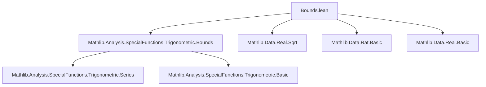

**Technical Brief: `Bounds.lean` — Formalization of π Bounds in Lean 4**

---

### 1. **Key Definitions & Theorems**

| Name | Type | Purpose |
|------|------|---------|
| `sqrtTwoAddSeries` | `ℕ → ℝ → ℝ` | Recursive sequence approximating $2\cos(\pi/2^{n+1})$, defined via $s_{n+1} = \sqrt{2 + s_n}$, $s_0 = 0$ |
| `pi_gt_sqrtTwoAddSeries` | `∀ n, 2^{n+1} * √(2 - s_n) < π` | Lower bound on π using trigonometric identity and series |
| `pi_lt_sqrtTwoAddSeries` | `∀ n, π < 2^{n+1} * √(2 - s_n) + 1/4^n` | Upper bound on π using Taylor expansion of sin and monotonicity |
| `pi_lower_bound_start` | `sqrtTwoAddSeries 0 n ≤ 2 - (a/2^{n+1})^2 ⇒ a < π` | Converts rational lower bounds on the cosine series into lower bounds on π |
| `pi_upper_bound_start` | `2 - ((a - 1/4^n)/2^{n+1})^2 ≤ sqrtTwoAddSeries 0 n ∧ 1/4^n ≤ a ⇒ π < a` | Converts rational upper bounds on the cosine series into upper bounds on π |
| `sqrtTwoAddSeries_step_up` / `step_down` | Monotonicity lemmas for rational refinements of the sequence | Enable inductive construction of rational bounds via witness sequences |
| `pi_gt_three`, `pi_lt_four`, `pi_gt_d2`, `pi_lt_d2`, … | Concrete rational bounds on π (e.g., `3 < π < 4`, `3.14 < π < 3.15`, etc.) | Verified numerical approximations of π up to 20 decimal places |
| `floor_pi_eq_three`, `ceil_pi_eq_four`, `round_pi_eq_three` | Integer rounding properties of π | Derived from previous bounds |

---

### 2. **Naming Conventions**

- **Prefixes**:
  - `pi_*`: Theorems about π bounds.
  - `sqrtTwoAddSeries_*`: Lemmas about the cosine-series sequence.
  - `step_up` / `step_down`: Inductive refinement steps for rational approximations.
- **Suffixes**:
  - `_gt`, `_lt`: Direction of inequality.
  - `_start`: Entry point for bounding arguments.
  - `_step_*`: Inductive steps in rational approximation chains.
- **Numeric suffixes**:
  - `d2`, `d4`, `d6`, `d20`: Decimal precision (2, 4, 6, 20 digits).

---

### 3. **Tactic Stack**

Frequently used tactics in proofs:

| Tactic | Role |
|--------|------|
| `norm_num1`, `norm_num` | Simplify numeric expressions, especially powers and rational arithmetic |
| `simp [sqrtTwoAddSeries]` | Expand recursive definition of `sqrtTwoAddSeries` |
| `apply pi_*_start`, `apply sqrtTwoAddSeries_step_*` | Core proof automation for bounding arguments |
| `gcongr`, `linarith`, `nlinarith` | Handle inequalities involving powers and positivity |
| `rw [← ...]`, `congr 1`, `ring`, `field_simp` | Algebraic manipulation of expressions involving powers, divisions, and products |
| `exact_mod_cast`, `mod_cast` | Cast between `ℕ`, `ℤ`, `ℝ` as needed |
| `evalTactic`, `Term.elabTermAndSynthesize` | In tactic macros (`pi_lower_bound`, `pi_upper_bound`) for metaprogramming |

---

### 4. **Proof Logic**

The logical flow for bounding π follows a **two-phase strategy**:

1. **Series Approximation Phase**:
   - Use the identity $ \sqrt{2 - s_n} = 2 \sin(\pi / 2^{n+2}) $ (via `sin_pi_over_two_pow_succ`).
   - Apply inequalities like $ x - x^3/6 < \sin x < x $ to derive bounds on $ \pi / 2^{n+2} $, then scale up.

2. **Rational Witness Refinement Phase**:
   - Given a rational witness sequence $ r_0 = 0 < r_1 < \dots < r_n < 2 $ satisfying:
     - $ \sqrt{2 + r_i} \le r_{i+1} $ (for lower bounds) or $ \ge $ (for upper bounds),
     - $ \sqrt{2 - r_n} \gtrless (a - \varepsilon)/2^{n+1} $,
   - Use `sqrtTwoAddSeries_step_up` / `step_down` to inductively show $ s_n \lessgtr r_n $,
   - Then apply `pi_lower_bound_start` / `pi_upper_bound_start` to conclude $ a < \pi $ or $ \pi < a $.

The tactic macros `pi_lower_bound` and `pi_upper_bound` automate this process: they generate a proof script that applies the lemmas in sequence, simplifies, and normalizes numerics.

---

### 5. **Imports & Dependencies**

- **Core imports**:
  ```lean
  import Mathlib.Analysis.SpecialFunctions.Trigonometric.Bounds
  ```
  Provides foundational trigonometric inequalities (e.g., `sin_lt`, `sin_gt_sub_cube`, `pi_pos`, `pi_le_four`).

- **Implicit dependencies**:
  - `Mathlib.Data.Real.Basic`, `Mathlib.Data.Real.Sqrt`, `Mathlib.Data.Rat.Basic`
  - `Mathlib.Analysis.SpecialFunctions.Trigonometric.Series` (for `sin_pi_over_two_pow_succ`)
  - `Mathlib.Tactic.NormNum`, `Mathlib.Tactic.GCongr`, `Mathlib.Tactic.Simp`, `Mathlib.Tactic.Linarith`

---

### 6. **Mermaid Diagrams**

#### **Dependency Graph (Module-Level)**



#### **Overview of π Bounds Theory Flow**

```mermaid
flowchart LR
  A[sqrtTwoAddSeries] --> B[Trig identity: sin(π/2^{n+2}) = √(2 - s_n)/2]
  B --> C[Inequalities on sin x]
  C --> D[pi_gt_sqrtTwoAddSeries]
  C --> E[pi_lt_sqrtTwoAddSeries]
  D --> F[pi_lower_bound_start]
  E --> G[pi_upper_bound_start]
  F --> H[pi_gt_three, pi_gt_d2, ...]
  G --> I[pi_lt_four, pi_lt_d2, ...]
  H & I --> J[floor_pi_eq_three, ceil_pi_eq_four, round_pi_eq_three]
```

#### **Tactic Macro Automation Flow**

```mermaid
flowchart LR
  Input[π bound goal: a < π or π < a] --> Tactic[pi_lower_bound / pi_upper_bound]
  Tactic --> ApplyStart[apply pi_*_start n]
  ApplyStart --> StepSeq[apply step_up/step_down for each r_i]
  StepSeq --> Simplify[simp [sqrtTwoAddSeries]]
  Simplify --> Normalize[norm_num1]
  Normalize --> Proof[Qed]
```

---

### 7. **Notes on Numerical Witnesses**

- The rational sequences used in theorems like `pi_gt_d20` were **automatically generated** via a Mathematica script (included in comments) that:
  - Solves for initial $r_0$ satisfying the target bound,
  - Iteratively constructs $r_i$ using Newton-like refinement,
  - Verifies monotonicity and convergence constraints.
- This reflects a **hybrid symbolic-numeric** approach: formal proofs are generated from numerically verified witnesses.

---

### 8. **Summary**

This file formalizes rigorous, high-precision bounds on $ \pi $ using a recursive trigonometric series. It combines classical analysis (Taylor bounds on sin), algebraic manipulation of radicals, and metaprogramming to automate the verification of rational approximations. The structure exemplifies Lean’s strength in **computational mathematics**, where numerical algorithms are embedded into formal proofs with full correctness guarantees.
