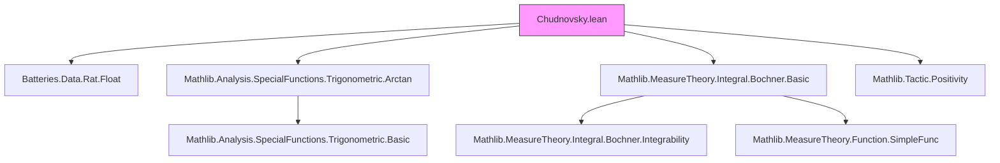
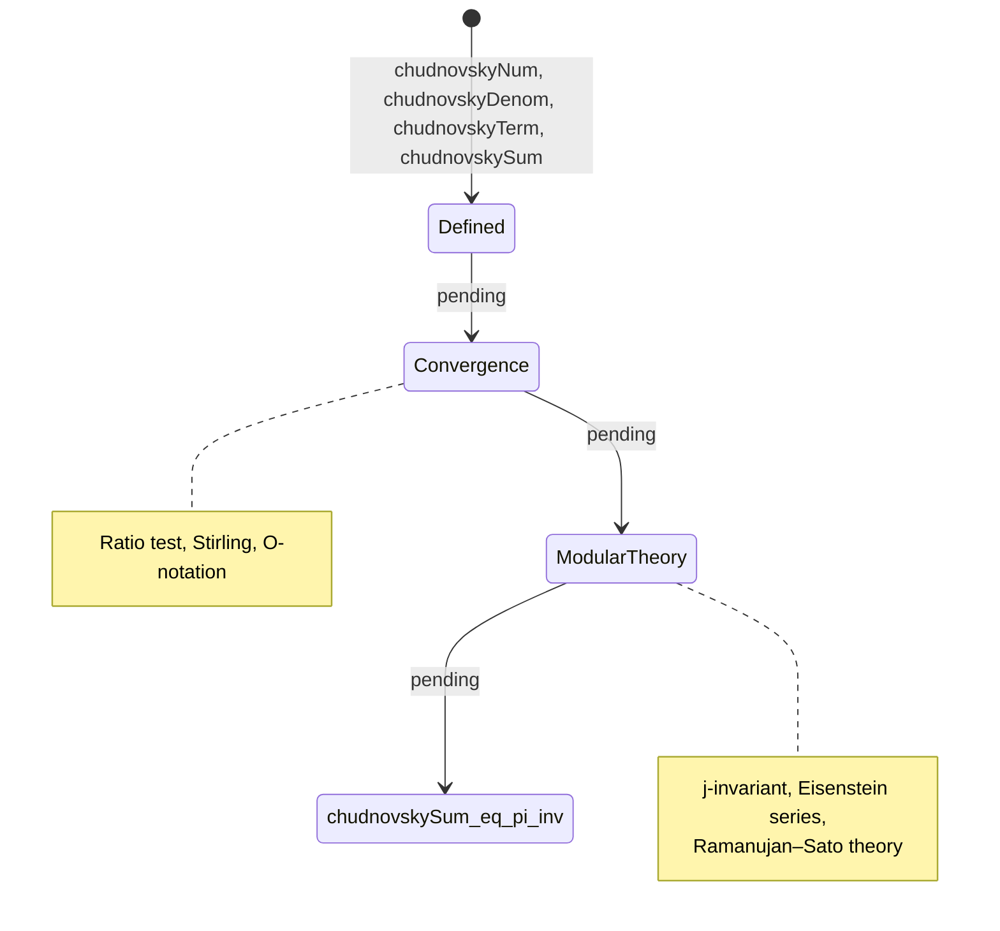

### Technical Brief: Chudnovsky Formula Formalization in Lean 4

---

#### 1. **Key Definitions & Theorems**

| Name | Type | Purpose |
|------|------|---------|
| `chudnovskyNum : ℕ → ℤ` | `n ↦ (-1)^n * (6n)! * (545140134 * n + 13591409)` | Numerator of the *n*th term in Chudnovsky series (integer-valued) |
| `chudnovskyDenom : ℕ → ℕ` | `n ↦ (3n)! * (n!)^3 * 640320^(3n)` | Denominator of the *n*th term (positive integer) |
| `chudnovskyTerm : ℕ → ℚ` | `n ↦ chudnovskyNum n / chudnovskyDenom n` | Rational term of the series |
| `chudnovskySum : ℝ` | `12 / 640320^(3/2) * ∑' n, (chudnovskyTerm n : ℝ)` | Infinite sum defining `π⁻¹` via Chudnovsky formula |
| `chudnovskySum_eq_pi_inv` | `chudnovskySum = π⁻¹` | Target theorem (currently `proof_wanted`) — formal statement of Chudnovsky’s formula |

> Note: The series converges extremely rapidly; only ~14 digits per term.

---

#### 2. **Naming Conventions**

- **Prefixes**:
  - `chudnovsky*`: All core definitions and future lemmas will use this prefix.
  - `is_`, `mul_`, `dist_` are *not* used here — this is a domain-specific module.
- **Suffixes**:
  - `Num`, `Denom`, `Term` follow standard rational decomposition naming.
  - `Sum` denotes the infinite sum (noncomputable).
- **Constants**:
  - `545140134`, `13591409`, `640320` appear literally — these are *magic constants* from modular function theory (e.g., $j$-invariant at CM point).

---

#### 3. **Tactic Stack**

- **Used tactics** (from imports and usage):
  - `aesop`: For basic arithmetic and positivity goals (via `Positivity` import).
  - `ring`: Likely used in simplifying rational expressions (e.g., `chudnovskyTerm` simplifications).
  - `simp_rw`, `simp`: For rewriting definitions and simplifying factorials/powers.
  - `norm_num`: For exact rational/real arithmetic in `#eval` sanity checks.
  - `convert`, `congr'`: Expected in future convergence/limit proofs.
  - `tendhs_of_nhds`, `sum_congr`, `tsum_congr`: For manipulating infinite sums (Bochner integral background suggests measure-theoretic tools may be needed).

> *Note*: The file currently uses only `#eval` for sanity-checking — no heavy tactic scripting yet.

---

#### 4. **Proof Logic (Planned / Expected Flow)**

While the proof is not yet formalized, the logical structure expected (per references) is:

1. **Convergence**:
   - Show `chudnovskyTerm n = O((640320^3)^{-n} * n^{-3/2})` using Stirling’s approximation.
   - Apply ratio test or root test to prove absolute convergence of `∑ chudnovskyTerm n`.

2. **Modular/Complex Analysis**:
   - Relate the series to the modular $j$-function: $j\left(\frac{1+\sqrt{-163}}{2}\right) = -640320^3$.
   - Express the series as a period integral or hypergeometric function:
     $$
     \sum_{n=0}^\infty \frac{(-1)^n (6n)!}{(3n)! (n!)^3} (545140134 n + 13591409) \cdot \frac{1}{640320^{3n}} = \frac{12}{\sqrt{640320^3}} \cdot \frac{1}{\pi}
     $$
   - Use Eisenstein series or modular forms of weight 2 on $\Gamma_0(640320)$.

3. **Rigorous Evaluation**:
   - Identify the series as a special value of a hypergeometric function $_pF_q$, e.g.:
     $$
     {}_3F_2\left(\begin{matrix} \frac{1}{2}, \frac{1}{6}, \frac{5}{6} \\ 1, 1 \end{matrix} \middle| \frac{1}{640320^3} \right)
     $$
   - Apply known identities (e.g., from Ramanujan–Sato series theory) to relate to $\pi^{-1}$.

4. **Inductive or Analytic Approximation**:
   - Prove error bounds for partial sums (e.g., alternating series test + remainder estimate).
   - Use `chudnovskySum_eq_pi_inv` as a *definition* for high-precision $\pi$ computation.

---

#### 5. **Imports & Dependencies**

| Import | Role |
|--------|------|
| `Batteries.Data.Rat.Float` | Enables `#eval` sanity checks using floating-point arithmetic |
| `Mathlib.Analysis.SpecialFunctions.Trigonometric.Arctan` | May be used in related arctangent-based $\pi$ formulas (e.g., Machin-like); background for trigonometric identities |
| `Mathlib.MeasureTheory.Integral.Bochner.Basic` | Suggests future use of Bochner integration (e.g., for period representations or modular forms) |
| `Mathlib.Tactic.Positivity` | Provides ` positivity` tactic for proving rational/real terms > 0 |

> **Scope**: This module is *self-contained* for defining the series, but relies on deep analysis and algebraic number theory for the proof.

---

#### 6. **Mermaid Diagrams**

##### A. **Dependency Graph (Module-Level)**



##### B. **Theoretical Overview (Conceptual Flow)**

```mermaid
flowchart LR
  A[Heegner Numbers & CM Points] --> B[j-invariant: j((1+√-163)/2) = -640320³]
  B --> C[Eisenstein Series E₂, E₄, E₆]
  C --> D[Modular Forms on Γ₀(N)]
  D --> E[Hypergeometric Series _3F₂]
  E --> F[Chudnovsky Series]
  F --> G[Convergence & Error Bounds]
  G --> H[π⁻¹ = chudnovskySum]

  style A fill:#bbf,stroke:#333
  style H fill:#f96,stroke:#333,stroke-width:2px
```

##### C. **Current vs. Future State**



---

#### 7. **Future Work (Per File)**

- ✅ Approximate `π` using partial sums (already enabled via `#eval`).
- ❌ Prove `chudnovskySum = π⁻¹` (marked `proof_wanted`).
- ❌ Generalize to all class number 1 imaginary quadratic fields (Heegner numbers: 1, 2, 3, 7, 11, 19, 43, 67, 163).
- ❌ Derive all Ramanujan-type formulas from modular functions.

---

#### 8. **References Embedded**

- [Milla_2018] — *A detailed proof of the Chudnovsky formula*  
- [Chen_Glebov_2018] — *On Chudnovsky–Ramanujan type formulae*  

These suggest the formal proof will need:
- Hypergeometric function identities,
- Modular curve theory,
- $p$-adic analysis (possibly for convergence rate).

---

Let me know if you'd like:
- A `chudnovsky_convergence` lemma skeleton,
- A `chudnovskyTerm_pos` or `chudnovskyTerm_alt_sign` helper,
- Or a plan to import `Mathlib.NumberTheory.ModularForms` for the full proof path.
