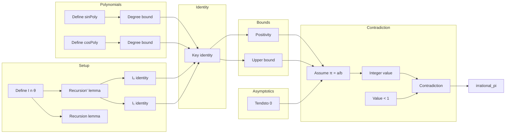

### Technical Brief: `Irrational.lean` — Proof that $ \pi $ is irrational

---

#### **1. Key Definitions & Theorems**

| Name | Type / Signature | Purpose |
|------|------------------|---------|
| `I n θ` | `ℕ → ℝ → ℝ` | Sequence of integrals: $ I_n(\theta) = \int_{-1}^1 (1 - x^2)^n \cos(x\theta)\,dx $ |
| `recursion'` | `∀ n, I (n+1) θ * θ^2 = ...` | Recursive relation for $ I_{n+1} $ in terms of $ I_n $ and $ I_{n-1} $ (with `0^n` trick) |
| `recursion` | `∀ n, I (n+2) θ * θ^2 = ...` | Standard recursion: $ I_{n+2} \theta^2 = A_n I_{n+1} - B_n I_n $ |
| `I_zero` | `I 0 θ * θ = 2 sin θ` | Base case $ I_0 $ |
| `I_one` | `I 1 θ * θ^3 = 4 sin θ - 4 θ cos θ` | Second base case $ I_1 $ |
| `sinPoly n` | `ℕ → ℤ[X]` | Integer-coefficient polynomial sequence defined recursively; satisfies $ I_n(\theta)\theta^{2n+1} = n! \cdot (\text{sinPoly}_n(\theta)\sin\theta + \text{cosPoly}_n(\theta)\cos\theta) $ |
| `cosPoly n` | `ℕ → ℤ[X]` | Companion polynomial to `sinPoly`, same role for $ \cos\theta $ |
| `sinPoly_natDegree_le` | `∀ n, (sinPoly n).natDegree ≤ n` | Degree bound for `sinPoly` |
| `cosPoly_natDegree_le` | `∀ n, (cosPoly n).natDegree ≤ n` | Degree bound for `cosPoly` |
| `sinPoly_add_cosPoly_eval` | `∀ n, I n θ * θ^{2n+1} = n! * (sinPoly n.eval₂ θ * sin θ + cosPoly n.eval₂ θ * cos θ)` | Core identity linking integrals and polynomials |
| `is_integer` | `∀ p a b k, p.natDegree ≤ k ⇒ ∃ z, p(a/b) * b^k = z` | Rational evaluation of integer-coefficient polynomials yields rational with denominator dividing $ b^k $ |
| `I_pos` | `0 < I n (π / 2)` | Positivity of the integral at $ \theta = \pi/2 $ |
| `I_le` | `I n (π / 2) ≤ 2` | Upper bound on the integral |
| `tendsto_pow_div_factorial_at_top_aux` | `Tendsto (λ n, a^{2n+1}/n!) atTop (nhds 0)` | Asymptotic decay of $ a^{2n+1}/n! $ |
| `irrational_pi` | `Irrational π` | Main theorem: $ \pi $ is irrational |

---

#### **2. Naming Conventions**

- **Prefixes**:
  - `I_`: integrals (e.g., `I_zero`, `I_one`, `I_pos`, `I_le`)
  - `sinPoly_`, `cosPoly_`: polynomial-related lemmas (`sinPoly_natDegree_le`, `cosPoly_natDegree_le`)
  - `recursion'`, `recursion`: recursion lemmas (`recursion'` is the more convenient version with `n-1`)
  - `is_integer`, `tendsto_...`: auxiliary lemmas with generic mathematical meaning
- **Suffixes**:
  - `_eval`: evaluation identities (`sinPoly_add_cosPoly_eval`)
  - `_le`, `_pos`: inequality/positivity lemmas
  - `_at_top`: filter/tendsto lemmas

---

#### **3. Tactic Stack**

Frequently used tactics in this file:

| Tactic | Usage |
|--------|-------|
| `rw` / `simp_rw` | Rewriting definitions, lemmas, and simplifying expressions |
| `ring` | Simplifying polynomial/ring expressions (especially in recursion proofs) |
| `simp` | Simplifying base cases, evaluating at endpoints, simplifying `0^n`, factorials |
| `convert_to`, `convert` | Changing goal to a more convenient form while preserving equality |
| `exact`, `refine`, `apply` | Applying lemmas with missing arguments filled via unification |
| `have`, `suffices` | Introducing intermediate claims |
| `cases n` | Induction on natural numbers |
| `push_cast` | Pushing natural/integer casts into expressions |
| `linear_combination` | Solving linear combinations of equalities (used in final step) |
| `norm_num`, `nlinarith`, `lia` | Arithmetic reasoning, positivity, inequalities |
| `filter_upwards` | Working with filters (eventually statements) |
| `fun_prop` | Proving continuity (used in integration lemmas) |

---

#### **4. Proof Logic**

The proof follows **Cartwright’s proof** of irrationality of $ \pi $, structured as:

1. **Define integral sequence** $ I_n(\theta) $.
2. **Derive recursion** for $ I_n $ using integration by parts (twice), yielding a linear recurrence.
3. **Define integer-coefficient polynomials** `sinPoly`, `cosPoly` recursively to match the recurrence.
4. **Prove degree bounds** on `sinPoly`, `cosPoly` (by induction using recursion).
5. **Show key identity**:  
   $$
   I_n(\theta) \cdot \theta^{2n+1} = n! \cdot (\text{sinPoly}_n(\theta)\sin\theta + \text{cosPoly}_n(\theta)\cos\theta)
   $$
   via induction using recursion and base cases.
6. **Bound $ I_n(\pi/2) $**:  
   - $ 0 < I_n(\pi/2) \le 2 $ (integrand is nonnegative, bounded by 1, interval length 2).
7. **Assume $ \pi/2 = a/b $ rational**, derive contradiction:
   - Multiply identity by $ b^{2n+1} $:  
     $$
     \frac{a^{2n+1}}{n!} I_n(\pi/2) = \text{integer}
     $$
     because $ \text{sinPoly}_n(a/b) \cdot b^{2n+1} \in \mathbb{Z} $ (by `is_integer` + degree bound).
   - But LHS → 0 as $ n \to \infty $ (since $ a^{2n+1}/n! \to 0 $ and $ I_n \le 2 $), so for large $ n $, it lies in $ (0,1) $, impossible for an integer.

---

#### **5. Imports & Dependencies**

| Module | Purpose |
|--------|---------|
| `Mathlib.Analysis.SpecialFunctions.Integrals.Basic` | Interval integrals, continuity, integration by parts |
| `Mathlib.Topology.Algebra.Order.Floor` | For `FloorSemiring.tendsto_pow_div_factorial_atTop` (asymptotics) |
| `Mathlib.NumberTheory.Real.Irrational` | Core definitions: `Irrational`, `not_irrational_exists_rep` |

---

#### **6. Mermaid Diagrams**

##### **Dependency Graph (High-Level)**

```mermaid
graph TD
  A[Analysis.Integrals.Basic] --> B[Define I n θ]
  C[FloorSemiring] --> D[Tendsto a^n/n! → 0]
  E[NumberTheory.Irrational] --> F[Assume π rational ⇒ π = a/b]
  B --> G[Recursion lemmas]
  G --> H[Define sinPoly, cosPoly]
  H --> I[Degree bounds]
  I --> J[Key identity sinPoly_add_cosPoly_eval]
  J --> K[Bound I n (π/2)]
  K --> L[Contradiction: integer in (0,1)]
  F & L --> M[irrational_pi]
```

##### **File Overview**



---

#### **7. Summary**

This file formalizes a clean, self-contained proof that $ \pi $ is irrational using:
- A sequence of integrals $ I_n $,
- Recurrence relations derived via integration by parts,
- Integer-coefficient polynomials encoding the recurrence,
- Degree bounds and rational evaluation properties,
- Asymptotic decay of $ a^n / n! $.

The Lean formalization is highly structured, with clear separation of:
- **auxiliary definitions** (`I`, `sinPoly`, `cosPoly`),
- **key lemmas** (`recursion`, `sinPoly_add_cosPoly_eval`, `is_integer`),
- **final contradiction** via integer bounded in $ (0,1) $.

The proof is a textbook example of *proof engineering* in Lean: leveraging recursion, induction, and algebraic structure to reduce analytic statements to arithmetic contradictions.

--- 

Let me know if you'd like a dependency graph for `Mathlib.NumberTheory.Real.Irrational` or a comparison with other irrationality proofs (e.g., $ e $, $ \sqrt{2} $).
