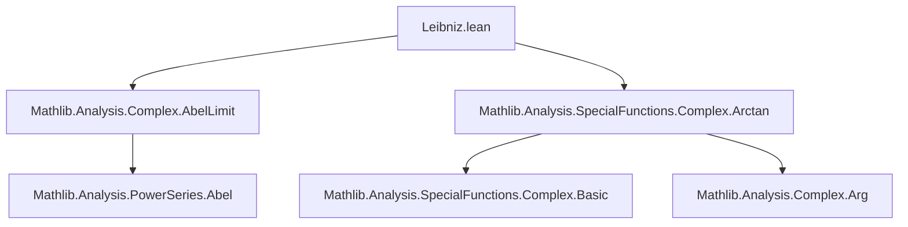
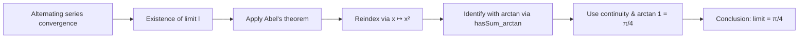

### Technical Brief: `Leibniz.lean`

---

#### **1. Key Definitions & Theorems**

| Name | Type / Signature | Purpose |
|------|------------------|---------|
| `tendsto_sum_pi_div_four` | `Tendsto (fun k => ∑ i ∈ range k, (-1 : ℝ) ^ i / (2 * i + 1)) atTop (𝓝 (π / 4))` | States that the partial sums of the alternating series of odd reciprocals converge to $ \pi / 4 $. This is the formal statement of **Leibniz’s series for $ \pi $**. |
| `abel` (local) | `tendsto_tsum_powerSeries_nhdsWithin_lt h` | Applies **Abel’s limit theorem**, linking convergence of a power series at the boundary point $ x = 1 $ to the limit of its sum as $ x \to 1^- $. |
| `q` | `Tendsto (fun x : ℝ ↦ x ^ 2) (𝓝[<] 1) (𝓝[<] 1)` | Shows squaring preserves the left-neighbourhood filter at 1, used to reindex the power series. |
| `m` | `𝓝[<] (1 : ℝ) ≤ 𝓝 1` | Inclusion of the left-neighbourhood filter into the full neighbourhood filter, used to extend limits from one-sided to full limits. |
| `hasSum_arctan` (imported) | `‖y‖ < 1 → HasSum (fun n ↦ (-1)^n * y^(2*n+1) / (2*n+1)) (arctan y)` | Provides the power series expansion of `arctan` inside the unit disk — used to identify the tsum with `arctan`. |

---

#### **2. Naming Conventions**

- **Prefixes**:
  - `tendsto_`: for convergence statements (e.g., `tendsto_sum_pi_div_four`, `tendsto_tsum_powerSeries_nhdsWithin_lt`)
  - `hasSum_`: for power series convergence (e.g., `hasSum_arctan`)
- **Suffixes**:
  - `_atTop`: for filters at infinity (e.g., `tendsto_atTop_add_const_right`)
  - `_nhdsWithin_lt`: for one-sided limits (e.g., `nhdsWithin_lt` in `tendsto_tsum_powerSeries_nhdsWithin_lt`)
- **Descriptive compound names**:
  - `antitone_iff_forall_lt.mpr`: uses equivalence to extract monotonicity condition.
  - `eventuallyEq_nhdsWithin_iff`, `Metric.eventually_nhds_iff`: standard filter-based rewriting lemmas.

---

#### **3. Tactic Stack**

| Tactic | Usage Frequency | Purpose |
|--------|-----------------|---------|
| `obtain` / `have` | High | Introduce intermediate results and witnesses (e.g., existence of limit `l`). |
| `apply` | High | Apply theorems or lemmas (e.g., `Antitone.tendzo_alternating_series_of_tendsto_zero`, `tendsto_tsum_powerSeries_nhdsWithin_lt`). |
| `rw` / `rwa` | High | Rewrite using equalities or equivalences (e.g., `mul_one`, `arctan_one`). |
| `simp_rw` | Medium | Simplify with rewriting (e.g., `simp_rw [mul_assoc, ← pow_mul, ← pow_succ, div_mul_eq_mul_div]`). |
| `gcongr` | Medium | Prove inequalities by congruence (e.g., for monotonicity of $ i \mapsto 1/(2i+1) $). |
| `linarith` | Medium | Solve linear arithmetic goals (e.g., bounding norms). |
| `norm_cast` | Medium | Normalize casts between `ℝ` and `ℂ` or `ℕ`. |
| `constructor` | Low | Split conjunctions or equivalences. |
| `use` | Medium | Provide witnesses for existential goals. |
| `rwa`, `rfl` | Low | Rewrite and apply reflexivity where needed. |

No heavy automation like `aesop` or `ring` is used — the proof is mostly **manual and filter-theoretic**, relying on analysis-specific lemmas.

---

#### **4. Proof Logic**

The proof follows this logical flow:

1. **Convergence of the alternating series**:
   - Show the terms $ a_n = 1/(2n+1) $ are positive, decreasing, and tend to 0.
   - Apply `Antitone.tendzo_alternating_series_of_tendsto_zero` to get convergence to some limit $ l $.

2. **Apply Abel’s limit theorem**:
   - Use `tendzo_tsum_powerSeries_nhdsWithin_lt` to relate the series sum at $ x = 1 $ to the limit of the power series as $ x \to 1^- $.

3. **Reindex the power series**:
   - Compose with $ x \mapsto x^2 $ to convert $ x^n $ to $ x^{2n+1} $, adjusting filters accordingly.

4. **Identify the power series with `arctan`**:
   - Use `hasSum_arctan` (from `Complex.Arctan`) to equate the tsum with `arctan(y)` for $ |y| < 1 $.
   - Show the expressions are equal on a neighborhood of 1 from the left.

5. **Evaluate the limit**:
   - Use continuity of `arctan` and the known value `arctan 1 = π / 4` to conclude the limit is $ \pi / 4 $.

The proof is **constructive in structure**, but relies on classical analysis (Abel’s theorem, continuity, filter convergence).

---

#### **5. Imports**

| Module | Purpose |
|--------|---------|
| `Mathlib.Analysis.Complex.AbelLimit` | Provides **Abel’s limit theorem** (`tendzo_tsum_powerSeries_nhdsWithin_lt`) for power series. |
| `Mathlib.Analysis.SpecialFunctions.Complex.Arctan` | Supplies the power series expansion of `arctan` (`hasSum_arctan`) and basic properties like `arctan_one`, `continuous_arctan`. |

These imports define the analytic backbone: convergence of power series near the radius of convergence and the connection between `arctan` and its series.

---

#### **6. Mermaid Diagrams**

##### **Dependency Graph (Module-Level)**

##### **Overview of Proof Structure**

---

#### **7. Theory Context**

- **Domain**: Real analysis, specifically **series convergence** and **special functions**.
- **Mathlib Module**: Part of the `Mathlib.Analysis` hierarchy, under `SpecialFunctions.Complex`.
- **Related Theories**:
  - Alternating series test (`Antitone.tendzo_alternating_series_of_tendsto_zero`)
  - Power series and radius of convergence (`Mathlib.Analysis.PowerSeries`)
  - Continuity and limits in filter-theoretic topology (`Mathlib.Topology.Basic`, `Mathlib.Topology.Basic.Filter`)
  - Trigonometric functions and their inverses (`Mathlib.Analysis.SpecialFunctions.Trigonometric`, `Arctan`)

---

#### **8. Formal Statement Summary**

> The alternating sum of reciprocals of odd natural numbers converges to $ \pi / 4 $:
> $$
> \sum_{i=0}^\infty \frac{(-1)^i}{2i+1} = \frac{\pi}{4}
> $$
> proved by extending the Maclaurin series of `arctan` to $ x = 1 $ using **Abel’s limit theorem**.

This is a canonical example of **analytic continuation at the boundary of convergence**, formalized in Lean using filter-theoretic tools.
