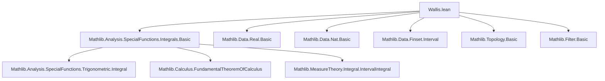
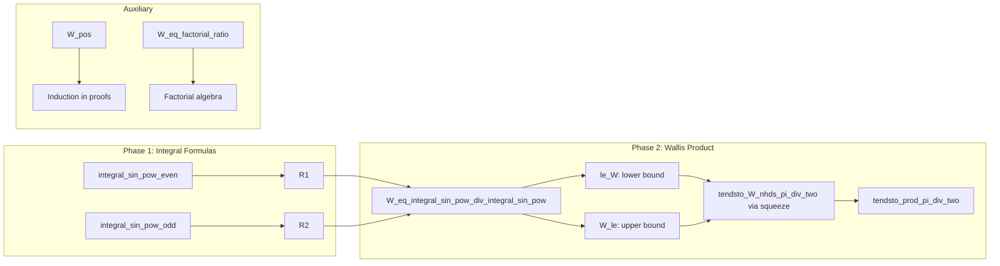

### Technical Brief: Wallis Product Formalization in Lean 4

---

#### **1. Key Definitions & Theorems**

| Name | Type / Signature | Purpose |
|------|------------------|---------|
| `W : ℕ → ℝ` | `def W (k : ℕ) : ℝ := ∏ i ∈ range k, (2 * i + 2) / (2 * i + 1) * ((2 * i + 2) / (2 * i + 3))` | Defines the *k*-th partial Wallis product. |
| `W_succ` | `W (k + 1) = W k * ((2 * k + 2) / (2 * k + 1) * ((2 * k + 2) / (2 * k + 3)))` | Recursive definition of `W`. |
| `W_pos` | `0 < W k` | Positivity of Wallis partial products. |
| `W_eq_factorial_ratio` | `W n = 2^(4*n) * n!^4 / ((2*n)!^2 * (2*n + 1))` | Closed-form expression of `W n` using factorials. |
| `W_eq_integral_sin_pow_div_integral_sin_pow` | `(π / 2)⁻¹ * W k = ∫ x in 0..π, sin x^(2*k+1) / ∫ x in 0..π, sin x^(2*k)` | Relates `W k` to ratios of integrals of powers of `sin`. |
| `W_le` | `W k ≤ π / 2` | Upper bound for `W k`. |
| `le_W` | `((2 * k + 1) / (2 * k + 2)) * (π / 2) ≤ W k` | Lower bound for `W k`. |
| `tendsto_W_nhds_pi_div_two` | `Tendsto W atTop (𝓝 <| π / 2)` | Main convergence result: `W k → π / 2`. |
| `tendsto_prod_pi_div_two` | `Tendsto (fun k => ∏ i ∈ range k, ((2 * i + 2) / (2 * i + 1) * ((2 * i + 2) / (2 * i + 3)))) atTop (𝓝 (π / 2))` | Final Wallis product theorem: convergence of the infinite product to `π / 2`. |

---

#### **2. Naming Conventions**

- **Prefixes**:
  - `W_`: All definitions and theorems about the Wallis product.
  - `integral_sin_pow_`: Integrals of powers of sine (imported from `Basic.lean`).
- **Suffixes**:
  - `_le`, `_pos`, `_succ`: Standard Lean conventions for inequalities, positivity, and successor-case lemmas.
  - `_eq_...`: Equality lemmas (e.g., `W_eq_factorial_ratio`, `W_eq_integral_sin_pow_div_integral_sin_pow`).
- **Constants**:
  - `pi_div_two`: Used for `π / 2`.
  - `two_pos`: Proof that `2 > 0`.

---

#### **3. Tactic Stack**

| Tactic | Usage Frequency | Purpose |
|--------|-----------------|---------|
| `simp_rw` | High | Rewriting with simplification, especially for algebraic manipulation of products and divisions. |
| `rw` | Very High | Rewriting using previously proven equalities (e.g., integral formulas, factorial identities). |
| `refine` / `exact` | High | Constructing proofs step-by-step, especially in induction and inequality chaining. |
| ` positivity` | Medium | Proving positivity of expressions (e.g., denominators, numerators). |
| `ring` | Medium | Simplifying polynomial/rational expressions. |
| `convert` | Medium | Matching goals up to definitional equality (e.g., in `le_W`). |
| `tendsto_of_tendsto_of_tendsto_of_le_of_le` | Low (specialized) | Applying squeeze theorem for filters (key for convergence proof). |
| `atTop`, `𝓝` | Medium | Working with filters (limits at infinity, neighborhoods). |

---

#### **4. Proof Logic**

The proof follows a **two-phase strategy**:

1. **Integral Analysis (done in `Basic.lean`)**:
   - Derive closed forms for $I_n = \int_0^\pi \sin^n x \, dx$:
     - $I_{2k} = \frac{(2k-1)!!}{(2k)!!} \cdot \pi$
     - $I_{2k+1} = \frac{(2k)!!}{(2k+1)!!}$
   - These are rational multiples of $\pi$, enabling ratio analysis.

2. **Wallis Product Convergence (here)**:
   - Define $W_k = \frac{I_{2k+1}}{I_{2k}} \cdot \frac{2}{\pi}$.
   - Prove bounds:
     - Lower: $\frac{2k+1}{2k+2} \cdot \frac{\pi}{2} \le W_k$
     - Upper: $W_k \le \frac{\pi}{2}$
   - Apply **squeeze theorem** for filters:
     - Show $\frac{2k+1}{2k+2} \to 1$, so both bounds converge to $\frac{\pi}{2}$.
     - Conclude $W_k \to \frac{\pi}{2}$.

Induction is used in:
- `W_pos`, `W_eq_factorial_ratio`, and `W_succ`.

Algebraic simplifications (via `ring`, `simp_rw`) are heavily used to manipulate factorial and rational expressions.

---

#### **5. Imports & Dependencies**

| Module | Role |
|--------|------|
| `Mathlib.Analysis.SpecialFunctions.Integrals.Basic` | Provides integral formulas for $\int_0^\pi \sin^n x\,dx$, including `integral_sin_pow`, `integral_sin_pow_even`, `integral_sin_pow_odd`, and monotonicity (`integral_sin_pow_succ_le`). |
| `Mathlib.Data.Real.Basic`, `Mathlib.Data.Nat.Basic`, `Mathlib.Data.Finset.Interval`, `Mathlib.Topology.Basic`, `Mathlib.Filter.Basic` | Implicit via `open scoped Real Topology Nat`, used for arithmetic, intervals, filters, topology. |

---

#### **6. Mermaid Diagrams**

##### **Dependency Graph (Module-Level)**

##### **Overview of Proof Structure**

---

#### **7. Summary**

This formalization of the Wallis product in Lean 4 demonstrates a clean separation of concerns:
- **Analysis** (integral behavior of $\sin^n x$) is abstracted into imported lemmas.
- **Algebra** (factorial identities, rational expressions) is handled via `ring`, `simp_rw`, and induction.
- **Topology** (convergence via filters) is used to formalize the squeeze theorem.

The final theorem `tendsto_prod_pi_div_two` is a direct restatement of the classical Wallis product:
$$
\prod_{i=1}^\infty \frac{(2i)^2}{(2i-1)(2i+1)} = \frac{\pi}{2}
$$

This is a canonical example of how Lean 4 bridges analysis, algebra, and topology in a rigorous, machine-checked proof.
