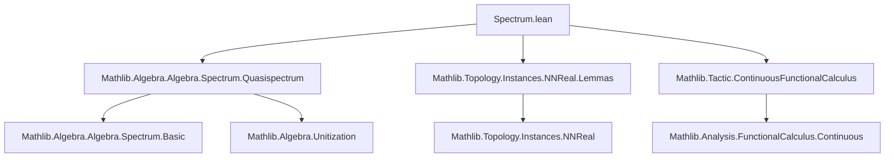
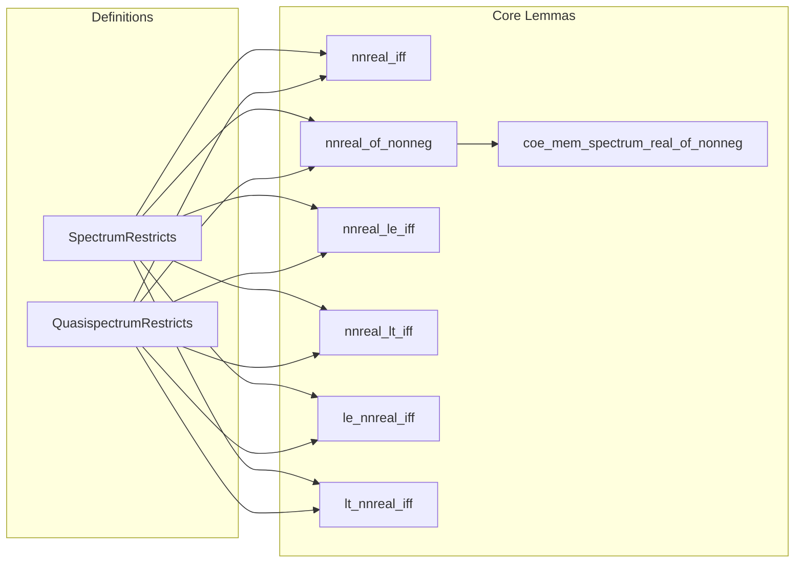

**Technical Brief: `Spectrum.lean`**

---

### 1. KEY DEFINITIONS & THEOREMS

| Name | Type / Signature | Purpose |
|------|------------------|---------|
| `SpectrumRestricts` | `SpectrumRestricts a f` | Predicate stating that the spectrum of `a` is contained in the range of `f`; used to relate spectra over different base fields/rings (e.g., `ℝ` vs `ℝ≥0`). |
| `QuasispectrumRestricts` | `QuasispectrumRestricts a f` | Analogous to `SpectrumRestricts`, but for *quasispectra* (spectra in non-unital algebras via unitization). |
| `nnreal_iff` | `SpectrumRestricts a realToNNReal ↔ ∀ x ∈ spectrum ℝ a, 0 ≤ x` | Characterizes when the spectrum of `a` is nonnegative in terms of restriction to `ℝ≥0`. |
| `nnreal_of_nonneg` | `0 ≤ a → SpectrumRestricts a realToNNReal` | If `a` is positive, its spectrum lies in `ℝ≥0`. |
| `nnreal_le_iff`, `nnreal_lt_iff`, `le_nnreal_iff`, `lt_nnreal_iff` | Equivalences between inequalities over `ℝ≥0` and `ℝ` spectra, under `SpectrumRestricts` assumption. | Allows translating order-theoretic statements about spectra from `ℝ≥0` to `ℝ` (and vice versa), crucial for positivity arguments. |
| `coe_mem_spectrum_real_of_nonneg` | `(x : ℝ) ∈ spectrum ℝ a ↔ x ∈ spectrum ℝ≥0 a` (under `0 ≤ a`) | Shows that for nonnegative `a`, inclusion of a nonnegative real `x` in the real spectrum is equivalent to inclusion in the `ℝ≥0`-spectrum. |

---

### 2. NAMING CONVENTIONS

- **Prefixes**:
  - `nnreal_`: Relates to `ℝ≥0` (nonnegative reals), e.g., `nnreal_iff`, `nnreal_of_nonneg`.
  - `le_`, `lt_`: Used for order-theoretic lemmas (`≤`, `<`).
- **Suffixes**:
  - `_iff`: Biconditional characterizations.
  - `_of_nonneg`: Implication from a positivity hypothesis.
- **Notation**:
  - `σₙ` is locally defined as `quasispectrum`.
  - `coe` refers to coercion `(x : ℝ≥0) ↦ (x : ℝ)`.

---

### 3. TACTIC STACK

- `simp`: Heavily used, especially with `← ha.algebraMap_image` to rewrite spectra under algebra map images.
- `rw`: For rewriting using equivalences like `quasispectrumRestricts_iff_spectrumRestricts_inr`.
- `exact`, `refine`: Standard for constructing proofs via `⟨...⟩` and applying lemmas.
- `cfc_tac`: Used in `coe_mem_spectrum_real_of_nonneg` to discharge continuity/functional calculus goals (from `ContinuousFunctionalCalculus`).
- `cases`, `obtain`: For extracting witnesses from existential hypotheses (e.g., `obtain ⟨x, -, rfl⟩`).

---

### 4. PROOF LOGIC

- **Structure**:
  - Proofs of biconditionals (`↔`) follow standard `⟨fun h ↦ ?, fun h ↦ ?⟩` pattern.
  - For `nnreal_iff`, one direction uses `algebraMap_image` to pull back spectrum elements; the other constructs a witness using `Real.toNNReal_coe`.
  - Inequalities (`≤`, `<`) are reduced via `simp` using `ha.algebraMap_image`, which identifies the image of the algebra map `ℝ≥0 → ℝ`.
  - Quasispectrum lemmas lift to spectrum lemmas via `Unitization.quasispectrum_eq_spectrum_inr'` and `quasispectrumRestricts_iff_spectrumRestricts_inr`.
- **Key logical flow**:
  1. Use positivity (`0 ≤ a`) to get spectrum containment in `ℝ≥0`.
  2. Use `SpectrumRestricts` to identify spectra over `ℝ` and `ℝ≥0`.
  3. Translate order-theoretic statements across the identification.

---

### 5. IMPORTS (PRIMARY DEPENDENCIES)

| Module | Role |
|--------|------|
| `Mathlib.Algebra.Algebra.Spectrum.Quasispectrum` | Core definitions: `spectrum`, `quasispectrum`, `SpectrumRestricts`, `QuasispectrumRestricts`. |
| `Mathlib.Topology.Instances.NNReal.Lemmas` | Properties of `ℝ≥0` as a topological semiring, coercion lemmas. |
| `Mathlib.Tactic.ContinuousFunctionalCalculus` | Provides `cfc_tac`, used for functional calculus reasoning (e.g., positivity of elements via continuous functional calculus). |

---

### 6. DEPENDENCY & THEORY OVERVIEW

#### Mermaid Diagram: Theory Dependencies

#### Mermaid Diagram: File Overview

---

### 7. DOMAIN & INTENDED USE

- **Domain**: Operator algebras / functional analysis, specifically spectral theory over real algebras with positivity structure.
- **Use Case**: Enables reasoning about positivity of elements via spectral containment in `ℝ≥0`, and translating between spectra over `ℝ` and `ℝ≥0`. Critical for developing continuous functional calculus and positivity-based arguments (e.g., in C*-algebras or ordered algebras).

--- 

Let me know if you'd like a formalization roadmap or a summary of related files (e.g., `SpectrumBasic.lean`, `FunctionalCalculus.lean`).
