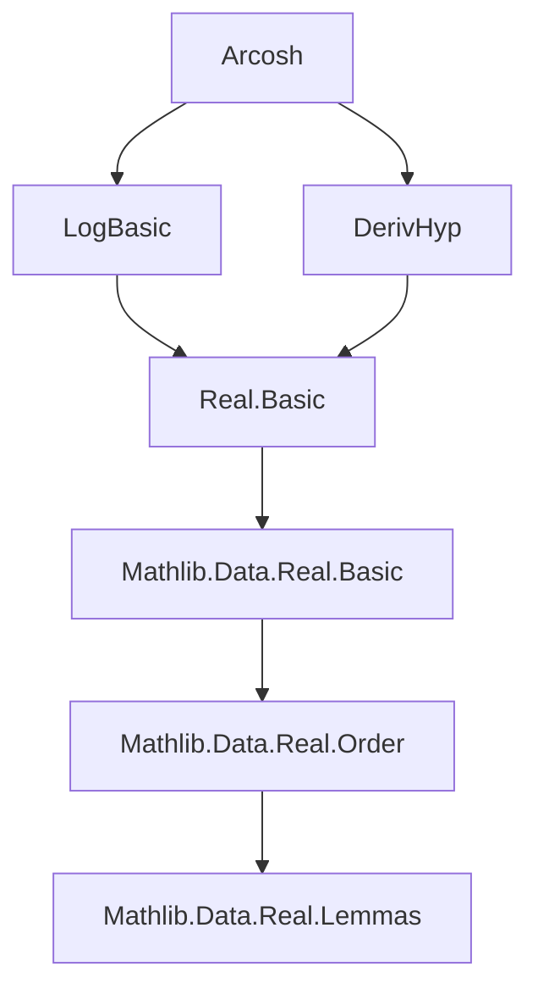
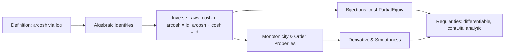
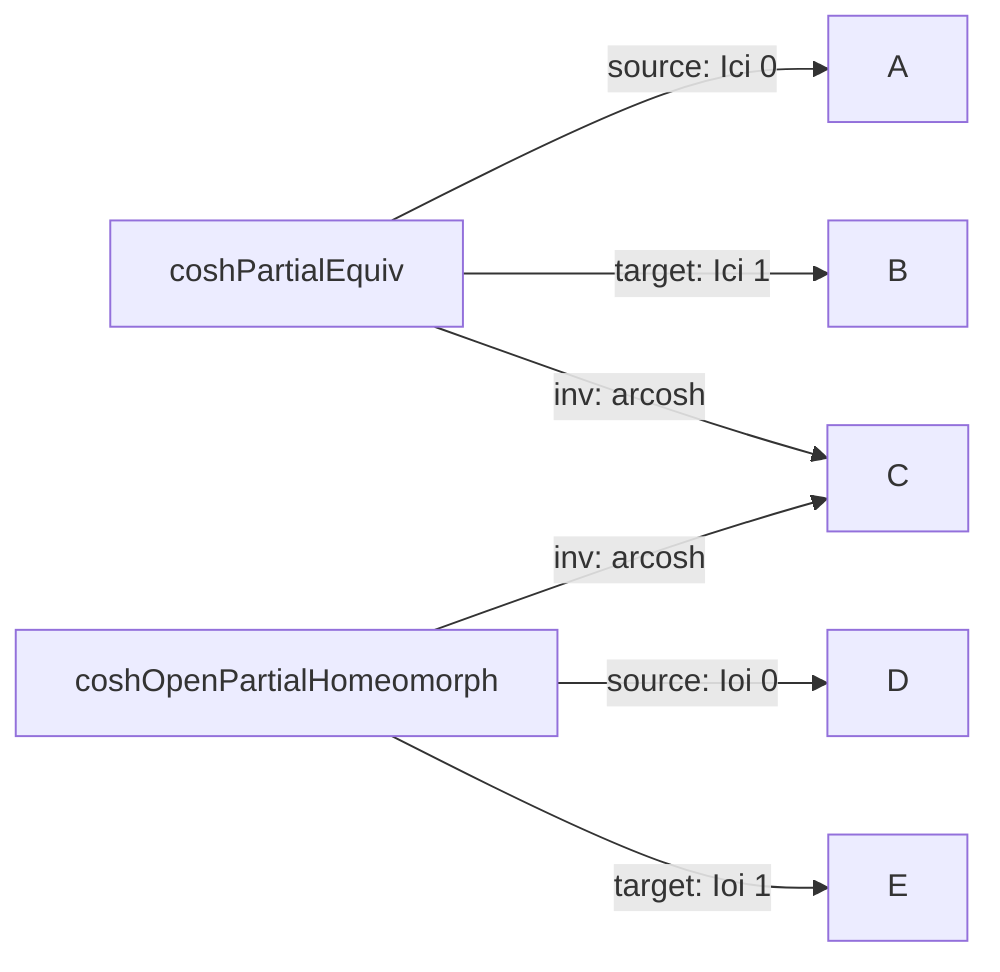

### Technical Brief: `Arcosh.lean`

---

#### **1. Key Definitions & Theorems**

| Name | Type / Signature | Purpose |
|------|------------------|---------|
| `arcosh` | `ℝ → ℝ`, `arcosh x := log (x + √(x ^ 2 - 1))` | Defines the inverse of `cosh` on $[1, \infty)$ via logarithmic expression. |
| `coshPartialEquiv` | `PartialEquiv ℝ ℝ` | Bundles `cosh` and `arcosh` as a partial equivalence between $[0, \infty)$ and $[1, \infty)$. |
| `coshOpenPartialHomeomorph` | `OpenPartialHomeomorph ℝ ℝ` | Bundles `cosh` and `arcosh` as a homeomorphism between open intervals $(0, \infty)$ and $(1, \infty)$. |
| `cosh_arcosh` | `1 ≤ x → cosh (arcosh x) = x` | Right-inverse property: `cosh ∘ arcosh = id` on $[1, \infty)$. |
| `arcosh_cosh` | `0 ≤ x → arcosh (cosh x) = x` | Left-inverse property: `arcosh ∘ cosh = id` on $[0, \infty)$. |
| `arcosh_nonneg` | `1 ≤ x → 0 ≤ arcosh x` | Ensures output of `arcosh` lies in $[0, \infty)$. |
| `arcosh_pos` | `1 < x → 0 < arcosh x` | Strict positivity on $(1, \infty)$. |
| `strictMonoOn_arcosh` | `StrictMonoOn arcosh (Ioi 0)` | Monotonicity of `arcosh` on $(0, \infty)$. |
| `hasDerivAt_arcosh`, `hasStrictDerivAt_arcosh` | `x ∈ Ioi 1 → HasDerivAt arcosh (x^2 - 1)^{-1/2} x` | Derivative formula: $(\operatorname{arcosh}' x) = 1 / \sqrt{x^2 - 1}$. |
| `differentiableOn_arcosh`, `contDiffOn_arcosh`, `analyticOn_arcosh` | Regularity properties on $(1, \infty)$ | Establishes smoothness and analyticity of `arcosh`. |
| `cosh_bijOn`, `cosh_injOn`, `cosh_surjOn` | Bijectivity/injectivity/surjectivity of `cosh` on $[0, \infty) \to [1, \infty)$ | Formalizes bijection via `coshPartialEquiv`. |
| `arcosh_bijOn`, `arcosh_injOn`, `arcosh_surjOn` | Bijectivity/injectivity/surjectivity of `arcosh` on $[1, \infty) \to [0, \infty)$ | Follows from symmetry of `coshPartialEquiv`. |

---

#### **2. Naming Conventions**

- **Prefixes**:
  - `arcosh_`, `cosh_`: Core function-related lemmas.
  - `hasDerivAt_`, `hasStrictDerivAt_`, `differentiableAt_`, `contDiffAt_`, `analyticAt_`: Regularity properties.
  - `bijOn`, `injOn`, `surjOn`: Set-theoretic properties.

- **Suffixes**:
  - `_le_iff_le`, `_lt_iff_lt`: Characterizations of monotonicity.
  - `_iff`: Biconditional equivalences (e.g., `arcosh_eq_zero_iff`).
  - `_nonneg`, `_pos`: Sign properties.

- **Notable patterns**:
  - `Ici` = closed interval $[a, \infty)$, `Ioi` = open interval $(a, \infty)$.
  - `PartialEquiv`, `OpenPartialHomeomorph`: Bundled structure types for invertible maps with domain restrictions.

---

#### **3. Tactic Stack**

| Tactic | Usage Frequency | Purpose |
|--------|------------------|---------|
| `simp` / `simp_rw` | High | Simplify definitions like `arcosh`, `cosh_eq`, `exp_log`. |
| `ring` | High | Algebraic simplifications (e.g., verifying inverses). |
| `grind` | Medium | Automated reasoning for inequalities and positivity. |
| `gcongr` | Medium | Propagate inequalities under monotone operations (e.g., `+`, `√`). |
| `apply`, `rw`, `exact` | High | Core proof steps for applying lemmas and rewriting. |
| `grind [MapsTo]` | Low | Prove `MapsTo` goals automatically. |
| `ne_of_gt`, `ne_of_lt` | Medium | Convert strict inequalities to inequalities for `ne`. |
| `mono` | Low | Apply monotonicity of continuous functions. |

---

#### **4. Proof Logic**

- **Structure**:
  1. **Definition**: `arcosh` defined via `log` and `sqrt`.
  2. **Basic algebraic identities**:
     - `exp_arcosh`, `add_sqrt_self_sq_sub_one_inv`: Key algebraic lemmas for simplifying compositions.
  3. **Inverse properties**:
     - `cosh_arcosh`, `arcosh_cosh`: Proven using `exp_log`, `sinh/cosh` identities, and algebra.
  4. **Monotonicity & order properties**:
     - `strictMonoOn_arcosh`: Proven via composition of strictly monotone functions (`log`, `id + sqrt`).
     - `arcosh_le_arcosh`, `arcosh_lt_arcosh`: Derived from monotonicity.
  5. **Regularity**:
     - Derivative via `hasStrictDerivAt_symm` from `coshOpenPartialHomeomorph`.
     - Smoothness via `contDiffAt_symm_deriv` and `contDiff_cosh`.
     - Analyticity via `contDiffAt → analyticAt`.
  6. **Bijections**:
     - All bijection/injection/surjection results follow from `coshPartialEquiv` and its symmetry.

- **Induction**: Not used.
- **Cases**: Minimal; mostly algebraic or monotonic reasoning.

---

#### **5. Imports**

| Module | Purpose |
|--------|---------|
| `Mathlib.Analysis.SpecialFunctions.Log.Basic` | `log`, `exp`, continuity, monotonicity, derivatives. |
| `Mathlib.Analysis.SpecialFunctions.Trigonometric.DerivHyp` | `cosh`, `sinh`, `tanh`, their derivatives and identities. |

---

#### **6. Mermaid Diagrams**

##### **Dependency Graph (Module-Level)**

##### **Overview of Theory Flow**

##### **Bundled Structures**

---

#### **7. Tags**

- `arcosh`, `arccosh`, `argcosh`, `acosh`
- `inverse_function`
- `hyperbolic_functions`
- `differentiable`
- `analytic`
- `monotone`
- `bijection`

---

#### **8. Summary**

This file formalizes the inverse hyperbolic cosine function `arcosh` over its natural domain $[1, \infty)$, establishing:
- Explicit definition via logarithms,
- Full inverse relationship with `cosh` on appropriate domains,
- Smoothness and analyticity on $(1, \infty)$,
- Bijective correspondence between $[0, \infty)$ and $[1, \infty)$,
- Bundled structures (`PartialEquiv`, `OpenPartialHomeomorph`) for reuse in analysis.

The proofs rely heavily on algebraic manipulation, monotonicity of elementary functions, and the inverse function theorem for `OpenPartialHomeomorph`.
