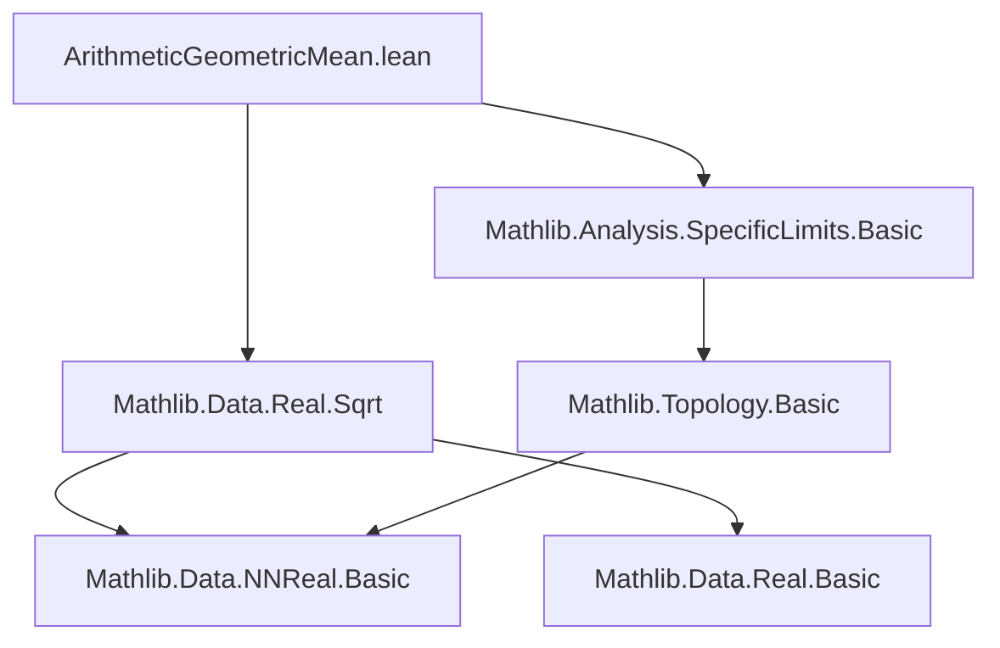
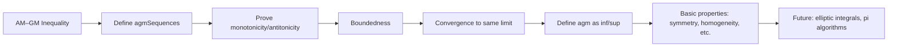

### Technical Brief: Arithmetic-Geometric Mean in `NNReal`

---

#### **1. Key Definitions & Theorems**

| Name | Type / Signature | Purpose |
|------|------------------|---------|
| `sqrt_mul_le_half_add` | `∀ x y : ℝ≥0, sqrt (x * y) ≤ (x + y) / 2` | AM–GM inequality for `NNReal`s (non-strict). |
| `sqrt_mul_lt_half_add_of_ne` | `∀ {x y : ℝ≥0}, x ≠ y → sqrt (x * y) < (x + y) / 2` | Strict AM–GM inequality when inputs differ. |
| `agmSequences` | `ℝ≥0 → ℝ≥0 → ℕ → ℝ≥0 × ℝ≥0` | Iterative pair of geometric/arithmetic means starting from `(x, y)`. |
| `agm` | `ℝ≥0 → ℝ≥0 → ℝ≥0` | Arithmetic-geometric mean: `⨅ n, (agmSequences x y n).2`. |
| `agm_eq_ciSup` | `agm x y = ⨆ n, (agmSequences x y n).1` | AGM also equals supremum of geometric means. |
| `agm_comm` | `agm x y = agm y x` | Symmetry of AGM. |
| `agm_self` | `agm x x = x` | Fixed point property. |
| `agm_zero_left` / `agm_zero_right` | `agm 0 y = 0`, `agm x 0 = 0` | Vanishing at zero. |
| `agm_pos` | `0 < x → 0 < y → 0 < agm x y` | Positivity preservation. |
| `agm_mul_distrib` | `agm (k * x) (k * y) = k * agm x y` | Homogeneity (multiplicative linearity). |
| `tendsto_agmSequences_fst_agm` / `tendsto_agmSequences_snd_agm` | Convergence of both sequences to AGM | Formalizes convergence of iterates. |
| `dist_agmSequences_fst_snd` | `dist (gₙ, aₙ) ≤ dist (x, y) / 2^(n+1)` | Quantitative contraction bound. |

---

#### **2. Naming Conventions**

- **Prefixes**:
  - `agmSequences_`: properties of the iterative sequence.
  - `agm_`: properties of the AGM function itself.
  - `le_`, `lt_`, `dist_`, `bdd_`, `tendsto_`: standard order/topological predicates.
- **Suffixes**:
  - `_le`, `_lt`: inequality direction.
  - `_of_ne`, `_of_pos`: hypotheses on inequality/positivity.
  - `_comm`, `_self`, `_zero_*`: symmetry, diagonal, zero-case.
  - `_distrib`, `_eq_*`: algebraic identities.

---

#### **3. Tactic Stack**

Frequent tactics used:
- `rw`, `simp`, `simp_rw`: rewriting and simplification (especially with `NNReal` coercions).
- `gcongr`: for monotonicity and inequality chaining.
- `wlog`: well-ordering / symmetry reduction.
- `induction`: structural induction on `ℕ`, often with `generalizing`.
- `exact`, `apply`, `convert`: proof construction.
- `nth_rw`: targeted rewriting at specific positions.
- `conv`: for equational reasoning in tactic mode.
- `tendsto_*` lemmas: convergence arguments using `squeeze_zero`, `tendsto_pow_atTop_nhds_zero`, etc.
- `ring`, `norm_num`: arithmetic normalization.

---

#### **4. Proof Logic**

- **Inductive structure**: Most proofs about `agmSequences` proceed by induction on `n`, often with `generalizing x y` to preserve generality across iterations.
- **Monotonicity/antitonicity**: Proven via `monotone_nat_of_le_succ` / `antitone_nat_of_succ_le`, using base case `le_gm_and_am_le`.
- **Convergence**: Uses:
  - Monotone convergence theorem (`tendsto_atTop_ciSup`, `tendsto_atTop_ciInf`).
  - Contraction bound (`dist_agmSequences_fst_snd`) + squeeze theorem (`squeeze_zero`) to show distance → 0.
- **Symmetry & normalization**: `wlog` reductions using `le_total` or `lt_total`, combined with `agmSequences_comm`.
- **Algebraic identities**: Proven by unfolding definitions and applying `mul_div_assoc`, `sqrt_mul`, `sqrt_sq`, etc.

---

#### **5. Imports**

- `Mathlib.Analysis.SpecificLimits.Basic`: for `tendsto`, `atTop`, `squeeze_zero`, etc.
- `Mathlib.Data.Real.Sqrt`: for `sqrt`, `sqrt_le_iff_le_sq`, `sqrt_mul`, `sqrt_sq`, etc.

---

#### **8. Mermaid Diagrams**

##### **Dependency Graph (Module-Level)**



##### **Overview of Theory Flow**



##### **Data Flow of `agmSequences`**

```mermaid
flowchart LR
  x,y[Input: x,y ∈ ℝ≥0] --> iter[Iterate: (g,a) ↦ (√(ga), (g+a)/2)]
  iter --> g_seq[Geometric means gₙ ↑]
  iter --> a_seq[Arithmetic means aₙ ↓]
  g_seq --> sup[Sup = AGM]
  a_seq --> inf[Inf = AGM]
  sup & inf --> AGM[AGM(x,y)]
```

---

This module formalizes the classical AGM construction in the nonnegative reals, emphasizing constructive convergence and algebraic structure, with a focus on `NNReal` to avoid sign complications and ensure totality of `sqrt`.
