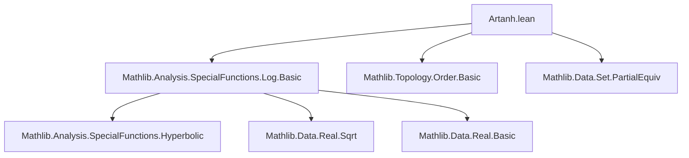

### Technical Brief: `Artanh.lean`

---

#### **1. Key Definitions & Theorems**

| Name | Type / Signature | Purpose |
|------|------------------|---------|
| `artanh` | `ℝ → ℝ` | Defined as `log √((1 + x) / (1 - x))`; serves as the inverse of `tanh` on $(-1, 1)$. |
| `tanhPartialEquiv` | `PartialEquiv ℝ ℝ` | Bundles `tanh` and `artanh` as a partial equivalence between `ℝ` (source) and `Ioo (-1) 1` (target). |
| `artanh_eq_half_log` | `x ∈ Icc (-1) 1 → artanh x = 1/2 * log ((1 + x)/(1 - x))` | Rewrites `artanh` using standard half-log formula on closed interval. |
| `exp_artanh` | `x ∈ Ioo (-1) 1 → exp (artanh x) = √((1 + x)/(1 - x))` | Exponential form of `artanh`. |
| `sinh_artanh`, `cosh_artanh` | `x ∈ Ioo (-1) 1 → sinh(artanh x) = x / √(1 - x²)`, `cosh(artanh x) = 1 / √(1 - x²)` | Hyperbolic identities for `artanh`. |
| `tanh_artanh` | `x ∈ Ioo (-1) 1 → tanh (artanh x) = x` | `artanh` is a **right inverse** of `tanh`. |
| `artanh_tanh` | `∀ x, artanh (tanh x) = x` | `artanh` is a **left inverse** of `tanh`. |
| `strictMonoOn_artanh` | `StrictMonoOn artanh (Ioo (-1) 1)` | `artanh` is strictly increasing on its domain. |
| `artanh_le_artanh_iff`, `artanh_lt_artanh_iff` | Biconditional order-preserving properties | Enables equivalence between order in domain and codomain. |
| `tanh_bijOn`, `tanh_injective`, `tanh_surjOn` | `BijOn tanh univ (Ioo (-1) 1)`, etc. | Formalizes bijectivity/injectivity/surjectivity of `tanh`. |
| `artanh_bijOn`, `artanh_injOn`, `artanh_surjOn` | `BijOn artanh (Ioo (-1) 1) univ`, etc. | Formalizes bijectivity/injectivity/surjectivity of `artanh`. |

---

#### **2. Naming Conventions**

- **Prefixes**:
  - `artanh_`: for properties of the inverse function.
  - `tanh_`: for properties of the original function.
  - `strictMonoOn_`: monotonicity lemmas.
  - `bijOn`, `injOn`, `surjOn`: standard Lean terminology for restricted bijections/injections/surjections.

- **Suffixes**:
  - `_iff`: biconditional characterizations (e.g., order, equality).
  - `_le`, `_lt`, `_eq_zero_iff`: relational or equality properties.

- **Notable patterns**:
  - `artanh_zero`, `exp_artanh`, `sinh_artanh`, `cosh_artanh`: function composition lemmas.
  - `tanhPartialEquiv`: bundled equivalence structure.

---

#### **3. Tactic Stack**

Frequently used tactics in proofs:

| Tactic | Usage |
|--------|-------|
| `grind` | Automated simplification and arithmetic reasoning (custom tactic in Mathlib, likely `simp` + `linarith` + field operations). |
| `rw` | Rewriting using previously proven equalities. |
| `simp` | Simplification (e.g., `simp [artanh]`). |
| `field_simp`, `field` | Field simplification and normalization (especially for rational expressions). |
| `apply ... <;> grind` | Sequential tactic chaining with `grind`. |
| `have := ...` | Intermediate lemma introduction. |
| `← exp_eq_exp`, `sq_eq_sq₀`, `sq_sqrt` | Algebraic and analytic rewrites. |
| `mem_Ioo.mpr` | Membership in open interval. |
| `mul_pos`, `div_pos`, `div_nonneg` | Positivity/nonnegativity of products/quotients. |

---

#### **4. Proof Logic**

- **Structure**:
  - **Definition first**: `artanh` defined via logarithmic expression.
  - **Domain restrictions**: Most lemmas assume `x ∈ Ioo (-1) 1` (open interval), or `x ∈ Icc (-1) 1` for continuity at endpoints.
  - **Key strategy**:
    - Use `exp_log`, `log_sqrt`, `sqrt_mul`, `sinh_eq`, `cosh_eq`, `tanh_eq_sinh_div_cosh` to reduce to algebraic forms.
    - Prove monotonicity via composition of strictly monotone functions (`log`, `sqrt`, rational function).
    - Use `PartialEquiv` to bundle inverse relationships and derive bijection properties automatically.
    - For `artanh_tanh`, use `exp_eq_exp` and algebraic manipulation of `tanh x = sinh x / cosh x`.

- **Induction**: Not used — all proofs are direct analytic/algebraic.

- **Case analysis**: Used in sign lemmas (`artanh_nonneg`, `artanh_nonpos`) via `by_cases`.

---

#### **5. Imports**

- `Mathlib.Analysis.SpecialFunctions.Log.Basic`: Provides `log`, `exp`, `sqrt`, and their basic properties.

- **Implicit dependencies** (via Mathlib):
  - `Mathlib.Analysis.SpecialFunctions.Hyperbolic`: for `sinh`, `cosh`, `tanh`.
  - `Mathlib.Topology.Basic`, `Mathlib.Topology.Order.Basic`: for `Ioo`, `Icc`, monotonicity, continuity.
  - `Mathlib.Data.Real.Basic`, `Mathlib.Data.Real.Sqrt`: for real arithmetic and square roots.
  - `Mathlib.Data.Set.PartialEquiv`: for `PartialEquiv` typeclass.

---

#### **6. Mermaid Diagrams**

##### **Dependency Graph (Module-Level)**



##### **Overview of Theory Flow**

```mermaid
flowchart LR
  subgraph Definitions
    D1[artanh x = log √((1+x)/(1-x))]
    D2[tanhPartialEquiv]
  end

  subgraph Core Identities
    I1[exp_artanh]
    I2[sinh_artanh]
    I3[cosh_artanh]
    I4[tanh_artanh]
    I5[artanh_tanh]
  end

  subgraph Monotonicity & Order
    M1[strictMonoOn_artanh]
    M2[artanh_le_artanh_iff]
    M3[artanh_lt_artanh_iff]
  end

  subgraph Bijection Properties
    B1[tanh_bijOn]
    B2[artanh_bijOn]
    B3[tanh_injective]
    B4[artanh_injOn]
  end

  D1 --> I1 & I2 & I3
  I1 & I2 & I3 --> I4
  D1 --> I5
  D1 --> M1
  M1 --> M2 & M3
  D2 --> B1 & B2 & B3 & B4
```

---

#### **7. Summary**

This file formalizes the inverse hyperbolic tangent function (`artanh`) over the reals, establishing its analytic definition, domain restrictions, monotonicity, and inverse relationship with `tanh`. It leverages `PartialEquiv` to elegantly package the bijection between `ℝ` and `(-1, 1)`, and proves key algebraic and order-theoretic properties using standard real analysis tools. The formalization is clean, modular, and follows Lean’s standard library conventions.
