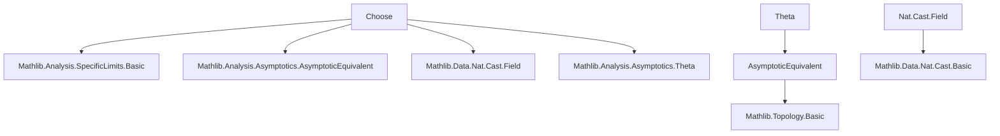
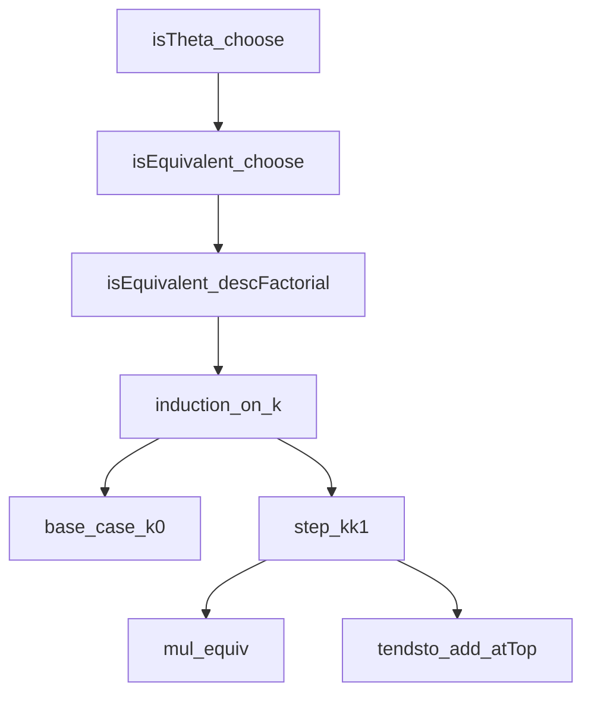

**Technical Brief: `Choose.lean`**

---

### 1. KEY DEFINITIONS & THEOREMS

| Name | Type / Signature | Purpose |
|------|------------------|---------|
| `descFactorial` | `ℕ → ℕ → ℕ` (implicit in `n.descFactorial k`) | *Descending factorial*: $ n^{\underline{k}} = n(n-1)\cdots(n-k+1) $ |
| `choose` | `ℕ → ℕ → ℕ` (implicit in `n.choose k`) | Binomial coefficient: $ \binom{n}{k} = \frac{n!}{k!(n-k)!} $ |
| `isEquivalent_descFactorial` | `∀ k : ℕ, (n ↦ n.descFactorial k) ~[atTop] (n ↦ n^k)` | Proves $ n^{\underline{k}} \sim n^k $ as $ n \to \infty $ |
| `isEquivalent_choose` | `∀ k : ℕ, (n ↦ n.choose k) ~[atTop] (n ↦ n^k / k!)` | Proves $ \binom{n}{k} \sim \frac{n^k}{k!} $ as $ n \to \infty $ |
| `isTheta_choose` | `∀ k : ℕ, (n ↦ n.choose k) = Θ[atTop] (n ↦ n^k)` | Proves $ \binom{n}{k} = \Theta(n^k) $ as $ n \to \infty $ |

---

### 2. NAMING CONVENTIONS

- **Prefixes**:
  - `isEquivalent_`: for asymptotic equivalence (`~`) statements.
  - `isTheta_`: for big-Theta (`= Θ[]`) statements.
- **Suffixes**:
  - `_descFactorial`, `_choose`: indicate the function being analyzed.
- **Mathematical terms**:
  - `descFactorial`, `choose`, `factorial`, `pow`, `div` — standard Lean/Mathlib names.

---

### 3. TACTIC STACK

| Tactic | Usage Frequency | Role |
|--------|-----------------|------|
| `induction` | High | Structural induction on `k` (natural number parameter) |
| `rw` / `simp_rw` | High | Rewriting definitions (`choose_eq_descFactorial_div_factorial`, `cast_div`, etc.) |
| `refine` | Medium | Building proofs via intermediate goals (e.g., `IsEquivalent.mul ?_ h`) |
| `simpa` | Medium | Simplifying goals using assumptions |
| `exact` | Medium | Finishing with a direct application |
| `conv_lhs => intro n` | Medium | Convolution-style rewriting on LHS of asymptotic equivalence |
| `trans_isTheta` | Low | Transitivity step for `= Θ[]` |
| `mul_comm`, `div_eq_mul_inv`, `inv_ne_zero`, `mod_cast` | Low–Medium | Rewriting and simplification of algebraic expressions over `ℝ` |

---

### 4. PROOF LOGIC

- **Inductive structure on `k`**:
  - Base case `k = 0`: trivial equivalence via `IsEquivalent.refl`.
  - Inductive step `k+1`: decompose `descFactorial (k+1)` as `n.descFactorial k * (n - k)`, apply induction hypothesis, and handle the linear term via `tendsto_add_atTop_iff_nat`.
- **For `isEquivalent_choose`**:
  - Rewrite `n.choose k` using `choose_eq_descFactorial_div_factorial`.
  - Use algebraic properties of `cast_div` and divisibility (`factorial_dvd_descFactorial`) to reduce to `isEquivalent_descFactorial`.
- **For `isTheta_choose`**:
  - Chain `~` to `Θ` via `trans_isTheta`.
  - Reduce to `n^k / k! = Θ(n^k)` using `isTheta_rfl.const_mul_left` and invertibility of `k!`.

**Logical flow summary**:
> Induction on `k` → factorize descending factorial → apply IH + limit arithmetic → lift to binomial via division → conclude big-Theta via transitivity and constant scaling.

---

### 5. IMPORTS

| Module | Role |
|--------|------|
| `Mathlib.Analysis.SpecificLimits.Basic` | Basic limit theory, including `tendsto`, `atTop`, etc. |
| `Mathlib.Analysis.Asymptotics.AsymptoticEquivalent` | Asymptotic equivalence (`~`) and its properties (`IsEquivalent.refl`, `mul`, `div`, `trans_isTheta`) |
| `Mathlib.Data.Nat.Cast.Field` | Casting naturals to fields (e.g., `ℝ`), including `mod_cast`, `cast_div`, `cast_mul` |
| `Mathlib.Analysis.Asymptotics.Theta` | Big-Theta notation (`= Θ[]`) and related lemmas (`isTheta_rfl`, `const_mul_left`) |

---

### 6. DEPENDENCY & THEORY OVERVIEW (Mermaid Diagrams)

#### **Module Dependency Graph**


#### **Theoretical Flow (within `Choose.lean`)**
```mermaid
flowchart LR
  A[descFactorial definition] --> B[isEquivalent_descFactorial]
  B --> C[choose = descFactorial / k!]
  C --> D[isEquivalent_choose]
  D --> E[isTheta_choose]
  E --> F[Asymptotic comparison: Θ(n^k)]
```

#### **Proof Dependency Tree**


---

### 7. MATHEMATICAL BACKGROUND

- **Asymptotic equivalence** (`~[atTop]`): $ f \sim g $ iff $ \lim_{n \to \infty} f(n)/g(n) = 1 $.
- **Big-Theta** (`= Θ[atTop]`): $ f = Θ(g) $ iff $ \exists c_1, c_2 > 0 $ s.t. $ c_1 g(n) \le f(n) \le c_2 g(n) $ eventually.
- **Key algebraic identity** used:
  $$
  \binom{n}{k} = \frac{n^{\underline{k}}}{k!}, \quad n^{\underline{k}} = n(n-1)\cdots(n-k+1)
  $$
- **Divisibility**: $ k! \mid n^{\underline{k}} $ for $ n \ge k $, enabling exact division in `ℝ`.

---

### 8. REMARKS

- The proofs are **uniform in `k`**, i.e., `k` is fixed but arbitrary; no uniformity over `k` is claimed.
- All functions are cast to `ℝ` for limit analysis, using `cast` lemmas from `Mathlib.Data.Nat.Cast.Field`.
- The file is a **targeted asymptotic analysis** of low-degree combinatorial functions, foundational for more complex enumerative or probabilistic estimates.

--- 

*End of Technical Brief.*
