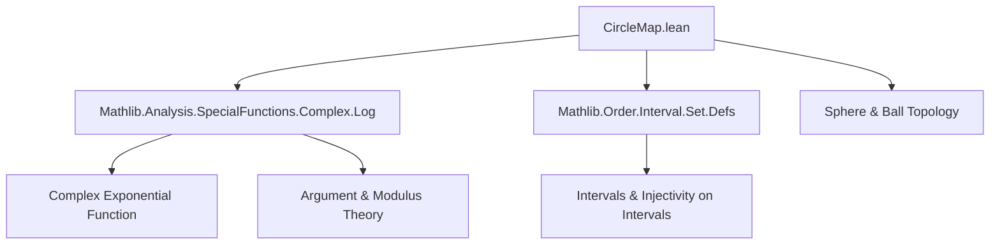

### Technical Brief: `CircleMap.lean`

---

#### **1. Key Definitions & Theorems**

| Name | Type / Signature | Purpose |
|------|------------------|---------|
| `circleMap` | `def circleMap (c : ℂ) (R : ℝ) : ℝ → ℂ` | Parametrizes a circle in ℂ with center `c` and radius `|R|` via $θ ↦ c + R e^{iθ}$. |
| `circleMap_sub_center` | `circleMap c R θ - c = circleMap 0 R θ` | Shifts center to origin; simplifies distance analysis. |
| `norm_circleMap_zero` | `‖circleMap 0 R θ‖ = |R|` | Shows points on the circle have constant modulus `|R|`. |
| `circleMap_mem_sphere'` | `circleMap c R θ ∈ sphere c |R|` | Confirms image lies on the sphere (circle) of radius `|R|`. |
| `circleMap_eq_center_iff` | `circleMap c R θ = c ↔ R = 0` | Characterizes when the map is constant (degenerate circle). |
| `circleMap_zero_radius` | `circleMap c 0 = const ℝ c` | Degenerate case: radius zero gives constant map. |
| `circleMap_zero_mul` | `(circleMap 0 R₁ θ₁) * (circleMap 0 R₂ θ₂) = circleMap 0 (R₁ * R₂) (θ₁ + θ₂)` | Encodes group homomorphism property of unit circle under multiplication. |
| `circleMap_zero_div`, `circleMap_zero_inv`, `circleMap_zero_pow`, `circleMap_zero_zpow` | Various algebraic identities for powers and inverses | Extend multiplicative structure to ℤ-powers. |
| `periodic_circleMap` | `Periodic (circleMap c R) (2 * π)` | Formalizes $2π$-periodicity of the exponential parametrization. |
| `circleMap_eq_circleMap_iff` | Equality condition in terms of integer multiples of $2πi$ | Links equality of points on the circle to angular equivalence modulo $2π$. |
| `eq_of_circleMap_eq` | Injectivity on small intervals (distance < $2π$) | Enables local invertibility of the parametrization. |
| `injOn_circleMap_of_abs_sub_le`, `injOn_circleMap_of_abs_sub_le'` | Injectivity on intervals of length ≤ $2π$ | Ensures monotonic parametrization on arcs. |

---

#### **2. Naming Conventions**

- **Prefixes**:
  - `circleMap_`: All definitions and theorems related to the map.
  - `norm_`, `mem_`, `eq_`, `ne_`, `preimage_`: Standard Lean naming for properties of sets/values.
- **Suffixes**:
  - `_zero`: Special case when center is 0.
  - `_iff`: Biconditional characterizations.
  - `_periodic`: Periodicity statements.
  - `_le`, `_lt`: Inequality-based injectivity conditions.
- **Structure**:
  - `circleMap c R θ` is the canonical term; variants like `circleMap_zero` fix `c = 0`.

---

#### **3. Tactic Stack**

Frequently used tactics in proofs:

| Tactic | Usage |
|--------|-------|
| `simp` | Simplifying definitions (`circleMap`, `exp`, `abs`, `norm`, `sphere`, `ball`), algebraic identities. |
| `ring` | Verifying algebraic equalities (e.g., `circleMap_zero_mul`). |
| `rw` | Rewriting using lemmas or definitions. |
| `simp only [...]` | Targeted simplification with explicit lemmas. |
| `norm_cast` | Handling coercion between ℤ, ℝ, ℂ. |
| `linarith` | Linear arithmetic over inequalities (e.g., interval bounds). |
| `apply eq_of_circleMap_eq ...` | Leveraging injectivity lemmas. |
| `simp (disch := positivity)` | Simplifying under positivity assumptions. |
| `cases` / `intro` | Intro/elimination for quantifiers and implications. |

---

#### **4. Proof Logic**

- **Structure of proofs**:
  - **Direct simplification**: Most basic properties (`circleMap_sub_center`, `norm_circleMap_zero`, etc.) follow by unfolding `circleMap` and applying `simp`.
  - **Algebraic manipulation**: For multiplicative properties (`circleMap_zero_mul`, `pow`, `zpow`), use `simp` + `ring` to reduce to known identities (`exp_add`, `mul_pow`, etc.).
  - **Injectivity arguments**:
    - Reduce equality of points to equality of angles modulo $2π$ via `circleMap_eq_circleMap_iff`.
    - Use bounds on angular difference (`|a - b| < 2π`) to force integer multiple $n = 0$, yielding $a = b$.
  - **Countability**: Preimage countability uses chain of preimage lemmas under injective maps (`ofReal_injective`, `mul_left_injective₀`, `preimage_cexp`).
  - **Periodicity**: Directly from `exp_periodic`.

---

#### **5. Imports**

| Module | Purpose |
|--------|---------|
| `Mathlib.Analysis.SpecialFunctions.Complex.Log` | Provides `exp`, `arg`, `cexp`, and related lemmas (e.g., `exp_periodic`, `exp_eq_exp_iff_exists_int`). |
| `Mathlib.Order.Interval.Set.Defs` | Defines interval types (`Ι`, `Ico`) used in injectivity statements. |

Other open namespaces: `Complex`, `Function`, `Metric`, `Real`.

---

#### **6. Mermaid Diagrams**

##### **Dependency Graph (Top-Level)**



##### **Overview of Theory Flow**

```mermaid
flowchart LR
  A[Definition: circleMap c R θ = c + R * exp(iθ)] --> B[Basic Properties]
  B --> C[Geometric Facts: lies on sphere, not in ball]
  B --> D[Algebraic Identities: mul, div, inv, pow, zpow]
  B --> E[Periodicity & Injectivity]
  E --> F[Local invertibility: eq_of_circleMap_eq]
  E --> G[Global structure: countability, periodicity]
  D --> H[Group homomorphism: (ℝ, +) → (ℂ*, ·) modulo 2π]
```

---

#### **7. Summary**

This module formalizes the exponential parametrization of circles in the complex plane, emphasizing:

- **Geometric correctness**: image lies exactly on the circle (`sphere c |R|`).
- **Algebraic structure**: multiplicative behavior of radius and angle.
- **Analytic properties**: periodicity, injectivity on bounded intervals, countability of preimages.
- **Foundational support**: relies on `exp`, `arg`, and interval topology from Mathlib.

It serves as a building block for further work on winding numbers, contour integration, or complex dynamics involving circular arcs.
