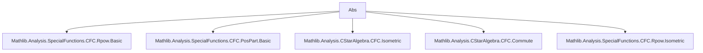

### Technical Brief: Absolute Value via Continuous Functional Calculus (`Abs.lean`)

---

#### **1. Key Definitions & Theorems**

| Name | Type / Signature | Purpose |
|------|------------------|---------|
| `CFC.abs` | `abs (a : A) := sqrt (star a * a)` | Defines absolute value using non-unital CFC; generalizes $|a| = \sqrt{a^*a}$ from $C^*$-algebras. |
| `abs_neg` | `abs (-a) = abs a` | Symmetry of absolute value under sign change. |
| `abs_nonneg` | `0 ≤ abs a` | Positivity of absolute value. |
| `abs_star` | `IsStarNormal a → abs (star a) = abs a` | Absolute value is invariant under star for normal elements. |
| `abs_zero` | `abs 0 = 0` | Absolute value of zero. |
| `abs_mul_abs` | `abs a * abs a = star a * a` | Fundamental identity linking square of absolute value to $a^*a$. |
| `Commute.cfcAbs_left` / `cfcAbs_right` / `cfcAbs_cfcAbs` | `Commute a b ∧ Commute a (star b) → Commute (abs a) b` etc. | Ensures absolute value preserves commutation under mild hypotheses. |
| `commute_abs_self` | `IsStarNormal a → Commute (abs a) a` | Normal elements commute with their absolute value. |
| `cfcAbs_mul_eq` | `abs (a * b) = abs a * abs b` under commutation assumptions | Multiplicativity of absolute value in commuting contexts. |
| `abs_nnrpow_two`, `abs_nnrpow_two_mul`, `abs_nnrpow` | Power laws for nonnegative real exponents | Extend scalar powers of absolute value via CFC. |
| `abs_of_nonneg`, `abs_of_nonpos` | `0 ≤ a → abs a = a`, `a ≤ 0 → abs a = -a` | Recovers classical piecewise definition for self-adjoint elements. |
| `abs_eq_cfcₙ_norm` | `IsSelfAdjoint a → abs a = cfcₙ (‖·‖) a` | Absolute value equals CFC of norm function for self-adjoint elements. |
| `posPart_add_negPart` | `a⁺ + a⁻ = abs a` | Decomposition of absolute value into positive/negative parts. |
| `abs_sub_self`, `abs_add_self` | `abs a - a = 2 • a⁻`, `abs a + a = 2 • a⁺` | Expresses positive/negative parts via absolute value. |
| `abs_smul` (RCLike) | `abs (r • a) = ‖r‖ • abs a` | Scalar multiplication behavior in complex/real-closed settings. |
| `abs_eq_cfcₙ_coe_norm` | `p a → abs a = cfcₙ (fun z ↦ ‖z‖) a` | Generalizes norm-based CFC representation. |
| `cfcₙ_comp_norm`, `quasispectrum_abs` | Functional calculus composition & spectrum mapping | Links spectrum of `abs a` to norm image of spectrum of `a`. |
| `abs_eq_cfc_norm` (Unital) | `IsSelfAdjoint a → abs a = cfc (‖·‖) a` | Unital version of norm-based representation. |
| `abs_one`, `abs_natCast`, `abs_intCast`, `abs_algebraMap` | Behavior on units, naturals, integers, scalars | Verifies consistency with classical absolute value on scalars. |
| `abs_sq`, `spectrum_abs` | `(abs a)^2 = star a * a`, `spectrum(abs a) = ‖·‖ '' spectrum(a)` | Square and spectral properties. |
| `abs_eq_zero_iff`, `norm_abs` (CStar) | `abs a = 0 ↔ a = 0`, `‖abs a‖ = ‖a‖` | Definiteness and norm preservation in $C^*$-algebra setting. |
| `continuous_abs` (Isometric) | `Continuous abs` | Continuity of absolute value in complete normed setting. |

---

#### **2. Naming Conventions**

- **Prefixes**:
  - `abs_`: Core absolute value lemmas (`abs_neg`, `abs_zero`, `abs_nonneg`, etc.)
  - `cfcAbs_`: Commutation lemmas involving `abs` (`cfcAbs_left`, `cfcAbs_cfcAbs`, etc.)
  - `cfcₙ_`, `cfc_`: Functional calculus lemmas (`cfcₙ_norm_sq_nonneg`, `cfc_comp_norm`, etc.)
  - `quasispectrum_`, `spectrum_`: Spectral mapping lemmas.

- **Suffixes**:
  - `_left`, `_right`: Direction of commutation.
  - `_cfcAbs`: For lemmas about `abs` in terms of `cfcₙ`/`cfc`.
  - `_nnrpow`: For nonnegative real power laws.
  - `_smul`: For scalar multiplication behavior.

- **Pattern**: `abs_*`, `cfcAbs_*`, `cfcₙ_*`, `quasispectrum_*`, `spectrum_*`.

---

#### **3. Tactic Stack**

Frequent tactics used in proofs:

| Tactic | Usage |
|--------|-------|
| `simp` | Simplification using definitional equalities and lemmas (e.g., `abs`, `sqrt`, `star`). |
| `rw` | Rewriting using equalities (especially `abs_mul_abs`, `sqrt_mul_self`, `cfcₙ_*` lemmas). |
| `conv_lhs` / `conv_rhs` | Focused rewriting in subexpressions. |
| `have` / `suffices` | Intermediate lemma introduction. |
| `trans` | Chaining equalities. |
| `congr` | Congruence closure for equality of expressions. |
| `cases` | Case analysis (e.g., on integers). |
| `lift` | Lifting to `ℝ≥0` for nonnegative reals. |
| `fun_prop`, `cfc_tac`, `cfc_cont_tac` | Custom tactics for functional calculus reasoning (e.g., verifying continuity, normality, positivity). |
| ` positivity` | Proving nonnegativity of expressions. |

---

#### **4. Proof Logic**

- **Induction**: Not used directly; proofs rely on structural properties of CFC and functional calculus.
- **Case analysis**: Used for integers (`abs_intCast`) and scalar cases.
- **Functional calculus reasoning**:
  - Reduce to known CFC lemmas (`cfcₙ_mul`, `cfcₙ_comp'`, `cfcₙ_nonneg`, `cfcₙ_map_quasispectrum`).
  - Use `cfcₙ_congr` for pointwise equality of functions.
  - Apply `sqrt_mul_self_self` or `sqrt_eq_iff` for square root simplifications.
- **Commutation arguments**:
  - Leverage `Commute.cfcₙ_nnreal` as a black box, then simplify hypotheses.
  - Use `star_comm_self'`, `star_left`, `mul_mul_mul_comm` to rearrange products.
- **Spectral arguments**:
  - Use `quasispectrum_abs`, `spectrum_abs`, and `cfcₙ_map_quasispectrum`/`cfc_map_spectrum`.
- **Scalar behavior**:
  - Reduce to algebra map properties (`algebraMap_eq_smul_one`) and known absolute value on reals/integers.

---

#### **5. Imports**

| Module | Purpose |
|--------|---------|
| `Mathlib.Analysis.SpecialFunctions.ContinuousFunctionalCalculus.Rpow.Basic` | Real powers (`rpow`) in CFC. |
| `Mathlib.Analysis.SpecialFunctions.ContinuousFunctionalCalculus.PosPart.Basic` | Positive/negative parts (`a⁺`, `a⁻`). |
| `Mathlib.Analysis.CStarAlgebra.ContinuousFunctionalCalculus.Isometric` | Isometric CFC. |
| `Mathlib.Analysis.CStarAlgebra.ContinuousFunctionalCalculus.Commute` | Commutation lemmas for CFC. |
| `Mathlib.Analysis.SpecialFunctions.ContinuousFunctionalCalculus.Rpow.Isometric` | Isometric properties of `rpow`. |

---

#### **8. Mermaid Diagrams**

##### **Dependency Graph (Module-Level)**



##### **Overview of Theory Flow**

```mermaid
graph LR
  A[NonUnitalRing A + StarRing A + TopologicalSpace A] --> B[NonUnitalContinuousFunctionalCalculus]
  B --> C[abs a := sqrt(star a * a)]
  C --> D[Basic API: abs_neg, abs_nonneg, abs_zero]
  C --> E[Commutation: cfcAbs_left/right/cfcAbs]
  C --> F[Power Laws: abs_nnrpow_*]
  C --> G[Decomposition: posPart_add_negPart, abs_sub_self]
  C --> H[Spectral Theory: quasispectrum_abs, spectrum_abs]
  C --> I[Unital Refinements: abs_one, abs_intCast]
  C --> J[CStar Ring: abs_eq_zero_iff, norm_abs]
  C --> K[Isometric: continuous_abs]
```

##### **Conceptual Hierarchy**

```mermaid
graph TD
  CStarRing --> NonUnitalNormedRing
  NonUnitalNormedRing --> NonUnitalRing
  NonUnitalRing --> StarRing
  StarRing --> TopologicalSpace
  TopologicalSpace --> ContinuousStar
  NonUnitalRing --> Module ℝ
  Module ℝ --> SMulCommClass
  SMulCommClass --> IsScalarTower
  IsScalarTower --> NonUnitalContinuousFunctionalCalculus
  NonUnitalContinuousFunctionalCalculus --> abs_def
  abs_def --> abs_API
```

---

This file formalizes the absolute value in a highly general $C^*$-algebraic context, unifying real, complex, and non-unital settings. It emphasizes *API design* (simp lemmas, grind hints) and *modularity* (reusing `cfcₙ_*`, `Commute.*` infrastructure). The heavy lifting is delegated to functional calculus machinery, with proofs structured around simplification and functional calculus congruences.
