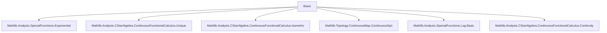
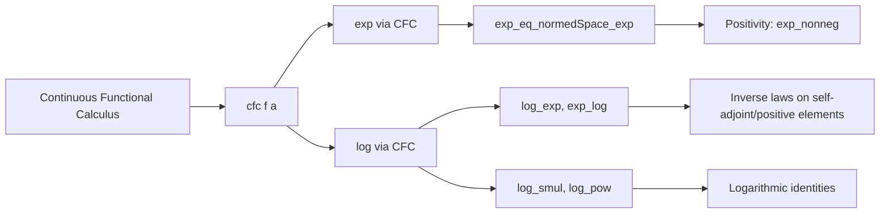
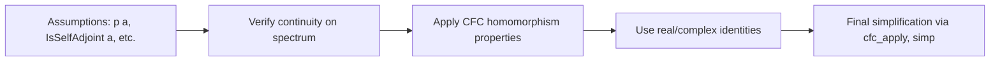

**Technical Brief: Basic.lean — Exponential and Logarithm via Continuous Functional Calculus**

---

### 1. **Key Definitions & Theorems**

| Name | Type / Signature | Purpose |
|------|------------------|---------|
| `CFC.log` | `log : A → A` (for `A` a real C*-algebra with self-adjoint CFC) | Defines the logarithm of a self-adjoint (or positive) element via `cfc Real.log`. |
| `CFC.exp_eq_normedSpace_exp` | `cfc exp a = exp a` (under `p a`) | Shows that the CFC-defined exponential coincides with the normed-space exponential (`NormedSpace.exp`) when defined. |
| `CFC.real_exp_eq_normedSpace_exp` | `cfc Real.exp a = exp a` (for `IsSelfAdjoint a`) | Specialization of `exp_eq_normedSpace_exp` to real scalars and self-adjoint elements. |
| `CFC.complex_exp_eq_normedSpace_exp` | `cfc Complex.exp a = exp a` (for `p a`) | Same as above for complex scalars. |
| `IsSelfAdjoint.exp_nonneg` | `0 ≤ exp a` (for `IsSelfAdjoint a`) | Positivity of exponential of self-adjoint element in ordered C*-algebra. |
| `log_zero` | `log 0 = 0` | Log of zero (in appropriate context) is zero. |
| `log_one` | `log 1 = 0` | Log of unit is zero. |
| `log_algebraMap` | `log (algebraMap ℝ A r) = algebraMap ℝ A (Real.log r)` | Compatibility of `log` with scalar embedding. |
| `log_smul` | `log (r • a) = Real.log r + log a` (under invertibility of spectrum & `r ≠ 0`) | Log of scalar multiple splits additively. |
| `log_pow` | `log (a ^ n) = n • log a` (under invertibility of spectrum) | Log of power scales log. |
| `log_exp` | `log (exp a) = a` (for `IsSelfAdjoint a`) | `log ∘ exp = id` on self-adjoint elements. |
| `exp_log` | `exp (log a) = a` (for `IsStrictlyPositive a`) | `exp ∘ log = id` on strictly positive elements. |
| `continuousOn_log` | `ContinuousOn log {a : A | IsSelfAdjoint a ∧ IsUnit a}` | Continuity of `log` on invertible self-adjoint elements (under stronger CFC assumptions). |

---

### 2. **Naming Conventions**

- **Prefixes**:
  - `cfc_`: functions/lemmas about the continuous functional calculus (`cfc f a`).
  - `log_`, `exp_`: API lemmas for `log`/`exp`.
  - `_root_`: opens namespace at top-level (e.g., `@[simp] lemma _root_.IsSelfAdjoint.log`).
- **Suffixes**:
  - `_eq_normedSpace_exp`: equates CFC exponential with `NormedSpace.exp`.
  - `_smul`, `_pow`, `_algebraMap`: structural properties (scalar multiplication, powers, scalars).
  - `'` (prime): variants under stronger assumptions (e.g., `log_smul'` uses `IsStrictlyPositive`).
- **Predicate-based naming**:
  - `IsSelfAdjoint`, `IsStrictlyPositive`, `IsUnit`: used in hypotheses and lemmas.

---

### 3. **Tactic Stack**

| Tactic | Usage Frequency | Purpose |
|--------|-----------------|---------|
| `cfc_tac` | High | Solves `p a` goals automatically (e.g., `IsSelfAdjoint a` or `p a`). |
| `simp_rw` | High | Rewriting with simp lemmas and definitional equalities. |
| `grind` | High | Custom simplifier for structured rewriting (used in `@[grind =]`, `@[grind =>]`). |
| `aesop` | Medium | Automated reasoning (e.g., in `log_smul'`, `exp_log`). |
| `fun_prop` | Medium | Proves continuity/Measurability goals (e.g., `ContinuousOn Real.log ...`). |
| `ext`, `congr 1`, `refine` | Medium | Structural proof steps (extensionality, congruence, refinement). |
| `conv_rhs` | Medium | Right-hand side rewriting in conv mode. |
| `have`, `let` | Medium | Intermediate lemma introduction. |

---

### 4. **Proof Logic**

- **General pattern**:
  1. **Reduction to CFC**: Use `← cfc_id` or `← cfc_apply` to rewrite target in terms of `cfc`.
  2. **Continuity verification**: Show `f` is continuous on spectrum (e.g., `Real.log` on invertible spectrum).
  3. **Functional calculus homomorphism**: Use `cfc_comp`, `cfc_const_add`, `cfc_const_mul`, `cfc_smul_id`, `cfc_pow_id`, etc., to decompose composite functions.
  4. **Apply known real/complex identities**: e.g., `Real.log_mul`, `Real.log_pow`, `Real.exp_log`.
  5. **Simplify using `cfc_apply` and definitional equalities**.

- **Induction**: Not used here (proofs are functional-calculus-based, not inductive on naturals).
- **Case analysis**: Minimal; mostly handled by `grind`/`aesop` on hypotheses like `IsSelfAdjoint`, `IsUnit`.

---

### 5. **Imports**

| Module | Role |
|--------|------|
| `Mathlib.Analysis.SpecialFunctions.Exponential` | Defines `exp`, `Real.exp`, `Complex.exp`, power-series definitions. |
| `Mathlib.Analysis.CStarAlgebra.ContinuousFunctionalCalculus.*` | Core CFC infrastructure: `cfc`, `ContinuousFunctionalCalculus` class, homomorphism properties. |
| `Mathlib.Topology.ContinuousMap.ContinuousSqrt` | Used for continuity of `sqrt`, possibly for future extensions. |
| `Mathlib.Analysis.SpecialFunctions.Log.Basic` | Defines `Real.log`, basic properties. |
| `Mathlib.Analysis.CStarAlgebra.ContinuousFunctionalCalculus.Continuity` | Continuity lemmas for `cfc`. |

---

### 6. **Mermaid Diagrams**

#### **Dependency Graph (Module-Level)**

#### **Conceptual Overview (Theory Flow)**

#### **Data Flow (Proof Strategy)**

---

### 7. **Domain-Specific AI Agent Notes**

- **Target domain**: Operator algebras, functional calculus, C*-algebras, quantum logic.
- **Key reasoning patterns**:
  - Use of `cfc` as a *functional homomorphism*.
  - Continuity + spectrum containment → valid application of `cfc`.
  - Reduction to classical real/complex analysis via `cfc_congr`.
- **Common pitfalls**:
  - Forgetting invertibility assumptions for `log`.
  - Missing `IsSelfAdjoint`/`IsStrictlyPositive` hypotheses.
  - Overlooking that `cfc` only applies to *continuous* functions on the spectrum.

--- 

Let me know if you'd like a formalized dependency graph (e.g., in Lean’s `doc` format) or a tactic-level trace of a representative proof (e.g., `log_exp`).
