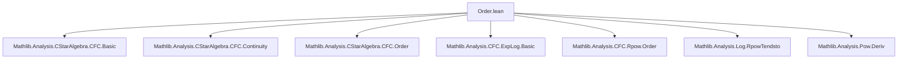

**Technical Brief: `Order.lean` — Order Properties of the Operator Logarithm**

---

### 1. KEY DEFINITIONS & THEOREMS

| Name | Type / Signature | Purpose |
|------|------------------|---------|
| `CFC.log_monotoneOn` | `MonotoneOn log {a : A | IsStrictlyPositive a}` | Proves that the operator logarithm (`CFC.log`) is monotone on strictly positive elements of a unital $C^*$-algebra. |
| `CFC.tendsto_cfc_rpow_sub_one_log` | `Tendsto (fun p ↦ cfc (fun x ↦ p⁻¹ * (x ^ p - 1)) a) (𝓝[>] 0) (𝓝 (CFC.log a))` | Shows that the operator logarithm arises as the limit $ \log(a) = \lim_{p \to 0^+} p^{-1}(a^p - 1) $, via continuous functional calculus. |
| `CFC.log_le_log` | `a ≤ b → IsStrictlyPositive a → log a ≤ log b` | Direct corollary of monotonicity: if $a \le b$ and $a > 0$, then $\log a \le \log b$. |

---

### 2. NAMING CONVENTIONS

- **Prefixes**:
  - `CFC.`: All main results belong to the *Continuous Functional Calculus* namespace.
  - `is_`, `monotoneOn`, `log_`: Standard mathematical predicate/function naming.
- **Suffixes**:
  - `_monotoneOn`: For monotonicity on a subset.
  - `_le_log`: For inequality consequences of monotonicity.
  - `_rpow_sub_one_log`: Reflects the limiting expression $p^{-1}(x^p - 1)$ converging to $\log x$.

---

### 3. TACTIC STACK

Frequently used tactics in this file:

| Tactic | Role |
|--------|------|
| `cfc_tac` | Automated tactic for proving `IsStrictlyPositive` goals in CFC context. |
| `fun_prop`, `grind` | Propagation of positivity/continuity assumptions; `grind` is a custom simplifier/automation tactic (likely from Mathlib’s `tactic.grind`). |
| `tendsto_cfc_fun`, `tendsto_pi_nhds`, `nhdsGT_basis` | Analysis of limits in functional calculus and product topology. |
| `simp +contextual`, `congr`, `gcongr` | Equality/inequality rewriting, especially under functional calculus. |
| `filter_upwards`, `mem_of_mem` | Filter-based reasoning (e.g., neighborhoods, eventually). |
| `isClosed_monotoneOn.mem_of_tendsto` | Closure argument: monotonicity preserved under uniform limits. |
| `rw [rpow_eq_cfc_real ..]` | Rewriting power functions via continuous functional calculus. |

---

### 4. PROOF LOGIC

**High-level proof strategy for `CFC.log_monotoneOn`:**

1. **Approximation**: Express $\log(a)$ as a limit:
   $$
   \log(a) = \lim_{p \to 0^+} p^{-1}(a^p - 1)
   $$
   via `tendsto_cfc_rpow_sub_one_log`, using uniform convergence on spectra.

2. **Monotonicity of approximants**: For each $p > 0$, the map $a \mapsto p^{-1}(a^p - 1)$ is monotone on strictly positive elements, because $a \mapsto a^p$ is monotone for $p \in (0,1]$ (`CFC.monotone_nnrpow`).

3. **Closure under uniform convergence**: The set of monotone functions on a domain is closed in the topology of uniform convergence on compact sets (`isClosed_monotoneOn`). Since the approximants converge uniformly on spectra (hence on the spectrum of any $a$), the limit $\log$ is monotone.

4. **Equality up to extension**: Use `MonotoneOn.congr` to relate the piecewise-defined approximants $f(p)$ to the actual log function on the domain of strictly positive elements.

**Corollary `CFC.log_le_log`** follows directly by unfolding `MonotoneOn`.

---

### 5. IMPORTS & DEPENDENCIES

| Module | Role |
|--------|------|
| `Mathlib.Analysis.CStarAlgebra.ContinuousFunctionalCalculus.Basic` | Core CFC definitions and basic properties. |
| `Mathlib.Analysis.CStarAlgebra.ContinuousFunctionalCalculus.Continuity` | Continuity of functional calculus maps. |
| `Mathlib.Analysis.CStarAlgebra.ContinuousFunctionalCalculus.Order` | Order-theoretic results for CFC (e.g., monotonicity of $x^p$). |
| `Mathlib.Analysis.SpecialFunctions.ContinuousFunctionalCalculus.ExpLog.Basic` | Definitions of `CFC.log`, `CFC.exp`. |
| `Mathlib.Analysis.SpecialFunctions.ContinuousFunctionalCalculus.Rpow.Order` | Monotonicity of $x^p$ for $p \ge 0$. |
| `Mathlib.Analysis.SpecialFunctions.Log.RpowTendsto` | Real analysis limit: $\lim_{p \to 0^+} p^{-1}(x^p - 1) = \log x$. |
| `Mathlib.Analysis.Pow.Deriv` | Differentiability of power functions (used implicitly for smoothness/propagation). |

**Assumptions on `A`**:
- `[CStarAlgebra A]`: $A$ is a unital $C^*$-algebra over $\mathbb{C}$ (or $\mathbb{R}$? — likely $\mathbb{C}$, but order structure suggests real scalars).
- `[PartialOrder A]`: $A$ carries a partial order (e.g., $a \le b \iff b - a$ is positive).
- `[StarOrderedRing A]`: Compatibility of order with ring and $*$-structure (e.g., $a^* = a$, $a \ge 0 \Rightarrow a^2 \ge 0$).

---

### 6. MERMAID DIAGRAMS

#### Dependency Graph (File-Level)



#### Theoretical Flow (Conceptual)

```mermaid
graph LR
  RealLimit[Real: lim_{p→0+} p⁻¹(xᵖ−1) = log x]
  CFCCont[CFC continuity]
  MonotoneRpow[x ↦ xᵖ monotone for p ∈ (0,1]]
  UniformConv[Uniform convergence on spectra]
  MonotoneLimit[Monotone functions closed under uniform limits]
  
  RealLimit --> UniformConv
  MonotoneRpow --> UniformConv
  UniformConv --> CFCCont
  CFCCont --> MonotoneLimit
  MonotoneLimit --> log_monotoneOn
```

---

### 7. SUMMARY

This file establishes the **operator monotonicity** of the logarithm in a unital $C^*$-algebra with compatible order structure. The proof leverages:
- A classical real-analytic limit representation of $\log$,
- Continuity and monotonicity properties of the continuous functional calculus,
- Topological closure of monotone functions under uniform convergence.

It sets the foundation for future work on **operator concavity** of $\log$ and **operator convexity** of $x \mapsto x \log x$, as indicated in the `TODO`.

--- 

Let me know if you'd like a formalized dependency graph (e.g., Lean module graph) or a proof-term extraction.
