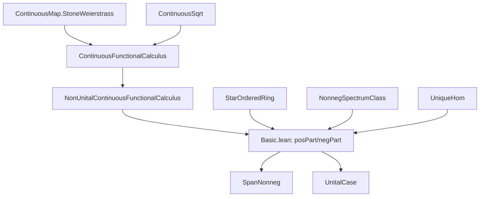
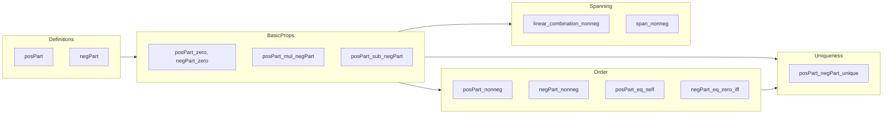

**Technical Brief: `Basic.lean` — Positive/Negative Parts in C*-Algebras**

---

### 1. KEY DEFINITIONS & THEOREMS

| Name | Type / Signature | Purpose |
|------|------------------|---------|
| `posPart` | `NonUnitalRing A → A` (instance) | Defines the *positive part* $a^+$ of a selfadjoint element $a$ via continuous functional calculus: $a^+ = \mathrm{cfc}_\mathbb{R}(x \mapsto x^+, \sigma(a))$. |
| `negPart` | `NonUnitalRing A → A` (instance) | Defines the *negative part* $a^-$ via $a^- = \mathrm{cfc}_\mathbb{R}(x \mapsto x^-, \sigma(a))$. |
| `posPart_def`, `negPart_def` | `a⁺ = cfcₙ (·⁺) a`, `a⁻ = cfcₙ (·⁻) a` | Definitional lemmas for `posPart`/`negPart`. |
| `posPart_zero`, `negPart_zero` | `(0 : A)⁺ = 0`, `(0 : A)⁻ = 0` | Vanishing at zero. |
| `posPart_mul_negPart`, `negPart_mul_posPart` | `a⁺ * a⁻ = 0`, `a⁻ * a⁺ = 0` | Orthogonality of positive and negative parts. |
| `posPart_sub_negPart` | `a⁺ - a⁻ = a` (for `IsSelfAdjoint a`) | Decomposition of selfadjoint element into positive/negative parts. |
| `posPart_neg`, `negPart_neg` | `(-a)⁺ = a⁻`, `(-a)⁻ = a⁺` | Behavior under sign change. |
| `posPart_smul`, `negPart_smul` | `(r • a)⁺ = r • a⁺` for $r \ge 0$ | Compatibility with nonnegative scalar multiplication. |
| `posPart_smul_of_nonpos`, `negPart_smul_of_nonpos` | `(r • a)⁺ = -r • a⁻` for $r \le 0$ | Scalar multiplication for arbitrary real scalars. |
| `posPart_nonneg`, `negPart_nonneg` | `0 ≤ a⁺`, `0 ≤ a⁻` | Positivity of parts (in ordered C*-algebra). |
| `posPart_eq_self` | `a⁺ = a ↔ 0 ≤ a` | Characterization of nonnegative elements via positive part. |
| `negPart_eq_zero_iff` | `a⁻ = 0 ↔ 0 ≤ a` | Vanishing of negative part characterizes nonnegativity. |
| `negPart_eq_neg` | `a⁻ = -a ↔ a ≤ 0` | Negative part equals negation iff element is nonpositive. |
| `posPart_eq_zero_iff` | `a⁺ = 0 ↔ a ≤ 0` | Vanishing of positive part characterizes nonpositivity. |
| `posPart_negPart_unique` | `a = b - c ∧ b*c = 0 ∧ 0 ≤ b, c ⇒ a⁺ = b ∧ a⁻ = c` | **Uniqueness**: the positive/negative parts are the *only* such decomposition. |
| `posPart_one`, `negPart_one` | `(1)⁺ = 1`, `(1)⁻ = 0` | Values in unital C*-algebra. |
| `posPart_algebraMap`, `negPart_algebraMap` | `(r)⁺ = r⁺`, `(r)⁻ = r⁻` for $r \in \mathbb{R}$ | Compatibility with algebra map from $\mathbb{R}$. |
| `CStarAlgebra.linear_combination_nonneg` | $x = (\Re x)^+ - (\Re x)^- + i((\Im x)^+ - (\Im x)^-)$ | Every element is a complex linear combination of nonnegative elements. |
| `CStarAlgebra.span_nonneg` | `Submodule.span ℂ {a | 0 ≤ a} = ⊤` | **Spanning theorem**: nonnegative elements span the algebra. |

---

### 2. NAMING CONVENTIONS

- **Prefixes**:
  - `posPart_`, `negPart_`: for lemmas about positive/negative parts.
  - `smul_`: for scalar multiplication behavior.
  - `algebraMap_`: for compatibility with `algebraMap ℝ A`.
  - `nonneg`, `nonpos`: for inequalities (`0 ≤ a`, `a ≤ 0`).
- **Suffixes**:
  - `_def`: definitional lemmas.
  - `_zero`: behavior at zero.
  - `_neg`: behavior under negation.
  - `_smul`, `_smul_of_nonneg`, `_smul_of_nonpos`: scalar multiplication cases.
  - `_iff`: biconditional characterizations.
  - `_unique`: uniqueness results.
- **Function names**:
  - `posPart`, `negPart`: instances.
  - `cfcₙ`: nonunital continuous functional calculus.
  - `quasispectrum` (noted as `σₙ`): spectrum in nonunital setting.

---

### 3. TACTIC STACK

- **Core tactics**: `rw`, `simp`, `conv`, `refine`, `congr!`, `nth_rw`, `simpa`, `grind`, `aesop`.
- **Specialized**:
  - `cfc_tac`: custom tactic for discharging `IsSelfAdjoint` goals (e.g., `by cfc_tac`).
  - `fun_prop`: for proving continuity of functions in functional calculus.
  - `lift x to σₙ ℝ _ using hx`: for lifting elements to spectrum.
- **Proof style**:
  - Heavy use of `cfcₙ_congr` to reduce to pointwise identities on spectra.
  - Case analysis on `IsSelfAdjoint a` (via `by_cases ha`).
  - Use of `quasispectrum_nonneg_of_nonneg` to relate positivity of elements to spectrum.

---

### 4. PROOF LOGIC

- **Structure**:
  1. **Definition** via continuous functional calculus (`cfcₙ`).
  2. **Basic properties** (zero, orthogonality, decomposition).
  3. **Sign behavior** (`posPart_neg`, `negPart_neg`).
  4. **Scalar multiplication** (split into $r \ge 0$, $r \le 0$).
  5. **Order-theoretic properties** (positivity, inequalities, characterizations).
  6. **Uniqueness proof** (`posPart_negPart_unique`):
     - Construct a compact spectrum $s = \sigma(a) \cup \sigma(b) \cup \sigma(-c)$.
     - Define two star homomorphisms: $f \mapsto \mathrm{cfc}(f, a)$ and $f \mapsto \mathrm{cfc}(f, b) + \mathrm{cfc}(f, -c)$.
     - Show they agree on identity function (since $a = b - c$).
     - Use uniqueness of continuous functional calculus (star homomorphisms agreeing on `id` are equal).
     - Evaluate at $f = (·)^+$ to get $b = a^+$, then $c = a^-$.
  7. **Spanning result** (`span_nonneg`): uses linear combination identity and positivity of parts.

- **Key logical pattern**:
  > *Reduce functional calculus identities to pointwise algebraic identities on the spectrum, using continuity and the universal property of $C_0(\sigma(a))$.*

---

### 5. IMPORTS & DEPENDENCIES

| Module | Purpose |
|--------|---------|
| `Mathlib.Analysis.CStarAlgebra.ContinuousFunctionalCalculus.Unique` | Uniqueness of continuous functional calculus (star homomorphisms). |
| `Mathlib.Topology.ContinuousMap.ContinuousSqrt` | Continuity of square root (used implicitly via functional calculus). |
| `Mathlib.Topology.ContinuousMap.StoneWeierstrass` | Stone–Weierstrass for $C_0(X)$, foundational for functional calculus. |
| `Mathlib.Algebra.Star.Module`, `StarRing`, `StarOrderedRing` | Algebraic structure for *-algebras and ordered *-algebras. |
| `Mathlib.Analysis.CStarAlgebra.*` (via `NonUnitalContinuousFunctionalCalculus`) | General C*-algebra theory, especially nonunital functional calculus. |
| `Mathlib.Order.NonnegSpectrumClass` | Spectrum containment for nonnegative elements. |

---

### 6. MERMAID DIAGRAMS

#### Dependency Graph (High-Level)

#### Overview of `Basic.lean`

---

### 7. THEORY CONTEXT

This file sits at the intersection of:
- **C*-algebra theory** (nonunital, ordered, *-algebraic),
- **Functional calculus** (continuous, nonunital),
- **Ordered algebra** (nonnegative elements, positivity),
- **Spectral theory** (quasispectrum, spectrum containment).

It provides the foundational *algebraic* and *order-theoretic* calculus for selfadjoint elements, enabling decomposition and approximation arguments (e.g., `span_nonneg` is used to extend results from positive to arbitrary elements).

The uniqueness lemma (`posPart_negPart_unique`) is critical for *characterizing* positive/negative parts without reference to functional calculus — essential for categorical or model-theoretic applications.

--- 

Let me know if you'd like a formalized dependency graph (e.g., `leanpkg` tree), or a proof sketch of `posPart_negPart_unique` in natural deduction style.
