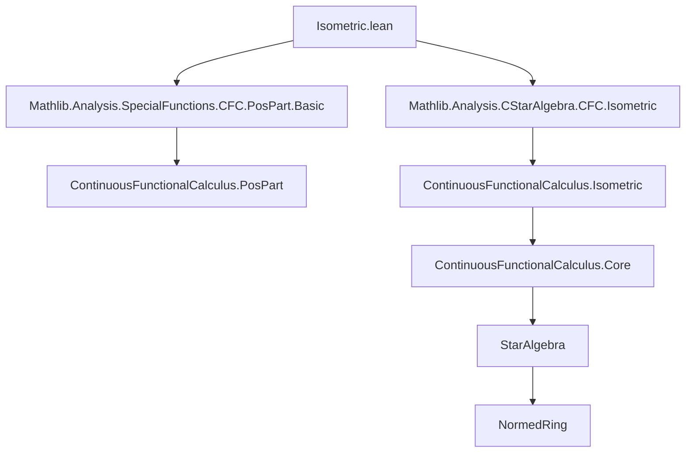

**Technical Brief: `Isometric.lean`**

---

### 1. KEY DEFINITIONS & THEOREMS

| Name | Type / Signature | Purpose |
|------|------------------|---------|
| `CFC.posPart` (`a⁺`) | `A → A` | Positive part of an element in a non-unital C*-algebra, defined via continuous functional calculus as `posPart ∘ spec(a)` where `posPart(x) = max(x, 0)`. |
| `CFC.negPart` (`a⁻`) | `A → A` | Negative part: `a⁻ = (-a)⁺`. |
| `CStarAlgebra.norm_posPart_le` | `∀ a : A, ‖a⁺‖ ≤ ‖a‖` | Norm of positive part is bounded by norm of element. |
| `CStarAlgebra.norm_negPart_le` | `∀ a : A, ‖a⁻‖ ≤ ‖a‖` | Norm of negative part is bounded by norm of element. |
| `IsSelfAdjoint.norm_eq_max_norm_posPart_negPart` | `∀ a : A, IsSelfAdjoint a → ‖a‖ = max ‖a⁺‖ ‖a⁻‖` | For self-adjoint elements, the norm equals the maximum of norms of positive and negative parts. |

*Note:* `cfcₙ` denotes the continuous functional calculus map (non-unital version), and `posPart_def`, `negPart_neg` are definitional lemmas used in proofs.

---

### 2. NAMING CONVENTIONS

- **Prefixes:**
  - `norm_`: for norm-related inequalities/equalities.
  - `posPart_`, `negPart_`: for properties of positive/negative parts.
- **Suffixes:**
  - `_le`: inequality (`≤`).
  - `_eq_…`: equality statement.
- **Contextual prefixes:**
  - `CStarAlgebra.`: namespace for C*-algebra results.
  - `IsSelfAdjoint.`: restricted to self-adjoint elements.

---

### 3. TACTIC STACK

| Tactic | Usage |
|--------|-------|
| `by_cases` / `obtain (h | h)` / `obtain (hx' | hx')` | Case analysis on order (`x ≤ 0` vs `x > 0`, or `0 ≤ x` vs `x ≤ 0`). |
| `simp` / `simp only [...]` | Simplify using definitions (`posPart_def`, `max_eq_left`, `max_eq_right`, `norm_neg`). |
| `refine` / `apply` / `exact` | Construct proofs stepwise, often using lemmas like `norm_cfcₙ_le`, `norm_apply_le_norm_cfcₙ`. |
| `rw [...]` | Rewrite using equalities (e.g., `posPart_eq_self`, `negPart_eq_neg`, `norm_neg`). |
| `conv_lhs => rw [...]` | Rewrite left-hand side in convolution-style proof. |
| `max_le` / `le_max_of_le_left` / `le_max_of_le_right` | Handle max inequalities. |
| `le_antisymm` | Prove equality by double inequality. |
| `by cfc_tac` | Custom tactic (likely from `ContinuousFunctionalCalculus`) to discharge `IsSelfAdjoint` goals or simplify functional calculus expressions. |

---

### 4. PROOF LOGIC

- **Structure:** Proofs rely heavily on:
  1. **Case analysis** on the sign of a real number (via `le_or_gt`, `le_total`).
  2. **Functional calculus properties**: especially `norm_cfcₙ_le`, `norm_cfcₙ_le_iff`, and evaluation on spectrum.
  3. **Definitional simplifications** using `posPart_def`, `negPart_neg`, and known identities like `posPart_eq_self` for nonnegative inputs.
  4. **Norm monotonicity**: `norm_apply_le_norm_cfcₙ` links pointwise evaluation to operator norm.
- **Typical flow**:
  - Reduce to spectrum via `cfcₙ`.
  - Split spectrum into positive/negative parts.
  - Use scalar inequalities (`max`, `abs`) to bound or equate norms.
  - For equality, apply `le_antisymm` with two inequalities: one from `max_le`, one from spectral analysis.

---

### 5. IMPORTS & DEPENDENCIES

| Import | Role |
|--------|------|
| `Mathlib.Analysis.SpecialFunctions.ContinuousFunctionalCalculus.PosPart.Basic` | Defines `posPart`, basic algebraic/analytic properties. |
| `Mathlib.Analysis.CStarAlgebra.ContinuousFunctionalCalculus.Isometric` | Provides `NonUnitalIsometricContinuousFunctionalCalculus`, the core isometric functional calculus setup for non-unital C*-algebras. |

**Contextual assumptions** (via `variable`):
- `A`: a non-unital normed ring, normed ℝ-space, with compatible scalar multiplication and star ring structure.
- `IsSelfAdjoint`: predicate for self-adjoint elements.
- `NonUnitalIsometricContinuousFunctionalCalculus ℝ A IsSelfAdjoint`: ensures existence of isometric functional calculus for self-adjoint elements.

---

### 6. MERMAID DIAGRAMS

#### Dependency Graph (Module-Level)



#### Overview of Theoretical Flow

```mermaid
flowchart LR
  A[NonUnital Normed *-Ring A] -->|Assumes| B[Isometric CFC for SelfAdjoint]
  B --> C[Define a⁺, a⁻ via posPart/negPart]
  C --> D[Prove norm bounds: ‖a⁺‖ ≤ ‖a‖, ‖a⁻‖ ≤ ‖a‖]
  D --> E[For self-adjoint a: ‖a‖ = max(‖a⁺‖, ‖a⁻‖)]
  E --> F[Applications: decomposition, positivity, spectral theory]
```

---

### 7. SUMMARY

This file formalizes foundational norm estimates for the positive and negative parts of elements in a non-unital C*-algebra, leveraging the isometric continuous functional calculus. It establishes that the norm of a self-adjoint element is exactly the maximum of the norms of its positive and negative parts — a key step in spectral decomposition and positivity analysis. The proofs are highly structured, relying on case analysis over the real line and functional calculus properties.
