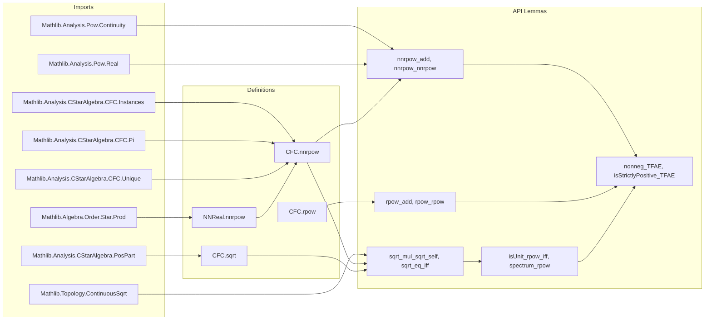

Here is the **technical metadata** extracted from `Basic.lean`, structured as requested:

---

### 1. KEY DEFINITIONS & THEOREMS

| Name | Type / Signature | Purpose |
|------|------------------|---------|
| `NNReal.nnrpow` | `ℝ≥0 → ℝ≥0 → ℝ≥0` | Nonnegative real power on `ℝ≥0`, defined as coercion of `Real.rpow`. Used to build operator powers. |
| `CFC.nnrpow` | `A → ℝ≥0 → A` | Real nonnegative powers in a non-unital C*-algebra via non-unital CFC: `cfcₙ (nnrpow · y) a`. |
| `CFC.rpow` | `A → ℝ → A` | Real powers in a unital C*-algebra via unital CFC: `cfc (fun x ↦ x ^ y) a`. |
| `CFC.sqrt` | `A → A` | Square root via non-unital CFC: `cfcₙ NNReal.sqrt`. |
| `Pow A ℝ≥0` instance | `Pow A ℝ≥0` | Low-priority instance enabling `a ^ x` for `x : ℝ≥0`, via `nnrpow`. |
| `Pow A ℝ` instance | `Pow A ℝ` | Low-priority instance enabling `a ^ y` for `y : ℝ`, via `rpow`. |
| `nnrpow_add` | `a ^ (x + y) = a ^ x * a ^ y` | Additive law for exponents (requires `x, y > 0`). |
| `nnrpow_nnrpow` | `(a ^ x) ^ y = a ^ (x * y)` | Exponentiation associativity (non-unital, requires `0 ≤ a`, `IsTopologicalRing`, `T2Space`). |
| `sqrt_mul_sqrt_self` | `sqrt a * sqrt a = a` | Fundamental property of square root (for `0 ≤ a`). |
| `sqrt_eq_iff` | `sqrt a = b ↔ b * b = a` | Characterization of square root as unique nonnegative square root. |
| `rpow_add` | `a ^ (x + y) = a ^ x * a ^ y` | Additive exponent law for unital CFC (requires `a` invertible). |
| `rpow_rpow` | `(a ^ x) ^ y = a ^ (x * y)` | Exponent associativity for unital CFC (requires `a` invertible, `x ≠ 0`). |
| `isUnit_rpow_iff` | `IsUnit (a ^ y) ↔ IsUnit a` | Invertibility preserved under real powers (for `y ≠ 0`). |
| `CStarAlgebra.nonneg_TFAE` | 9 equivalent conditions | TFAE for nonnegative elements in a unital C*-algebra (e.g., `0 ≤ a`, `a = b*b`, `a = a⁺`, etc.). |
| `CStarAlgebra.isStrictlyPositive_TFAE` | 9 equivalent conditions | TFAE for strictly positive elements (e.g., `IsStrictlyPositive a`, `a = b*b` with `b` invertible, spectrum `> 0`). |

---

### 2. NAMING CONVENTIONS

- **Prefixes**:
  - `nnrpow`: *nonnegative* real power (domain/codomain `ℝ≥0` or nonnegative operators).
  - `rpow`: *real* power (exponent in `ℝ`, unital CFC).
  - `sqrt`: square root (non-unital CFC).
  - `cfc`, `cfcₙ`: unital / non-unital continuous functional calculus.
  - `map_prod`, `map_pi`: behavior under product / pi types.

- **Suffixes**:
  - `_def`: definition simplification lemma (`rfl`).
  - `_eq_pow`: equating definition with `^` notation.
  - `_nonneg`: nonnegativity of result.
  - `_map_prod`, `_map_pi`: behavior under product/dependent product.
  - `_iff`: equivalence characterizations (e.g., `sqrt_eq_iff`, `isUnit_rpow_iff`).
  - `_TFAE`: "The Following Are Equivalent" theorems.

- **Pattern**:
  - `lemma [name]_[condition]`: e.g., `nnrpow_add`, `rpow_neg`, `sqrt_mul_self`.
  - `@[simp]` lemmas often match core algebraic identities (`nnrpow_zero`, `rpow_one`, `sqrt_zero`, etc.).

---

### 3. TACTIC STACK

Frequently used tactics in proofs:

| Tactic | Purpose |
|--------|---------|
| `simp` | Simplify using `@[simp]` lemmas, definitions (`rpow_def`, `nnrpow_def`, `sqrt_eq_nnrpow`, etc.). |
| `rw` | Rewrite using equalities (especially `cfcₙ_mul`, `cfc_congr`, `cfc_id`, `cfc_comp`). |
| `congr!` / `congr` | Congruence reasoning for functional calculus (e.g., `cfc_congr`, `cfcₙ_congr`). |
| `cfc_tac` | Custom tactic for verifying spectral predicates (`0 ≤ a`, `IsSelfAdjoint`, etc.). |
| `grind` / `grind_pattern` | Custom automation for spectral reasoning and predicate propagation. |
| `aesop` | Safe automation for propositional reasoning, especially in `IsUnit`, `IsStrictlyPositive` contexts. |
| `tfae_have`, `tfae_finish` | Prove equivalence of multiple statements. |
| `by_cases`, `obtain (rfl | hx)` | Case analysis on equality or positivity. |
| `ext` | Extensionality for functions (e.g., in `pi` lemmas). |
| `mod_cast` | Coerce between `ℝ≥0` and `ℝ` when needed. |

---

### 4. PROOF LOGIC

**General proof strategy**:

1. **Unfold definitions** (`nnrpow_def`, `rpow_def`, `sqrt`) to reduce to continuous functional calculus (`cfc`, `cfcₙ`).
2. **Reduce to scalar case** via:
   - `cfc_congr` / `cfcₙ_congr`: show equality of functions on spectrum.
   - `cfc_mul`, `cfc_comp`, `cfc_id`, `cfc_const_one`: algebraic properties of CFC.
3. **Spectral reasoning**:
   - Use `grind`/`cfc_tac` to deduce `0 ≤ a`, `IsSelfAdjoint a`, or `0 ∉ spectrum a`.
   - Apply lemmas like `cfcₙ_predicate`, `cfc_predicate`, `spectrum_rpow`.
4. **Case analysis** on:
   - Positivity (`eq_zero_or_pos x`), invertibility (`isUnit a`), or zero exponents.
   - Trivial vs nontrivial algebra (`nontriviality A`).
5. **Leverage known scalar identities**:
   - `Real.rpow_add`, `Real.rpow_mul`, `Real.sqrt_eq_rpow`, etc., via `mod_cast`.
6. **Product/π-type behavior**:
   - Use `cfc_map_prod`, `cfc_map_pi` to reduce to componentwise reasoning.
7. **Equivalence proofs**:
   - Use `tfae_have` + `tfae_finish` for multi-way equivalences.

---

### 5. IMPORTS (PRIMARY DEPENDENCIES)

| Module | Role |
|--------|------|
| `Mathlib.Algebra.Order.Star.Prod` | Product order, star, and ring structure. |
| `Mathlib.Analysis.CStarAlgebra.ContinuousFunctionalCalculus.Instances` | Basic CFC infrastructure (unital/non-unital). |
| `Mathlib.Analysis.CStarAlgebra.ContinuousFunctionalCalculus.Pi` | CFC for π-types. |
| `Mathlib.Analysis.CStarAlgebra.ContinuousFunctionalCalculus.Unique` | Uniqueness of CFC. |
| `Mathlib.Analysis.SpecialFunctions.ContinuousFunctionalCalculus.PosPart.Basic` | Positive part (`a⁺`) and spectral decomposition. |
| `Mathlib.Analysis.SpecialFunctions.Pow.Continuity` | Continuity of `rpow`. |
| `Mathlib.Analysis.SpecialFunctions.Pow.Real` | Basic properties of `Real.rpow`. |
| `Mathlib.Topology.ContinuousMap.ContinuousSqrt` | Continuity of `sqrt` on `ℝ≥0`. |

---

### 6. MERMAID DIAGRAMS

#### Dependency Graph (High-Level Theory)

```mermaid
graph TD
  A[Continuous Functional Calculus] --> B[Unital CFC]
  A --> C[Non-unital CFC]
  B --> D[CFC.rpow]
  C --> E[CFC.nnrpow]
  C --> F[CFC.sqrt]
  D --> G[Pow A ℝ]
  E --> H[Pow A ℝ≥0]
  F --> I[Square root API]
  G & H --> J[Operator powers in C*-algebras]
  I --> K[Nonnegative elements (TFAE)]
  J --> K
  K --> L[Strictly positive elements (TFAE)]
```

#### File Overview



--- 

Let me know if you'd like a formal dependency graph (e.g., in `graphviz` or `dot` format), or a breakdown of the `grind`/`cfc_tac` automation.
