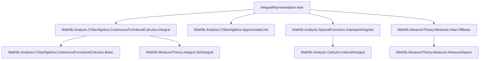

### Technical Brief: `IntegralRepresentation.lean`

---

#### **1. Key Definitions & Theorems**

| Name | Type / Signature | Purpose |
|------|------------------|---------|
| `rpowIntegrand₀₁` | `ℝ → ℝ → ℝ → ℝ` | Integrand for representing $x \mapsto x^p$ on $(0,1)$: $t^p (t^{-1} - (t+x)^{-1})$ |
| `rpow_eq_const_mul_integral` | `p ∈ Ioo 0 1 → x ≥ 0 → x^p = C⁻¹ ∫ t, rpowIntegrand₀₁ p t x` | Explicit integral representation of real $rpow$ with constant $C = \int t, rpowIntegrand₀₁ p t 1$ |
| `exists_measure_rpow_eq_integral` | `p ∈ Ioo 0 1 → ∃ μ, ∀ x ≥ 0, x^p = ∫ t, rpowIntegrand₀₁ p t x ∂μ` | Existence of a measure $\mu$ such that $x^p = \int rpowIntegrand₀₁(p,t,x)\,d\mu(t)$ |
| `cfcₙ_rpowIntegrand₀₁_eq_cfcₙ_rpowIntegrand₀₁_one` | `p ∈ Ioo 0 1 → t > 0 → a ≥ 0 → cfcₙ (rpowIntegrand₀₁ p t) a = t^{p-1} • cfcₙ (rpowIntegrand₀₁ p 1) (t⁻¹ • a)` | Functional calculus identity linking $cfcₙ$ of integrand at $t$ and $1$ |
| `exists_measure_nnrpow_eq_integral_cfcₙ_rpowIntegrand₀₁` | `p ∈ Ioo 0 1 → ∃ μ, ∀ a ≥ 0, a^p = ∫ t, cfcₙ (rpowIntegrand₀₁ p t) a ∂μ` | Integral representation of $a \mapsto a^p$ via CFC in non-unital $C^*$-algebras |
| `monotoneOn_cfcₙ_rpowIntegrand₀₁` | `p ∈ Ioo 0 1 → t > 0 → MonotoneOn (cfcₙ (rpowIntegrand₀₁ p t)) (Ici 0)` | Operator monotonicity of integrand under CFC |

---

#### **2. Naming Conventions**

- **Prefixes**:
  - `rpowIntegrand₀₁`: indicates integrand for $rpow$ on interval $(0,1)$.
  - `cfcₙ`: non-unital continuous functional calculus.
- **Suffixes**:
  - `_zero_right`, `_zero_left`: behavior at $x=0$ or $t=0$.
  - `_eq_pow_div`, `_eqOn_pow_div`: equivalence to rational form $t^{p-1} x/(t+x)$.
  - `_apply_mul`, `_apply_mul'`, `_apply_mul_eqOn_Ici`: scaling properties under $t \mapsto x \cdot t$.
  - `_le_...`, `_ge_...`: upper/lower bounds used for integrability and monotonicity.
  - `_monotoneOn`, `_continuousOn`, `_aestronglyMeasurable`: regularity properties.
  - `_integral`, `_measure`: measure-theoretic constructions.

---

#### **3. Tactic Stack**

Frequently used tactics:
- `simp`, `rw`, `congr`, `gcongr`, `linarith`, ` positivity`
- `fun_prop`, `grind`, `aesop`, `ring`, `field_simp`, `div_eq_mul_inv`, `mul_assoc`
- `setIntegral_congr_fun`, `integral_smul_const`, `integral_comp_mul_deriv_Ioi`
- `measurableSet_...`, `aestronglyMeasurable`, `continuousOn`, `integrableOn`
- `csSup`, `bddAbove`, `quasispectrum`, `isSelfAdjoint`

---

#### **4. Proof Logic**

- **Structure**:
  1. **Algebraic simplifications**: rewrite integrand using field arithmetic.
  2. **Regularity lemmas**: continuity, measurability, integrability (via comparison with $t^{p-1}$ near 0 and $t^{p-2}$ at $\infty$).
  3. **Change of variables**: use substitution $t \mapsto x \cdot t$ to relate $\int rpowIntegrand₀₁(p,t,x)$ to $x^p \cdot \int rpowIntegrand₀₁(p,t,1)$.
  4. **Measure construction**: define $\mu = C \cdot \text{volume}$, where $C = (\int rpowIntegrand₀₁(p,t,1))^{-1}$.
  5. **Functional calculus lifting**:
     - Use `cfcₙ_rpowIntegrand₀₁_eq_cfcₙ_rpowIntegrand₀₁_one` to reduce to scalar case.
     - Apply dominated convergence / integrability criteria for operator-valued integrals.
  6. **Operator monotonicity**: via pointwise monotonicity of integrand and positivity of measure.

- **Induction**: Not used.
- **Cases**: on $x = 0$ or $t = 0$, or $p \in Ioo 0 1$ bounds.
- **Substitution**: key in `integral_rpowIntegrand₀₁_eq_rpow_mul_const`.

---

#### **5. Imports**

| Module | Purpose |
|--------|---------|
| `Mathlib.Analysis.CStarAlgebra.ContinuousFunctionalCalculus.Integral` | CFC and integration theory |
| `Mathlib.Analysis.CStarAlgebra.ApproximateUnit` | Approximate units (used in CFC context) |
| `Mathlib.Analysis.SpecialFunctions.ImproperIntegrals` | Improper integrals, convergence tests |
| `Mathlib.MeasureTheory.Measure.Haar.OfBasis` | Haar measure construction (via basis) |

---

#### **6. Mermaid Diagrams**

##### **Dependency Graph (Top-Level)**

##### **Overview of Theory Flow**

---

#### **7. Summary**

This file provides a **measure-theoretic integral representation** of the real function $x \mapsto x^p$ for $p \in (0,1)$, and lifts it to the **non-unital continuous functional calculus** setting. The integrand is shown to be operator monotone and concave, enabling proofs of operator monotonicity/concavity of $rpow$ via integral preservation of order properties.

The constant $C = \int_0^\infty rpowIntegrand₀₁(p,t,1)\,dt$ is left unevaluated (as noted), avoiding contour integration — a pragmatic choice for downstream applications in quantum information theory (e.g., trace inequalities, entropy).

The file is a foundational step toward `Rpow.Order`, where monotonicity and concavity of $x^p$ are established for operators.

--- 

Let me know if you'd like a formalized summary in Lean syntax or a dependency graph for downstream files like `Rpow.Order`.
