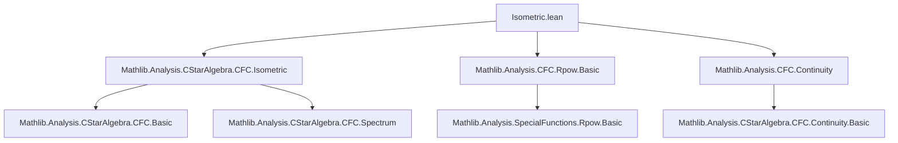
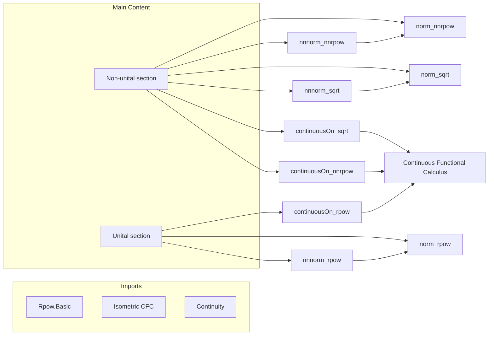

**Technical Brief: `Isometric.lean` — Properties of `rpow`, `nnrpow`, and `sqrt` under Isometric CFC**

---

### 1. **Key Definitions & Theorems**

| Name | Type / Signature | Purpose |
|------|------------------|---------|
| `nnnorm_nnrpow` | `∀ a : A, ∀ r : ℝ≥0, 0 < r → 0 ≤ a → ‖a ^ r‖₊ = ‖a‖₊ ^ (r : ℝ)` | Norm-preservation of `nnrpow` in non-unital setting (NNReal-valued norm). |
| `norm_nnrpow` | `∀ a : A, ∀ r : ℝ≥0, 0 < r → 0 ≤ a → ‖a ^ r‖ = ‖a‖ ^ (r : ℝ)` | Norm-preservation of `nnrpow` (real-valued norm), derived from `nnnorm_nnrpow`. |
| `nnnorm_sqrt` | `∀ a : A, 0 ≤ a → ‖sqrt a‖₊ = NNReal.sqrt ‖a‖₊` | Norm-preservation of `sqrt` in NNReal-valued norm. |
| `norm_sqrt` | `∀ a : A, 0 ≤ a → ‖sqrt a‖ = √‖a‖` | Real-valued norm version of `sqrt` norm-preservation. |
| `continuousOn_sqrt` | `ContinuousOn sqrt {a : A | 0 ≤ a}` | Continuity of `sqrt` on the nonnegative cone. |
| `continuousOn_nnrpow` | `∀ r : ℝ≥0, ContinuousOn (· ^ r) {a : A | 0 ≤ a}` | Continuity of `nnrpow` (i.e., `· ^ r`) on nonnegative cone. |
| `nnnorm_rpow` | `∀ a : A, ∀ r : ℝ, 0 < r → 0 ≤ a → ‖a ^ r‖₊ = ‖a‖₊ ^ r` | Norm-preservation of `rpow` (real exponent) in unital setting. |
| `norm_rpow` | `∀ a : A, ∀ r : ℝ, 0 < r → 0 ≤ a → ‖a ^ r‖ = ‖a‖ ^ r` | Real-valued norm version of `rpow` norm-preservation. |
| `continuousOn_rpow` | `[ContinuousStar A] → [CompleteSpace A] → ∀ r : ℝ, ContinuousOn (· ^ r) {a | IsStrictlyPositive a}` | Continuity of `rpow` on strictly positive elements. |

> **Note**: `a ^ r` denotes `CFC.rpow a r`, `sqrt a` is `CFC.sqrt a`, and `a ^ r` for `r : ℝ≥0` is `CFC.nnrpow a r`.

---

### 2. **Naming Conventions**

- **Prefixes**:
  - `nnnorm_`: statements about the **NNReal-valued norm** (`‖·‖₊`).
  - `norm_`: statements about the **real-valued norm** (`‖·‖`).
- **Suffixes**:
  - `_nnrpow`: for results involving `nnrpow` (nonnegative real exponentiation).
  - `_rpow`: for results involving `rpow` (real exponentiation).
  - `_sqrt`: for results involving `sqrt`.
- **Other**:
  - `continuousOn_`: continuity of a function on a subset (e.g., nonnegative or strictly positive elements).
  - `cfc_tac`: tactic used to discharge `0 ≤ a` hypotheses via functional calculus.

---

### 3. **Tactic Stack**

| Tactic | Usage |
|--------|-------|
| `cfc_tac` | Automatically proves `0 ≤ a` assumptions using properties of the continuous functional calculus (e.g., spectrum in `[0, ∞)`). |
| `simp` / `simpa` | Simplify goals using definitions (`sqrt_eq_nnrpow`, `NNReal.sqrt_eq_rpow`, etc.). |
| `rw` | Rewrite using lemmas like `nnnorm_nnrpow`, `← nnrpow_eq_rpow`. |
| `lift` | Lift `r : ℝ` with `0 < r` to `ℝ≥0` to reuse lemmas. |
| `congr` | Convert NNReal norm equalities to real norm equalities via `NNReal.toReal`. |
| `exact`, `all_goals` | Used in `nnnorm_rpow` to handle both `r = 0` and `r > 0` cases. |
| `continuous_on_id.cfcₙ_nnreal_of_mem_nhdsSet` / `cfc_nnreal_of_mem_nhdsSet` | Standard pattern for proving continuity of CFC-defined functions on cones. |
| `simp_rw` | Simplify with rewrite rules (e.g., `nhdsSet_iUnion`, `isOpen_compl_singleton.mem_nhdsSet`). |

---

### 4. **Proof Logic**

- **Structure**:  
  Proofs follow a **two-tiered approach**:
  1. **Non-unital case**: Prove `nnnorm_nnrpow` first (NNReal-valued), then lift to real norm via `NNReal.toReal`.
  2. **Unital case**: Reduce `rpow` (real exponent) to `nnrpow` (by lifting exponent to `ℝ≥0`) and reuse non-unital lemmas.

- **Common pattern**:
  - Use `cfc_tac` to discharge positivity assumptions.
  - Prove NNReal norm equality first (often via monotonicity or CFC continuity properties).
  - Apply `NNReal.toReal_inj` (via `congr`) to get real norm equality.

- **Continuity proofs**:
  - Use `continuous_on_id.cfcₙ_...` lemmas: if `f : ℝ → ℝ` is continuous and `a ↦ f(a)` is defined via CFC, then `a ↦ f(a)` is continuous on domains where `f` is defined (e.g., `[0,∞)` for `sqrt`, `rpow` with `r > 0`).
  - For `continuousOn_rpow`, restrict to `IsStrictlyPositive a` (i.e., spectrum bounded away from 0) to ensure invertibility and avoid singularities at 0.

---

### 5. **Imports & Dependencies**

| Import | Role |
|--------|------|
| `Mathlib.Analysis.SpecialFunctions.ContinuousFunctionalCalculus.Rpow.Basic` | Defines `rpow`, `nnrpow`, basic algebraic properties. |
| `Mathlib.Analysis.CStarAlgebra.ContinuousFunctionalCalculus.Isometric` | Provides `IsometricContinuousFunctionalCalculus` and `NonUnitalIsometricContinuousFunctionalCalculus`. |
| `Mathlib.Analysis.CStarAlgebra.ContinuousFunctionalCalculus.Continuity` | Supplies continuity lemmas for CFC-defined functions (e.g., `continuousOn_id.cfcₙ_...`). |

**Key typeclass assumptions**:
- `NonUnitalNormedRing`, `StarRing`, `NormedSpace ℝ`, `StarOrderedRing`, `NonnegSpectrumClass`, `IsSelfAdjoint`, `IsometricContinuousFunctionalCalculus` (or nonunital variant).
- For continuity results: `ContinuousStar`, `CompleteSpace`.

---

### 6. **Mermaid Diagrams**

#### **Dependency Graph (Module-Level)**

#### **Overview of File Structure**

---

### 7. **Domain-Specific AI Agent Guidance**

- **Focus areas for automation**:
  - Recognize patterns like `‖a ^ r‖ = ‖a‖ ^ r` and automatically suggest `nnnorm_nnrpow`/`norm_nnrpow`.
  - Detect `sqrt` goals and apply `norm_sqrt`/`nnnorm_sqrt`.
  - For continuity goals, check if function is CFC-defined and domain is `[0,∞)` or `IsStrictlyPositive`.
- **Common pitfalls**:
  - Forgetting `0 < r` in `nnnorm_nnrpow`/`norm_nnrpow`.
  - Missing `IsSelfAdjoint` or `NonnegSpectrumClass` assumptions.
  - Confusing `nnrpow` (exponent in `ℝ≥0`) vs `rpow` (exponent in `ℝ`).
- **Suggested rewrite hints**:
  - `sqrt a = a ^ (1/2)` → use `norm_rpow` with `r = 1/2`.
  - `‖a ^ r‖ = √‖a‖` → use `norm_sqrt` after rewriting `sqrt`.

--- 

Let me know if you'd like a **tactic automation script** or **formalization checklist** for this module.
