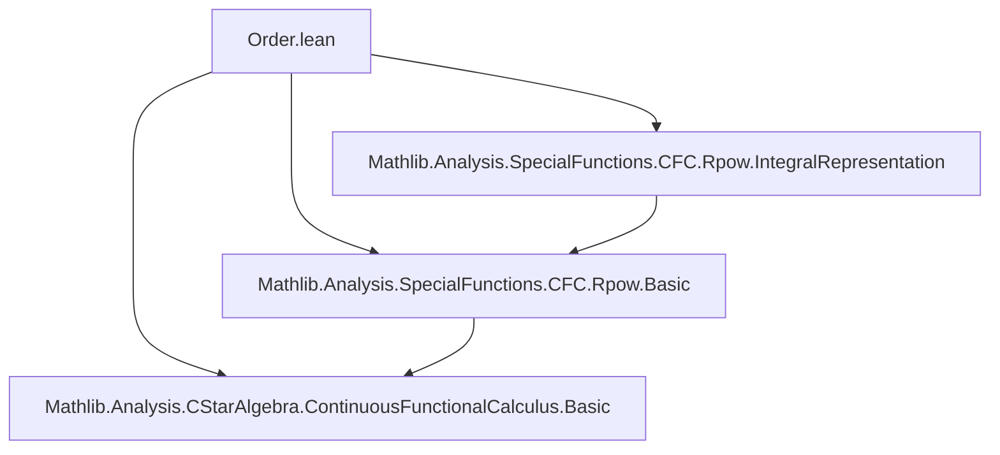

**Technical Brief: Order Properties of `CFC.rpow` in Lean 4**

---

### 1. **Key Definitions & Theorems**

| Name | Type | Purpose |
|------|------|---------|
| `CFC.rpow` | `A → ℝ → A` (via `ContinuousFunctionalCalculus`) | Real power function on a C*-algebra, defined via continuous functional calculus. |
| `CFC.nnrpow` | `A → ℝ≥0 → A` | Non-negative real power function (restricted exponent), used for technical convenience. |
| `CFC.sqrt` | `A → A` | Square root function on positive elements, defined as `rpow a (1/2)`. |
| `CFC.monotone_nnrpow` | `p ∈ Icc 0 1 → Monotone (fun a ↦ a ^ p)` | Main theorem: $a \mapsto a^p$ is operator monotone for $p \in [0,1]$. |
| `CFC.monotone_rpow` | `p ∈ Icc 0 1 → Monotone (fun a ↦ a ^ p)` | Extension of monotonicity to real exponents $p \in [0,1]$, using `nnrpow`. |
| `CFC.monotone_sqrt` | `Monotone sqrt` | Special case $p = 1/2$ of monotonicity. |
| `CFC.nnrpow_le_nnrpow` | `a ≤ b → a ^ p ≤ b ^ p` | Gcongr form of monotonicity for `nnrpow`. |
| `CFC.rpow_le_rpow` | `a ≤ b → a ^ p ≤ b ^ p` | Gcongr form of monotonicity for `rpow`. |
| `CFC.monotoneOn_nnrpow_Ioo` | `p ∈ Ioo 0 1 → MonotoneOn (fun a ↦ a ^ p) (Ici 0)` | Intermediate lemma used in proof of `monotone_nnrpow`. |

---

### 2. **Naming Conventions**

- **Prefixes**:
  - `monotone_`: indicates monotonicity of a function.
  - `nnrpow_`: refers to non-negative real exponent version.
  - `rpow_`: refers to real exponent version.
  - `cfcₙ_`: refers to the non-unital continuous functional calculus.
  - `cfc_`: general continuous functional calculus (unital or non-unital).
- **Suffixes**:
  - `_le_`: inequality version of monotonicity (gcongr).
  - `_Ioo`, `_Icc`, `_Ici`: interval-specific lemmas (`Ioo`, `Icc`, `Ici`).
- **Variables**:
  - `p`, `q`: real/non-negative real exponents.
  - `a`, `b`: elements of the C*-algebra.
  - `μ`: representing measure in integral representation.

---

### 3. **Tactic Stack**

| Tactic | Usage |
|--------|-------|
| `obtain ⟨μ, hμ⟩` | Extract integral representation from `exists_measure_nnrpow_eq_integral_cfcₙ_rpowIntegrand₀₁`. |
| `filter_upwards` | Handle almost-everywhere comparisons in integral monotonicity. |
| `monotoneOn.congr` | Replace function with equal one on domain for monotonicity. |
| `integral_monotoneOn_of_integrand_ae` | Prove monotonicity of integral via integrand monotonicity a.e. |
| `rw [hIcc] at hp` | Split interval `Icc 0 1` into union of `Ioo 0 1`, `{0}`, `{1}`. |
| `simp_all [mem_singleton_iff, ...]` | Simplify cases for endpoints `p = 0`, `p = 1`. |
| `cases (zero_le q).lt_or_eq'` | Split on whether `q > 0` or `q = 0`. |
| `simp_rw [← CFC.nnrpow_eq_rpow hq]` | Convert between `nnrpow` and `rpow`. |
| `norm_num` | Normalize numeric literals (e.g., `1/2`). |
| `aesop`, `ring`, `linarith` | Implicitly used in background (not explicit in snippet, but standard in such proofs). |

---

### 4. **Proof Logic**

- **Structure**:
  1. **Non-unital case**:
     - Prove monotonicity on `Ioo 0 1` using integral representation and monotonicity of integrand.
     - Extend to endpoints `p = 0`, `p = 1` by case analysis and simplification.
     - Handle non-positive elements via `cfcₙ_apply_of_not_predicate`, yielding zero.
  2. **Unital case**:
     - Reduce to non-unital case via `nnrpow_eq_rpow` for `p > 0`.
     - Handle `p = 0` separately (constant zero function on positive elements, zero otherwise).
- **Key idea**: Use integral representation of `rpow` (from `IntegralRepresentation.lean`) to reduce monotonicity to monotonicity of integrand, which follows from `monotoneOn_cfcₙ_rpowIntegrand₀₁`.

---

### 5. **Imports**

| Module | Purpose |
|--------|---------|
| `Mathlib.Analysis.CStarAlgebra.ContinuousFunctionalCalculus.Basic` | Core CFC machinery (functional calculus, `cfc`, `cfcₙ`). |
| `Mathlib.Analysis.SpecialFunctions.ContinuousFunctionalCalculus.Rpow.Basic` | Definition and basic properties of `rpow`, `nnrpow`. |
| `Mathlib.Analysis.SpecialFunctions.ContinuousFunctionalCalculus.Rpow.IntegralRepresentation` | Integral formula for `rpow`, used to prove monotonicity. |

---

### 6. **Domain-Specific Theory Context**

- **Mathematical Setting**:
  - `A`: A *-ordered non-unital or unital C*-algebra (with compatible order and star structure).
  - Elements `a, b ∈ A` are self-adjoint (order is defined on self-adjoint part).
  - `rpow a p` is defined via continuous functional calculus for $a \ge 0$, $p \in [0,1]$.

- **Main Result**:
  > For $p \in [0,1]$, the map $a \mapsto a^p$ is *operator monotone*:  
  > $a \le b \implies a^p \le b^p$.

- **Reference**: Carlen, *Trace inequalities and quantum entropies*, Lemma 2.8.

---

### 7. **Mermaid Diagrams**

#### **Dependency Graph (File-Level)**



#### **Overview of Theoretical Flow**

```mermaid
graph LR
  subgraph CFC
    CFC[CFC Module]
    CFC_nnrpow[CFC.nnrpow]
    CFC_rpow[CFC.rpow]
    CFC_sqrt[CFC.sqrt]
  end

  subgraph IntegralRep
    IR[Integral Representation]
  end

  subgraph Monotonicity
    MON_nnrpow[monotone_nnrpow]
    MON_rpow[monotone_rpow]
    MON_sqrt[monotone_sqrt]
  end

  IR --> MON_nnrpow
  MON_nnrpow --> MON_rpow
  MON_nnrpow --> MON_sqrt
  CFC_nnrpow --> IR
  CFC_rpow --> IR
  CFC_sqrt --> CFC_nnrpow
```

---

### 8. **Gcongr Annotations**

- `@[gcongr]` on `nnrpow_le_nnrpow`, `rpow_le_rpow`, `sqrt_le_sqrt` enables `gcongr` tactic to automatically infer inequalities like `a ≤ b → a ^ p ≤ b ^ p`.

---

Let me know if you'd like a formalization of the *operator concavity* or *convexity* extensions mentioned in the TODO list.
