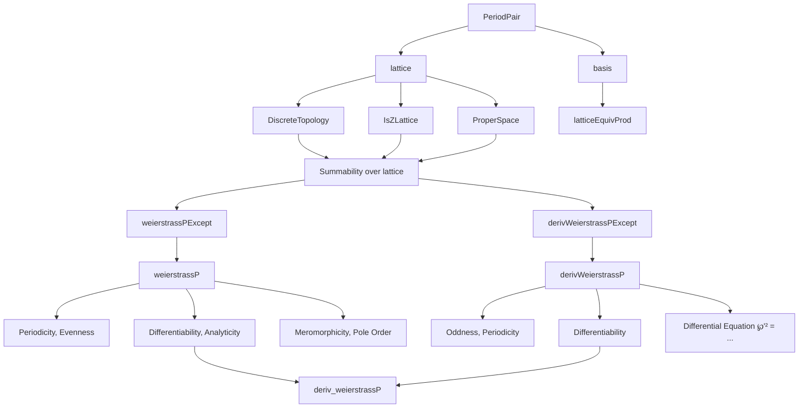
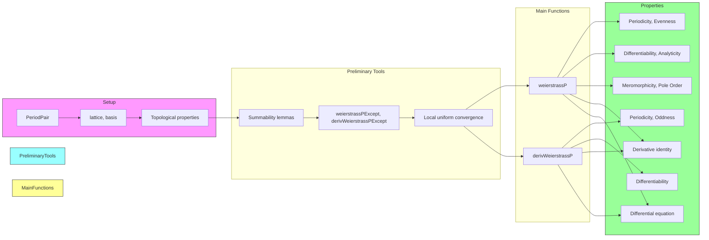

Here is the structured technical brief extracted from `Weierstrass.lean`:

---

### **1. Key Definitions & Theorems**

| Name | Type / Signature | Purpose |
|------|------------------|---------|
| `PeriodPair` | `Type` (structure) | Encodes a pair of $\mathbb{R}$-linearly independent complex numbers $\omega_1, \omega_2$, forming a period lattice. |
| `lattice` | `Submodule ℤ ℂ` | The $\mathbb{Z}$-lattice spanned by $\omega_1, \omega_2$. |
| `basis`, `latticeBasis` | `Basis (Fin 2) _ _` | Explicit $\mathbb{R}$- and $\mathbb{Z}$-bases for $\mathbb{C}$ and the lattice, respectively. |
| `weierstrassP` (`℘[L]`) | `ℂ → ℂ` | The Weierstrass $\wp$-function: $\wp(z) = \sum_{l \in L} \left(\frac{1}{(z - l)^2} - \frac{1}{l^2}\right)$. |
| `derivWeierstrassP` (`℘'[L]`) | `ℂ → ℂ` | The derivative $\wp'(z) = -2 \sum_{l \in L} \frac{1}{(z - l)^3}$. |
| `weierstrassPExcept` (`℘[L - l₀]`) | `ℂ → ℂ` | $\wp$ with the term at $l_0$ omitted (used for local analysis). |
| `derivWeierstrassPExcept` (`℘'[L - l₀]`) | `ℂ → ℂ` | Derivative with $l_0$-term omitted. |
| `hasSumLocallyUniformly_weierstrassP` | `HasSumLocallyUniformly ... ℘[L]` | Uniform convergence of the $\wp$-series on compact sets. |
| `differentiableOn_weierstrassP` | `DifferentiableOn ℂ ℘[L] Lᶜ` | $\wp$ is complex-differentiable away from lattice points. |
| `weierstrassP_add_coe` | `℘[L] (z + l) = ℘[L] z` | Periodicity of $\wp$. |
| `weierstrassP_neg` | `℘[L] (-z) = ℘[L] z` | Evenness of $\wp$. |
| `deriv_weierstrassP` | `deriv ℘[L] = ℘'[L]` | Global equality of derivative and formal derivative (even at poles, via junk values). |
| `meromorphic_weierstrassP` | `MeromorphicOn ℂ ℘[L] univ` | $\wp$ is meromorphic on $\mathbb{C}$. |
| `order_weierstrassP` | `Order ℘[L] l = -2` | Pole of order 2 at each lattice point $l$. |
| `derivWeierstrassP_sq` | `℘'(z)² = 4 ℘(z)³ - g₂ ℘(z) - g₃` | The fundamental differential equation of $\wp$. |
| `analyticOnNhd_weierstrassP` | `AnalyticOn ℂ ℘[L] Lᶜ` | $\wp$ is analytic away from the lattice. |

---

### **2. Naming Conventions**

- **Prefixes**:
  - `weierstrassP*`, `derivWeierstrassP*`: Main functions and their derivatives.
  - `hasSumLocallyUniformly*`: Convergence lemmas.
  - `differentiableOn*`, `analyticOn*`, `meromorphic*`: Regularity properties.
  - `Periodicity.*`: Periodicity lemmas (`add_coe`, `sub_coe`).
  - `weierstrassPExcept*`, `derivWeierstrassPExcept*`: “Except $l_0$” variants for technical lemmas.

- **Suffixes**:
  - `_except`: Omit a term (e.g., `weierstrassPExcept`, `derivWeierstrassPExcept`).
  - `_aux`: Helper lemmas (e.g., `hasSumLocallyUniformly_aux`, `weierstrassP_add_coe_aux`).
  - `_def`: Definition simplifications (e.g., `weierstrassPExcept_def`).
  - `_of_notMem`: When $l_0 \notin L$, omitting it does nothing.
  - `_zero`: Evaluations at 0 (e.g., `weierstrassP_zero`, `derivWeierstrassP_zero`).
  - `_coe`: When argument is in the lattice (e.g., `weierstrassP_coe`, `derivWeierstrassP_coe`).

- **Notation**:
  - `℘[L]`, `℘[L - l₀]`, `℘'[L]`, `℘'[L - l₀]` — scoped notations in `PeriodPair`.

---

### **3. Tactic Stack**

Frequently used tactics:
- `simp`, `simp only`, `simp_rw`: For rewriting definitions and simplifying hypotheses.
- `rw`, `congr`, `congr!`: Equality manipulation and functional extensionality.
- `convert`, `trans`, `refine`: Building proof chains.
- `aesop`, `linarith`, `norm_num`: Arithmetic and linear reasoning.
- `fun_prop`, `field_simp`, `ring`, `abel`: Algebraic simplifications.
- `gcongr`, `norm_cast`, `field`: Norm/inequality manipulations.
- `tsum_*`, `tsum_eq`, `tsum_neg`, `tsum_mul_left`: Infinite sum manipulations.
- `hasSum_*`, `summable_*`: Convergence arguments.
- `differentiableOn_*`, `analyticOn_*`, `deriv_*`: Complex analysis lemmas.
- `equiv_*`, `tsum_eq`, `congr`: Symmetry arguments (e.g., using `Equiv.neg`, `Equiv.addRight`).

---

### **4. Proof Logic**

- **Induction / Case Analysis**: Rarely used directly; most proofs rely on:
  - **Uniform convergence** (`hasSumLocallyUniformly_*`) to transfer regularity (differentiability, analyticity).
  - **Symmetry arguments** via group actions (`Equiv.neg`, `Equiv.addRight`) to prove periodicity, even/oddness.
  - **Local analysis**: Use `weierstrassPExcept` to avoid divergent terms, then relate back to full $\wp$.
  - **Pole analysis**: Show non-continuity at lattice points via contradiction with continuity of $z \mapsto z^{-2}$.
  - **Power series expansions**: Use `weierstrassPExceptSeries`, `weierstrassPExceptSummand`, and bounding arguments (`weierstrassP_bound`) to prove analyticity and coefficient formulas.

Typical flow:
1. Prove local uniform convergence of the defining series.
2. Deduce differentiability/analyticity via standard theorems (`differentiableOn_of_hasSumLocallyUniformly`, etc.).
3. Use symmetry (e.g., $z \mapsto -z$, $z \mapsto z + l$) to derive functional equations.
4. For global properties (e.g., `deriv_weierstrassP`), patch local results using `weierstrassPExcept_of_notMem` and handle lattice points separately (often via junk values or non-continuity).

---

### **5. Imports**

| Module | Purpose |
|--------|---------|
| `Mathlib.Algebra.Module.ZLattice.Summable` | Summability over $\mathbb{Z}$-lattices (e.g., $\sum \|l\|^{-r}$ for $r > 2$). |
| `Mathlib.Analysis.Analytic.Binomial` | Binomial series for complex powers (used in expansions). |
| `Mathlib.Analysis.Complex.Liouville` | Liouville-type results (used in meromorphicity). |
| `Mathlib.Analysis.Complex.LocallyUniformLimit` | Limits of locally uniform convergence preserve analyticity/differentiability. |
| `Mathlib.Analysis.Meromorphic.Order` | Order of poles, meromorphic functions. |
| `Mathlib.LinearAlgebra.Complex.FiniteDimensional` | Finite-dimensional complex vector spaces (basis constructions). |
| `Mathlib.Tactic.NormNum.NatFactorial` | Normalization of natural number arithmetic. |
| `Mathlib.Topology.Algebra.InfiniteSum.UniformOn` | Infinite sums and uniform convergence. |
| `Mathlib.Topology.MetricSpace.ProperSpace.Lemmas` | Proper metric space properties (e.g., closed balls compact). |

---

### **6. Mermaid Diagrams**

#### **Dependency Graph (High-Level)**

#### **Overview of File Structure**

--- 

Let me know if you'd like a formalized dependency graph (e.g., `leanpkg`-style), or a breakdown of the `g₂`, `g₃` invariants (not included here but referenced in `derivWeierstrassP_sq`).
