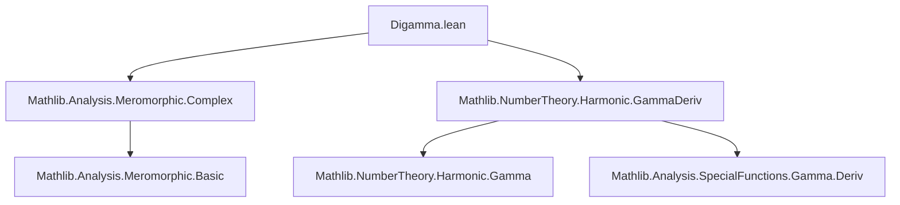
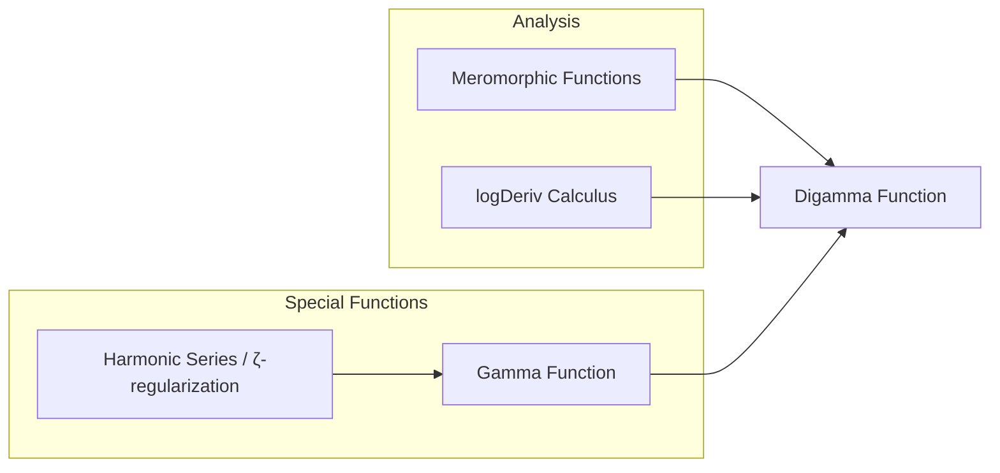

**Technical Brief: `Digamma.lean`**

---

### 1. **Key Definitions & Theorems**

| Name | Type | Purpose |
|------|------|---------|
| `digamma` | `ℂ → ℂ` | Defined as the logarithmic derivative of the Gamma function: `logDeriv Gamma`. |
| `digamma_def` | `digamma = logDeriv Gamma` | Definitional equality (refl). |
| `digamma_zero` | `digamma 0 = 0` | Evaluates digamma at 0 using `logDeriv_eq_zero_of_not_differentiableAt`. |
| `digamma_one` | `digamma 1 = -γ` (Euler–Mascheroni constant) | Uses derivative of `Gamma` at 1 and `Gamma 1 = 1`. |
| `digamma_one_half` | `digamma (1/2) = -2 log 2 - γ` | Evaluates at 1/2 using known values of `Gamma(1/2) = √π` and its derivative. |
| `digamma_apply_add_one` | `digamma (s + 1) = digamma s + s⁻¹` (for `s ≠ -m`, all `m ∈ ℕ`) | Functional equation; derived from Gamma’s recurrence and log-derivative rules. |
| `meromorphic_digamma` | `Meromorphic digamma` | States that digamma is meromorphic on ℂ (inherits from `Meromorphic.Gamma.logDeriv`). |

---

### 2. **Naming Conventions**

- **Prefixes**:
  - `digamma_`: for properties of the digamma function (e.g., `digamma_zero`, `digamma_apply_add_one`).
  - `hasDerivAt_`, `Gamma_`: for Gamma-related derivative facts (e.g., `hasDerivAt_Gamma_one`, `Gamma_add_one`).
- **Suffixes**:
  - `_apply`: for evaluation at a point (e.g., `logDeriv_apply`).
  - `_ne_zero`, `_eq_zero`: for non-vanishing or vanishing properties.
- **General pattern**: `function_property_point` or `function_property_condition`.

---

### 3. **Tactic Stack**

- `rw`: rewriting using definitional or proven equalities.
- `simp`: simplification, especially with `@[simp]` lemmas like `digamma_zero`.
- `div_mul_cancel_right₀`, `mul_div_mul_left`: algebraic simplifications in fields.
- `add_comm`, `neg_mul`, `mul_neg`, `neg_add'`: commutativity/associativity manipulations.
- `ofReal_cpow`, `Real.sqrt_eq_rpow`: conversion between real/complex exponentials.
- `simpa`: simplification with assumptions (e.g., to derive `s ≠ 0` from `hs`).
- `cases`-style reasoning via `have hs0 : s ≠ 0 := ...` (local assumptions).
- No heavy automation (e.g., no `aesop`, `linarith`, `norm_num`), indicating reliance on structured analysis.

---

### 4. **Proof Logic**

- **Structure**:
  - Proofs are mostly *direct calculations* using known facts about `Gamma`, its derivative, and `logDeriv`.
  - For `digamma_apply_add_one`, the proof:
    1. Extracts `s ≠ 0` from the hypothesis `hs`.
    2. Rewrites `digamma` as `logDeriv Gamma`.
    3. Applies `logDeriv_apply` (valid since `s` and `s+1` avoid poles).
    4. Uses `deriv_Gamma_add_one` and `Gamma_add_one` (functional equations of `Gamma`).
    5. Simplifies algebraically using field arithmetic and `Gamma_ne_zero`.
- **Induction is not used**; proofs rely on *analytic identities* and *algebraic simplification*.
- Hypotheses like `∀ m : ℕ, s ≠ -m` ensure `s` avoids poles of `Gamma` and `digamma`.

---

### 5. **Imports**

| Import | Role |
|--------|------|
| `Mathlib.Analysis.Meromorphic.Complex` | Provides `Meromorphic`, `logDeriv`, and meromorphicity machinery. |
| `Mathlib.NumberTheory.Harmonic.GammaDeriv` | Contains derivative facts for `Gamma`, including at `1` and `1/2`, and values like `Gamma_one`, `Gamma_one_half_eq`. |

> These imports indicate the module sits at the intersection of **complex analysis** (meromorphic functions, log-derivatives) and **analytic number theory** (Gamma function, Euler–Mascheroni constant).

---

### 6. **Mermaid Diagrams**

#### Dependency Graph (Module-Level)



#### Overview of Theory Flow

```mermaid
flowchart LR
  subgraph Gamma_Facts
    G1[Gamma_one : Γ(1) = 1]
    G2[Gamma_one_half_eq : Γ(1/2) = √π]
    G3[deriv_Gamma_add_one]
    G4[hasDerivAt_Gamma_one]
    G5[hasDerivAt_Gamma_one_half]
  end

  subgraph logDeriv_Def
    LD1[logDeriv_def]
    LD2[logDeriv_apply]
  end

  subgraph Digamma_Props
    D1[digamma_def]
    D2[digamma_zero]
    D3[digamma_one]
    D4[digamma_one_half]
    D5[digamma_apply_add_one]
    D6[meromorphic_digamma]
  end

  LD1 --> D1
  G3 & G4 & LD2 --> D5
  G1 & G4 & LD2 --> D3
  G2 & G5 & LD2 --> D4
  G1 & LD2 --> D2
  G1 & Meromorphic_Gamma --> D6
```

#### High-Level Theory Context



---

### 7. **TODO & Future Work**

- **Gauss’ integral representation**:  
  `digamma s = -γ + ∫ t in 0..1, (1 - t^(s-1)) / (1 - t)`  
  (Requires `intervalIntegral`, `Bochner integral`, and analytic continuation tools.)

---

**Summary**: This module formalizes the *digamma function* as `logDeriv Gamma`, proves its basic analytic properties (functional equation, meromorphicity), and evaluates it at key points (0, 1, 1/2). The proofs are analytical and rely on pre-established Gamma calculus in Mathlib. The style is *constructive but noncomputable*, with heavy use of algebraic simplification and known derivative identities.
