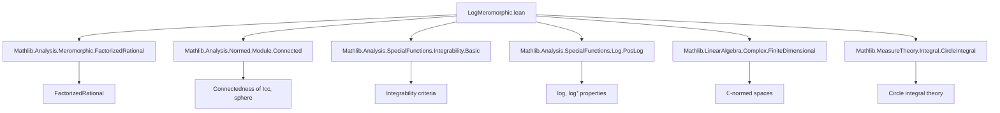

### Technical Brief: `LogMeromorphic.lean`

---

#### **1. Key Definitions & Theorems**

| Name | Type / Signature | Purpose |
|------|------------------|---------|
| `MeromorphicOn` | `f : α → E →ₘ[σ] F` | Function meromorphic on a set w.r.t. a structure `σ` (e.g., `analyticOnNhd`) |
| `meromorphicOrderAt` | `meromorphicOrderAt f z` | Integer or `⊤` indicating order of zero/pole at `z` |
| `divisor f s` | `Σ₀ z : s, ℤ` | Formal sum of zeros and poles of `f` on `s` with multiplicities |
| `extract_zeros_poles` | `hf : MeromorphicOn f s → … → ∃ g, …` | Decomposes `f` into a product of a continuous nonvanishing function and elementary factors near zeros/poles |
| `extract_zeros_poles_log` | `h₂g h₃g → …` | Produces a decomposition of `log ‖f‖` into integrable pieces |
| `intervalIntegrable_log_norm_meromorphicOn` | `MeromorphicOn f [[a, b]] → IntervalIntegrable (log ‖f·‖) volume a b` | Main result: `log ‖f‖` is interval integrable for real meromorphic `f` |
| `intervalIntegrable_posLog_norm_meromorphicOn` | `MeromorphicOn f [[a, b]] → IntervalIntegrable (log⁺ ‖f·‖) volume a b` | Same for `log⁺ = max(log, 0)` |
| `MeromorphicOn.intervalIntegrable_log` | `MeromorphicOn f [[a, b]] → IntervalIntegrable (log ∘ f) volume a b` | Integrability of `log ∘ f` for real-valued `f` |
| `circleIntegrable_log_norm_meromorphicOn` | `MeromorphicOn f (sphere c |R|) → CircleIntegrable (log ‖f·‖) c R` | Main complex result: `log ‖f‖` is circle integrable |
| `circleIntegrable_log_norm_factorizedRational` | `∑ᶠ u, (D u) * log ‖· - u‖` is circle integrable | Integrability of finite sum of logarithmic terms (used in factorized rational functions) |

---

#### **2. Naming Conventions**

- **Prefixes**:
  - `intervalIntegrable_`, `circleIntegrable_`: indicate integrability over interval/circle.
  - `log_norm_`: refers to `log ‖f·‖`.
  - `posLog_`: refers to `log⁺ ‖f·‖`.
  - `meromorphicOn_`: indicates dependence on `MeromorphicOn f s`.
- **Suffixes**:
  - `_of_nonneg`: variant assuming nonnegative radius.
  - `_factorizedRational`: specific to factorized rational functions.
- **Other patterns**:
  - `extract_zeros_poles_…`: helper lemmas for decomposition.
  - `congr_codiscreteWithin`: integrability up to codiscrete modification (i.e., away from poles).

---

#### **3. Tactic Stack**

| Tactic | Usage Frequency | Purpose |
|--------|------------------|---------|
| `by_cases` / `push_neg` | High | Split on whether poles exist on the domain |
| `rw`, `simp_rw`, `simp` | Very High | Rewriting definitions, simplifying expressions (e.g., `norm_eq_abs`, `log_eq_zero`) |
| `apply`, `intro`, `intro i`, `intro x` | High | Standard proof structure |
| `filter_upwards` | Medium | Handling filter-based equality (`=ᶠ`) |
| `aesop` | Medium | Solving trivial goals (e.g., `log ∘ f = (log ‖f·‖)` for real `f`) |
| `ring`, `tauto`, `left`, `by_contra` | Medium | Algebraic simplifications, logic, contradiction |
| `continuousOn`, `intervalIntegrable`, `CircleIntegrable` constructors | Medium | Applying known integrability/continuity lemmas |
| `congr_codiscreteWithin`, `congr` | Medium | Replace function with equal one a.e. (w.r.t. codiscrete filter) |

---

#### **4. Proof Logic**

The proofs follow a **case analysis on pole presence**:

1. **Case 1: No poles on the domain** (`∀ u, meromorphicOrderAt f u ≠ ⊤`)
   - Use `extract_zeros_poles` to write `f = g * ∏ (· - u)^n_u`.
   - Apply `extract_zeros_poles_log` to get `log ‖f‖ = log ‖g‖ + ∑ n_u * log ‖· - u‖`.
   - Show each term is integrable:
     - `log ‖g‖` is continuous (hence integrable) since `g` is continuous and nonvanishing.
     - `log ‖· - u‖` integrable via change-of-variable and known integrability of `log |x|`.
   - Conclude via closure properties of integrable functions (sums, finite sums, constant multiples).

2. **Case 2: Poles exist on the domain**
   - Show `log ‖f·‖ = 0` almost everywhere w.r.t. `codiscreteWithin` filter (i.e., away from poles).
   - Use `intervalIntegrable_congr_codiscreteWithin` / `CircleIntegrable.congr_codiscreteWithin` to reduce to integrability of zero function.

The complex case mirrors the real case, but uses:
- `sphere c |R|` instead of `[[a, b]]`.
- `circleMap` to parametrize the circle.
- `intervalIntegrable_log_norm_meromorphicOn` for the pullback along `circleMap`.

---

#### **5. Imports**

| Module | Role |
|--------|------|
| `Mathlib.Analysis.Meromorphic.FactorizedRational` | Factorization of meromorphic functions into elementary factors |
| `Mathlib.Analysis.Normed.Module.Connected` | Connectedness of intervals/spheres (used in pole existence lemmas) |
| `Mathlib.Analysis.SpecialFunctions.Integrability.Basic` | General integrability criteria |
| `Mathlib.Analysis.SpecialFunctions.Log.PosLog` | Properties of `log` and `log⁺` |
| `Mathlib.LinearAlgebra.Complex.FiniteDimensional` | Finite-dimensionality over `ℂ` (for normed space structure) |
| `Mathlib.MeasureTheory.Integral.CircleIntegral` | Circle integral theory and properties |

---

#### **6. Mermaid Diagrams**

##### **Dependency Graph (High-Level)**



##### **Overview of Theory Flow**

```mermaid
flowchart LR
  subgraph Theory
    A[MeromorphicOn f s] --> B[No poles on s?]
    B -->|Yes| C[extract_zeros_poles]
    B -->|No| D[log ‖f·‖ = 0 a.e.]
    C --> E[log ‖f·‖ = log ‖g‖ + ∑ n_u log ‖·-u‖]
    E --> F[Each term integrable]
    D --> G[Conclude integrable via congruence]
    F --> H[Interval/Circle integrability]
  end

  H --> I[Applications: log(sin), log(cos), rational functions]
```

---

#### **7. Summary**

This module establishes foundational integrability results for `log ‖f‖` and `log⁺ ‖f‖` where `f` is meromorphic on an interval (real case) or a circle (complex case). The core idea is to decompose `f` into a product involving its zeros and poles, then analyze the resulting logarithmic terms. The proofs rely heavily on filter-theoretic congruence arguments and case analysis on pole presence. The results are critical for further development in complex analysis (e.g., argument principle, residue calculus) and real analysis (e.g., Fourier analysis of trigonometric functions).
