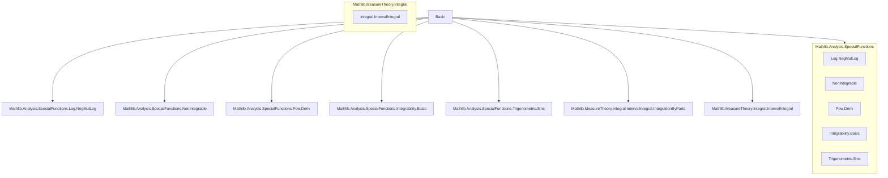

Here is the **technical metadata extraction** for the `Basic.lean` file, formatted as a structured technical brief:

---

## **1. Key Definitions & Theorems**

| Name | Type / Signature | Purpose |
|------|------------------|---------|
| `integral_cpow` | `∀ {r : ℂ}, -1 < r.re ∨ r ≠ -1 ∧ (0 : ℝ) ∉ [[a, b]] → ∫ x : ℝ in a..b, (x : ℂ) ^ r = ((b : ℂ) ^ (r + 1) - (a : ℂ) ^ (r + 1)) / (r + 1)` | General complex power integral over intervals, handling branch cut issues. |
| `integral_rpow` | `∀ {r : ℝ}, -1 < r ∨ r ≠ -1 ∧ (0 : ℝ) ∉ [[a, b]] → ∫ x in a..b, x ^ r = (b ^ (r + 1) - a ^ (r + 1)) / (r + 1)` | Real power integral, with conditions to avoid singularity at 0. |
| `integral_zpow` | `∀ {n : ℤ}, 0 ≤ n ∨ n ≠ -1 ∧ (0 : ℝ) ∉ [[a, b]] → ∫ x in a..b, x ^ n = (b ^ (n + 1) - a ^ (n + 1)) / (n + 1)` | Integer power integral (special case of `rpow`). |
| `integral_pow` | `∫ x in a..b, x ^ n = (b ^ (n + 1) - a ^ (n + 1)) / (n + 1)` | Natural power integral (simplified version of `zpow`). |
| `integral_pow_abs_sub_uIoc` | `∫ x in Ι a b, |x - a| ^ n = |b - a| ^ (n + 1) / (n + 1)` | Integral of shifted absolute value power; used in Picard–Lindelöf proofs. |
| `integral_id` | `∫ x in a..b, x = (b ^ 2 - a ^ 2) / 2` | Integral of identity function. |
| `integral_one` | `∫ _ in a..b, (1 : ℝ) = b - a` | Integral of constant 1. |
| `integral_inv` | `0 ∉ [[a, b]] → ∫ x in a..b, x⁻¹ = log (b / a)` | Integral of reciprocal, avoiding 0. |
| `integral_exp` | `∫ x in a..b, exp x = exp b - exp a` | Exponential integral via fundamental theorem. |
| `integral_log` | `∫ s in a..b, log s = b * log b - a * log a - b + a` | Logarithm integral, using primitives and limits. |
| `integral_sin`, `integral_cos` | `∫ x in a..b, sin x = cos a - cos b`, `∫ x in a..b, cos x = sin b - sin a` | Trigonometric integrals via derivatives. |
| `integral_one_div_one_add_sq` | `∫ x : ℝ in a..b, 1 / (1 + x ^ 2) = arctan b - arctan a` | Arctangent integral. |
| `integral_sin_pow`, `integral_cos_pow` | Reduction formulae for `∫ sin x ^ n`, `∫ cos x ^ n` for `n ≥ 2`. | Recursive computation of powers of sine/cosine integrals. |
| `integral_sin_pow_odd`, `integral_sin_pow_even` | Closed-form products for `∫₀^π sin x ^ n` depending on parity of `n`. | Key for Wallis product derivation. |
| `integral_sin_pow_mul_cos_pow_odd`, `integral_sin_pow_odd_mul_cos_pow` | Substitution-based simplifications for mixed powers when one exponent is odd. | Enables reduction to rational integrals via `u = sin x` or `u = cos x`. |
| `integral_sin_sq_mul_cos_sq` | `∫ x in a..b, sin x ^ 2 * cos x ^ 2 = (b - a)/8 - (sin 4b - sin 4a)/32` | Mixed even-power integral using double-angle identities. |
| `integral_sqrt_one_sub_sq` | `∫ x in -1..1, √(1 - x²) = π / 2` | Area of unit semicircle; trigonometric substitution proof. |

---

## **2. Naming Conventions**

- **Prefixes**:
  - `integral_`: core integral evaluation lemmas.
  - `integral_*_mul_*`: integrals involving compositions with linear transformations (e.g., `mul_integral_comp_mul_add`).
  - `integral_*_pow`: power functions (`pow`, `rpow`, `cpow`, `zpow`).
  - `integral_*_mul_*_odd` / `even`: parity-based simplifications for trigonometric products.
- **Suffixes**:
  - `_aux`: auxiliary lemmas used in proofs of main theorems (e.g., `integral_sin_pow_aux`).
  - `_of_pos`, `_of_neg`: specializations under positivity/negativity assumptions.
  - `_uIoc`: integrals over `Ι a b = (a, b]` (used in `integral_pow_abs_sub_uIoc`).
- **General patterns**:
  - `integral_*_deriv_*`: integrals via fundamental theorem of calculus (`integral_deriv_eq_sub'`, `integral_mul_deriv_eq_deriv_mul`).
  - `integral_comp_*`: change-of-variable lemmas.

---

## **3. Tactic Stack**

Frequently used tactics in this file:

| Tactic | Usage |
|--------|-------|
| `simp` / `simp only` | Simplifying expressions, applying known integral lemmas. |
| `rw` / `rwa` | Rewriting using equalities, often with assumptions (`h`). |
| `field_simp` | Simplifying division expressions, especially in reduction formulae. |
| `ring` / `norm_num` | Algebraic simplification and numeric normalization. |
| `convert` / `congr` | Matching goals up to definitional equality, often with `using n`. |
| `exact` / `apply` | Applying lemmas or hypotheses directly. |
| `intro` / `intro h` | Introducing hypotheses for implications or universal quantifiers. |
| `rcases` / `cases` | Case analysis on disjunctions or existential statements. |
| `have` / `suffices` | Introducing intermediate claims. |
| `calc` | Chain of equalities (especially in `integral_sqrt_one_sub_sq`). |
| `fun_prop` | Proving continuity/differentiability of functions (from `Mathlib`). |
| `abel` | Abelian group simplification (used in `integral_log_from_zero`). |
| `tauto` | Tactic for propositional logic (e.g., in `integral_cpow`). |
| `nlinarith` | Non-linear arithmetic (e.g., in `integral_one_div_one_add_sq`). |
| `conv` | Convolution-style rewriting (e.g., in `integral_log_from_zero`). |

---

## **4. Proof Logic**

- **Structure**:
  - Most proofs follow a **calculus-based pattern**:  
    `integral = F(b) - F(a)` where `F' = f`, via `integral_deriv_eq_sub'` or `integral_eq_sub_of_hasDerivAt`.
  - For power functions: use `integral_eq_sub_of_hasDerivAt` with primitive `x^(r+1)/(r+1)`, handling domain restrictions (e.g., `0 ∉ [[a,b]]` or `r > -1`).
  - For trigonometric integrals: use known derivatives (`d/dx sin = cos`, `d/dx cos = -sin`, `d/dx log = 1/x`, etc.).
  - For reduction formulae: apply **integration by parts** (`integral_mul_deriv_eq_deriv_mul`) to `sin^(n+1) * sin`, `cos^(n+1) * cos`, etc.
  - For mixed powers (`sin^m cos^n`):
    - If one exponent is odd: substitution (`u = sin x` or `u = cos x`) using `integral_comp_mul_deriv`.
    - If both even: use double-angle identities (`sin² = (1 - cos 2x)/2`, etc.).
  - For `∫₀^π sin^n x`: induction + reduction formula + product simplification (`prod_range_succ_comm`).
  - For integrals involving `√(1 - x²)`: trigonometric substitution (`x = sin t`), leveraging `cos² = 1 - sin²`.

- **Induction**:
  - Used in `integral_sin_pow_odd`, `integral_sin_pow_even`, `integral_cos_pow` (implicitly via `integral_sin_pow_aux`/`integral_cos_pow_aux`).

- **Case analysis**:
  - On `a ≤ b` or `b ≤ a` (e.g., `integral_pow_abs_sub_uIoc`).
  - On parity of `n` (even/odd) in `integral_sin_pow_pos`, `integral_sin_pow_odd`, etc.

---

## **5. Imports**

| Module | Purpose |
|--------|---------|
| `Mathlib.Analysis.SpecialFunctions.Log.NegMulLog` | Properties of `log`, especially near 0 and for negative arguments. |
| `Mathlib.Analysis.SpecialFunctions.NonIntegrable` | Integrability criteria (used implicitly via `intervalIntegrable_*`). |
| `Mathlib.Analysis.SpecialFunctions.Pow.Deriv` | Derivatives of `x^r`, `exp`, etc. |
| `Mathlib.Analysis.SpecialFunctions.Integrability.Basic` | Basic integrability lemmas (e.g., continuity ⇒ integrability). |
| `Mathlib.Analysis.SpecialFunctions.Trigonometric.Sinc` | `sinc` function and its integral. |
| `Mathlib.MeasureTheory.Integral.IntervalIntegral.IntegrationByParts` | Integration by parts for interval integrals. |

---

## **6. Mermaid Diagrams**

### **Dependency Graph (Top-Level Modules)**

### **Overview of File Structure**

```mermaid
flowchart TD
  A[Interval Integral Transformations] --> B[Simple Functions]
  B --> C1[integral_pow]
  B --> C2[integral_id]
  B --> C3[integral_one]
  B --> C4[integral_inv]
  B --> C5[integral_exp]
  B --> C6[integral_log]

  A --> D[Trigonometric Integrals]
  D --> D1[integral_sin]
  D --> D2[integral_cos]
  D --> D3[integral_one_div_one_add_sq]
  D --> D4[integral_cos_sq_sub_sin_sq]

  A --> E[Reduction Formulae]
  E --> E1[integral_sin_pow]
  E --> E2[integral_cos_pow]

  A --> F[Special Cases: 0..π]
  F --> F1[integral_sin_pow_odd]
  F --> F2[integral_sin_pow_even]
  F --> F3[integral_sin_pow_pos]
  F --> F4[integral_sin_pow_antitone]

  A --> G[Mixed Powers]
  G --> G1[integral_sin_pow_mul_cos_pow_odd]
  G --> G2[integral_sin_mul_cos₁]
  G --> G3[integral_sin_sq_mul_cos_sq]

  A --> H[Other Integrals]
  H --> H1[integral_sqrt_one_sub_sq]
```

---

## **7. Theory Scope**

- **Core domain**: Real (and complex) interval integration, with emphasis on:
  - Elementary functions (`id`, `pow`, `inv`, `exp`, `log`, `sin`, `cos`, `arctan`, `√`).
  - Reduction formulae and closed forms for powers of sine/cosine.
  - Applications to classical results (e.g., Wallis product via `integral_sin_pow_even/odd`).
- **Mathlib integration**: Leverages:
  - `intervalIntegral` calculus (change of variables, integration by parts).
  - Differentiability/continuity infrastructure (`HasDerivAt`, `intervalIntegrable`).
  - Measure-theoretic foundations (`MeasureTheory.Integral`).
- **Notable gaps**: No explicit treatment of improper integrals (handled via limits in `integral_log_from_zero`), and no general Lebesgue theory beyond `intervalIntegrable`.

---

Let me know if you'd like a **dependency graph of lemmas** or a **tactic usage heatmap**.
