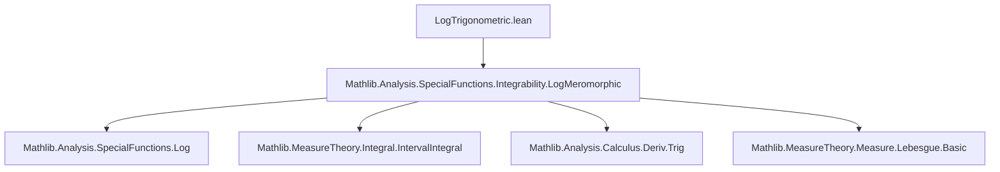

**Technical Brief: `LogTrigonometric.lean`**

---

### 1. **Key Definitions & Theorems**

| Name | Type / Signature | Purpose |
|------|------------------|---------|
| `integral_log_sin_zero_pi_div_two` | `∫ x in 0..(π / 2), log (sin x) = -log 2 * π / 2` | Computes the definite integral of `log ∘ sin` over `[0, π/2]`. |
| `integral_log_sin_zero_pi` | `∫ x in 0..π, log (sin x) = -log 2 * π` | Computes the integral over `[0, π]`, derived from the previous theorem. |
| `integral_log_sin_zero_pi_eq_two_mul_integral_log_sin_zero_pi_div_two` | `∫ x in 0..π, log (sin x) = 2 * ∫ x in 0..(π / 2), log (sin x)` | Symmetry lemma: uses `sin(π − x) = sin x` to relate integrals over `[0, π]` and `[0, π/2]`. |

---

### 2. **Naming Conventions**

- **Prefixes**:
  - `integral_log_sin_...`: Indicates computation of integrals involving `log ∘ sin`.
  - `intervalIntegrable_...`: Used for integrability lemmas (e.g., `intervalIntegrable_log_sin`, `intervalIntegrable_log_cos`).
- **Suffixes**:
  - `_eq_two_mul_...`: Denotes a doubling relation.
  - `_zero_pi`, `_zero_pi_div_two`: Specify integration bounds.

---

### 3. **Tactic Stack**

Frequently used tactics in this file:

| Tactic | Role |
|--------|------|
| `rw` | Rewriting using equalities (e.g., symmetry of sine, integral properties). |
| `conv` + `intro`, `arg`, `left`, `right` | Structural manipulation of expressions (especially in `conv` mode). |
| `simp` / `simp_all` | Simplification using definitional equalities and lemmas (e.g., `sin_two_mul`, `log_mul`). |
| `ring` | Simplifying algebraic expressions (especially after `simp`). |
| `linarith` | Solving linear arithmetic goals (e.g., verifying positivity of bounds). |
| `filter_upwards` | Working with codiscrete filters to handle almost-everywhere statements. |
| `intervalIntegral.integral_congr_codiscreteWithin` | Proving equality of integrals up to measure-zero sets. |
| `intervalIntegral.integral_comp_*` | Change-of-variable lemmas for interval integrals (e.g., `integral_comp_mul_left`, `integral_comp_sub_left`). |
| `simpa using ...` | Simplify goal using a given hypothesis. |

---

### 4. **Proof Logic**

The proof strategy follows a **symmetry + substitution + algebraic manipulation** pattern:

1. **Symmetry Lemma** (`integral_log_sin_zero_pi_eq_two_mul_...`):
   - Split `[0, π]` into `[0, π/2]` and `[π/2, π]`.
   - Use substitution `x ↦ π − x` and identity `sin(π − x) = sin x` to show both halves are equal.

2. **Main Computation** (`integral_log_sin_zero_pi_div_two`):
   - Use trigonometric identity:  
     $$
     \sin(2x) = 2 \sin x \cos x \implies \log(\sin x) = \log(\sin(2x)) - \log 2 - \log(\cos x)
     $$
     (valid a.e. on $(0, \pi/2)$).
   - Integrate both sides; apply change-of-variable lemmas to handle `log(sin(2x))`.
   - Use symmetry again: `∫ log(cos x) = ∫ log(sin x)` over `[0, π/2]`.
   - Solve resulting linear equation in the unknown integral.

3. **Final Result** (`integral_log_sin_zero_pi`):
   - Combine the symmetry lemma with the computed value over `[0, π/2]`.

---

### 5. **Imports**

- `Mathlib.Analysis.SpecialFunctions.Integrability.LogMeromorphic`: Provides integrability and analyticity facts for `log ∘ sin`, `log ∘ cos`, and related functions.

---

### 6. **Mermaid Diagrams**

#### **Dependency Graph**



#### **Overview of Theoretical Flow**

```mermaid
flowchart LR
  A[Analyticity of sin, cos] --> B[Integrability of log ∘ sin, log ∘ cos]
  B --> C[Change-of-variable lemmas for interval integrals]
  C --> D[Symmetry lemma: ∫₀^π = 2 ∫₀^{π/2}]
  D --> E[Trig identity: sin(2x) = 2 sin x cos x]
  E --> F[Functional equation for log(sin x)]
  F --> G[Linear equation for integral]
  G --> H[Final value: ∫₀^{π/2} log(sin x) = -log 2 · π / 2]
  D & H --> I[Final result: ∫₀^π log(sin x) = -log 2 · π]
```

---

### 7. **Mathematical Insight**

This file computes a classical special value:
$$
\int_0^{\pi/2} \log(\sin x)\,dx = -\frac{\pi}{2} \log 2,
$$
which is closely related to the dilogarithm function $ \mathrm{Li}_2 $, as the indefinite integral involves $ \mathrm{Li}_2(-e^{2ix}) $. The proof avoids special functions by exploiting symmetry and elementary trigonometric identities.

--- 

Let me know if you'd like a formalized dependency graph or a summary of related theorems in Mathlib.
