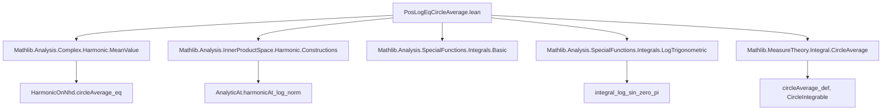

**Technical Brief: `PosLogEqCircleAverage.lean`**

---

### 1. KEY DEFINITIONS & THEOREMS

| Name | Type / Signature | Purpose |
|------|------------------|---------|
| `circleIntegrable_log_norm_sub_const` | `∀ r, CircleIntegrable (log ‖· - a‖) c r` | Guarantees integrability of `log ‖z - a‖` over any circle centered at `c` with radius `r`. |
| `circleAverage_log_norm_sub_const₀` | `‖a‖ < 1 → circleAverage (log ‖· - a‖) 0 1 = 0` | Computes the unit-circle average when `a` lies strictly inside the unit disk. |
| `circleAverage_log_norm_sub_const₁` | `‖a‖ = 1 → circleAverage (log ‖· - a‖) 0 1 = 0` | Handles the boundary case `‖a‖ = 1`, using rotational invariance and trigonometric integral evaluation. |
| `circleAverage_log_norm_sub_const₂` | `1 < ‖a‖ → circleAverage (log ‖· - a‖) 0 1 = log ‖a‖` | Computes the average when `a` lies outside the unit disk. |
| `circleAverage_log_norm_sub_const_eq_posLog` | `circleAverage (log ‖· - a‖) 0 1 = log⁺ ‖a‖` | Main representation: `log⁺(‖a‖)` is the unit-circle average of `log ‖z - a‖`. |
| `circleAverage_log_norm_add_const_eq_posLog` | `circleAverage (log ‖· + a‖) 0 1 = log⁺ ‖a‖` | Variant for `log ‖z + a‖`, via substitution `a ↦ -a`. |
| `circleAverage_log_norm_sub_const_eq_log_radius_add_posLog` | `R ≠ 0 → circleAverage (log ‖· - a‖) c R = log R + log⁺ (R⁻¹ * ‖c - a‖)` | Generalized formula for arbitrary circle center `c` and radius `R`. |
| `circleAverage_log_norm_sub_const_of_mem_closedBall` | `a ∈ closedBall c |R| → circleAverage (log ‖· - a‖) c R = log R` | Immediate corollary: average equals `log R` when `a` lies in the closed disk. |

---

### 2. NAMING CONVENTIONS

- **Prefixes**:
  - `circleAverage_...`: Denotes results about circle averages.
  - `circleIntegrable_...`: Concerns integrability over circles.
  - `log_norm_...`: Involves `log ‖· - a‖` or related expressions.
- **Suffixes**:
  - `_₀`, `_₁`, `_₂`: Distinguish cases based on `‖a‖ < 1`, `‖a‖ = 1`, `1 < ‖a‖`.
  - `_eq_posLog`: Indicates equality with `log⁺`.
  - `_of_mem_closedBall`: Corollaries under a membership hypothesis.

---

### 3. TACTIC STACK

Frequently used tactics:
- `simp`, `simp_all`, `congr`, `ext`, `rw`, `apply`, `calc`
- `field_simp`, `ring`, `norm_num`, `linarith`, `aesop`
- `intervalIntegral.integral_*`, `integral_congr`, `intervalIntegral.integral_add`
- `filter_upwards`, `codiscreteWithin.mono`, `fun_prop`
- `rcases lt_trichotomy ... with h | h | h`: Case analysis on trichotomy of real numbers.
- `have : Function.Periodic ...`, `periodic_circleMap`, `integral_comp_add_left`

---

### 4. PROOF LOGIC

The logical flow follows a **case analysis on the norm of `a`** relative to the unit circle:

1. **Inside the disk (`‖a‖ < 1`)**:
   - Use algebraic manipulation (`z - a = z(1 - z⁻¹ a)`) to reduce to `log ‖1 - z⁻¹ a‖`.
   - Apply analyticity of `log ‖1 - z a‖` near the closed unit disk (via `HarmonicOnNhd.circleAverage_eq`).
   - Show the function is harmonic and vanishes at 0.

2. **On the boundary (`‖a‖ = 1`)**:
   - Use rotational invariance: reduce to `a = 1`.
   - Compute the integral explicitly using trigonometric identities:
     - `‖e^{ix} - 1‖² = 4 sin²(x/2)`
     - Reduce to integral of `log(4 sin²(x/2))`, evaluated via known integral `∫₀^π log(sin x) dx = -π log 2`.

3. **Outside the disk (`1 < ‖a‖`)**:
   - Use identity `log ‖z - a‖ = log ‖a‖ + log ‖z/a - 1‖`.
   - Apply analyticity of `log ‖z/a - 1‖` on the unit circle (since `‖z/a‖ < 1`), whose average vanishes.

4. **Generalization**:
   - Reduce to unit circle via scaling/translation: `z ↦ (z - c)/R`.
   - Apply previous results and algebraic simplifications.

---

### 5. IMPORTS

- `Mathlib.Analysis.Complex.Harmonic.MeanValue`: For harmonic function properties and mean value theorems.
- `Mathlib.Analysis.InnerProductSpace.Harmonic.Constructions`: For constructions of harmonic functions.
- `Mathlib.Analysis.SpecialFunctions.Integrals.Basic`: Basic integral calculus.
- `Mathlib.Analysis.SpecialFunctions.Integrals.LogTrigonometric`: Evaluations of `∫ log(sin x)`, etc.
- `Mathlib.MeasureTheory.Integral.CircleAverage`: Definition and basic properties of circle averages.

---

### 6. DEPENDENCY & THEORY OVERVIEW

#### Mermaid Diagram: Theoretical Dependencies



#### Mermaid Diagram: File Overview

```mermaid
flowchart LR
  subgraph Definitions
    CI[CircleIntegrable]
    CA[CircleAverage]
  end

  subgraph Core Theorems
    CA0[CA = 0 if ‖a‖ < 1]
    CA1[CA = 0 if ‖a‖ = 1]
    CA2[CA = log ‖a‖ if 1 < ‖a‖]
    CA_eq_posLog[CA = log⁺ ‖a‖]
  end

  subgraph Generalizations
    CA_general[CA(c,R) = log R + log⁺(R⁻¹ * ‖c - a‖)]
    CA_memBall[If a ∈ closedBall(c,R), CA = log R]
  end

  CI --> CA0 & CA1 & CA2
  CA0 & CA1 & CA2 --> CA_eq_posLog
  CA_eq_posLog --> CA_general
  CA_general --> CA_memBall
```

---

### 7. DOMAIN & APPLICATION CONTEXT

- **Domain**: Complex analysis, potential theory, harmonic functions.
- **Key Concept**: Representation of the *positive logarithm* `log⁺(r) = max(0, log r)` as a *circle average* of the logarithmic potential `log ‖z - a‖`.
- **Applications**:
  - Potential theory on ℂ (e.g., Green’s functions, subharmonic functions).
  - Proof automation in complex analysis (e.g., in formal verification of the Poisson–Jensen formula).
  - Simplification of integrals involving `log ‖z - a‖` in geometric or analytic contexts.

--- 

Let me know if you'd like a formalized summary in Lean syntax or a dependency graph for the entire `Mathlib` module.
