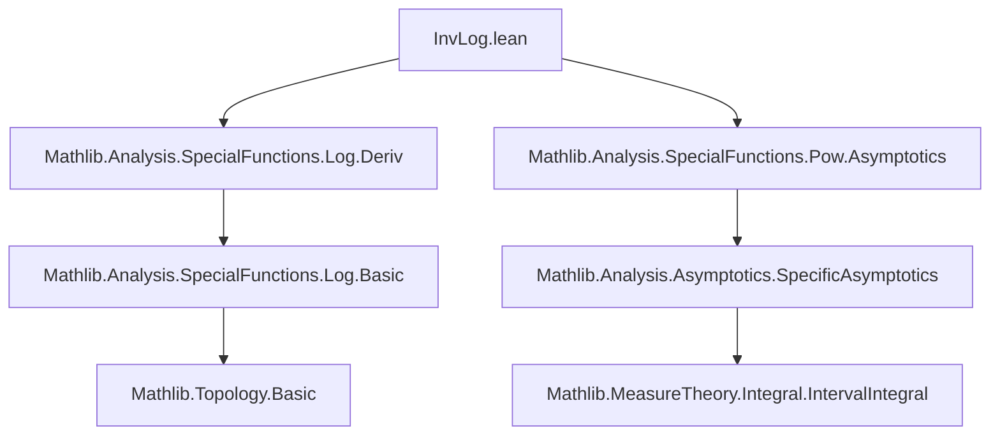
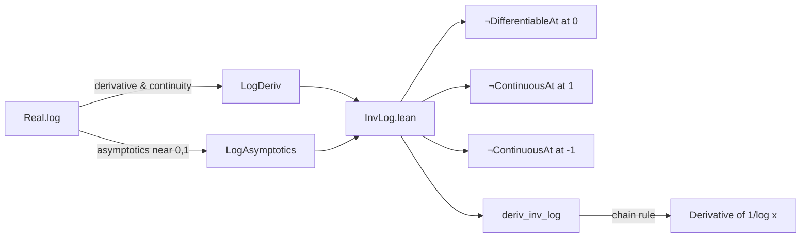

**Technical Brief: `InvLog.lean`**

---

### 1. KEY DEFINITIONS & THEOREMS

| Name | Type / Signature | Purpose |
|------|------------------|---------|
| `inv_log` | `ℝ → ℝ`, defined as `fun x ↦ (log x)⁻¹` | The multiplicative inverse of the real logarithm, i.e., $x \mapsto \frac{1}{\log x}$ |
| `not_differentiableAt_inv_log_zero` | `¬ DifferentiableAt ℝ inv_log 0` | Shows the function is not differentiable at $x = 0$ (where $\log 0$ is undefined). |
| `not_continuousAt_inv_log_one` | `¬ ContinuousAt inv_log 1` | Shows the function is not continuous at $x = 1$, since $\log 1 = 0$ and $1/0$ is undefined (pole). |
| `not_continuousAt_inv_log_neg_one` | `¬ ContinuousAt inv_log (-1)` | Shows the function is not continuous at $x = -1$, using $\log(-1) = \log(1)$ via `log_neg_eq_log`. |
| `deriv_inv_log` | `deriv inv_log x = -x⁻¹ / (log x)^2` | Gives the derivative formula for all $x \in \mathbb{R}$, handling points of non-differentiability by returning $0$ (standard Lean convention for derivative at non-differentiable points). |

> **Note**: In Lean, `deriv f x` is defined to be $0$ when $f$ is not differentiable at $x$, which is why the theorem holds *universally*.

---

### 2. NAMING CONVENTIONS

- **Prefixes**:
  - `not_`: for negative properties (`not_differentiableAt`, `not_continuousAt`)
  - `deriv_`: for derivative-related lemmas (`deriv_inv_log`)
- **Suffixes**:
  - `_zero`, `_one`, `_neg_one`: indicate the point of interest in the domain.
- **Function naming**:
  - `inv_log`: short for “inverse of log” (i.e., reciprocal, not functional inverse).
- **Helper lemmas**:
  - `log_neg_eq_log`: rewrites $\log(-x) = \log(x)$ for $x < 0$, used to reduce negative arguments to positive ones.

---

### 3. TACTIC STACK

| Tactic | Usage Frequency | Role |
|--------|-----------------|------|
| `simp` / `simp_all` | High | Simplifies goals using definitional equalities and lemmas (e.g., `log_zero`, `inv_zero`, `log_one`) |
| `grind` | Medium | Custom automation tactic (likely from the project’s infrastructure) for routine goals |
| `exact`, `refine`, `have` | Medium | Construct intermediate steps and apply known results |
| `mt` | Low | Modus tollens for contrapositive reasoning (e.g., `mt DifferentiableAt.continuousAt`) |
| `tendsto_*` tactics (`tendsto_nhdsWithin_mono_left`, `comp`, etc.) | Medium | Handle limit/tendsto arguments, especially around singularities |
| `rcases eq_or_ne x c with rfl \| h` | High | Case analysis on whether $x = c$ or $x \ne c$, standard in piecewise reasoning |
| `simpa using` | Medium | Simplify using a given proof |

---

### 4. PROOF LOGIC

The proofs follow a **case analysis + structural contradiction** pattern:

1. **For non-differentiability/non-continuity at singular points**:
   - Assume differentiability/continuity.
   - Derive a contradiction via:
     - Behavior of $\log x$ near $0$ or $1$ (e.g., $\log x \to -\infty$ as $x \to 0^+$, $\log x \to 0$ as $x \to 1$).
     - Use known asymptotics (`tendsto_log_mul_self_nhdsLT_zero`, `HasDerivAt.tendsto_nhdsNE`).
     - Apply continuity/differentiability preservation under composition (e.g., `ContinuousAt.comp'`, `DifferentiableAt.continuousAt`).

2. **For `deriv_inv_log`**:
   - Perform case analysis on $x = 0$, $x = 1$, $x = -1$.
   - For each singular point, use the corresponding `not_differentiableAt_*` lemma to conclude `deriv = 0`.
   - For regular points ($x \ne -1, 0, 1$), the derivative formula follows from the chain rule:
     $$
     \frac{d}{dx} \left(\frac{1}{\log x}\right) = -\frac{1}{x (\log x)^2}
     $$
     which Lean encodes as `-x⁻¹ / (log x ^ 2)`.

---

### 5. IMPORTS

| Import | Purpose |
|--------|---------|
| `Mathlib.Analysis.SpecialFunctions.Log.Deriv` | Provides derivative properties of `log`, e.g., `hasDerivAt_log`, `deriv_log`, continuity/differentiability results |
| `Mathlib.Analysis.SpecialFunctions.Pow.Asymptotics` | Supplies asymptotic behavior of powers/logs near singularities, e.g., `tendsto_log_mul_self_nhdsLT_zero` |

> These imports define the analytic foundation for handling $\log x$ and its reciprocal.

---

### 6. MERMAID DIAGRAMS

#### Dependency Graph (Module-Level)

#### Overview of Theoretical Flow

---

### 7. DOMAIN & SCOPE

- **Domain**: Real analysis, specifically differential calculus of special functions.
- **Scope**: Rigorous treatment of the reciprocal logarithm function, focusing on:
  - Points of discontinuity/non-differentiability ($x = -1, 0, 1$),
  - Global derivative formula (with convention for non-differentiable points),
  - Use of asymptotic behavior and topological properties (tendsto, continuity, differentiability).

---

### 8. REMARKS

- The function `x ↦ (log x)⁻¹` is only *real-valued* on $\mathbb{R}_{>0} \setminus \{1\}$, but Lean’s `log` is defined on all $\mathbb{R}$ (with `log x = log |x|` for $x < 0$), hence the need to handle $x = -1$.
- The theorem `deriv_inv_log` is *total* (holds for all $x : \mathbb{R}$) due to Lean’s convention that `deriv f x = 0` when $f$ is not differentiable at $x$.
- The proofs rely heavily on `log_neg_eq_log`, which reflects Lean’s definition: `log (-x) = log x` for $x < 0$.

--- 

Let me know if you'd like a formalization of the chain rule step or a tactic-level trace of `deriv_inv_log`.
