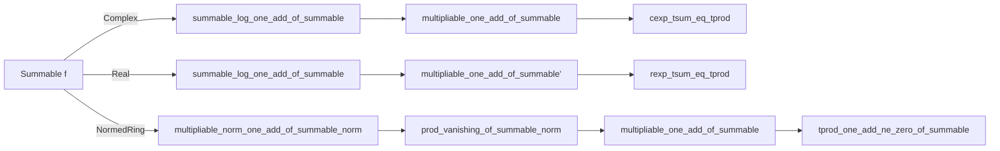

### Technical Brief: `Summable.lean`

---

#### **1. Key Definitions & Theorems**

| Name | Type / Signature | Purpose |
|------|------------------|---------|
| `hasProd_of_hasSum_log` | `{f : ι → ℂ} → (∀ i, f i ≠ 0) → HasSum (log ∘ f) a → HasProd f (exp a)` | Relates convergence of sum of logs to convergence of infinite product via exponential. |
| `multipliable_of_summable_log` | `{f : ι → ℂ} → Summable (log ∘ f) → Multipliable f` | If log-sum converges (and no zero terms), then the infinite product converges. |
| `cexp_tsum_eq_tprod` | `{f : ι → ℂ} → (∀ i, f i ≠ 0) → Summable (log ∘ f) → exp(∑' log(f i)) = ∏' f i` | Explicit equality between exponential of log-sum and infinite product. |
| `summable_log_one_add_of_summable` | `{f : ι → ℂ} → Summable f → Summable (log ∘ (1 + ·))` | If `f` is summable, then `log(1 + f(i))` is summable (for large `i`, `1 + f(i)` near 1). |
| `multipliable_one_add_of_summable` | `{f : ι → ℂ} → Summable f → Multipliable (1 + f)` | Infinite product `∏ (1 + f i)` converges if `f` is summable. |
| `Real.multipliable_of_summable_log'` | `{f : ι → ℝ} → (∀ᶠ i, 0 < f i) → Summable (log ∘ f) → Multipliable f` | Weakened version for real case: positivity only eventually. |
| `rexp_tsum_eq_tprod` | `{f : ι → ℝ} → (∀ i, 0 < f i) → Summable (log ∘ f) → exp(∑' log(f i)) = ∏' f i` | Real analog of `cexp_tsum_eq_tprod`. |
| `multipliable_norm_one_add_of_summable_norm` | `{f : ι → R} → Summable ‖f‖ → Multipliable ‖1 + f‖` | In normed ring, if `‖f‖` summable, then `‖1 + f(i)‖` is multipliable. |
| `Finset.norm_prod_one_add_sub_one_le` | `‖∏_{i ∈ t} (1 + f i) - 1‖ ≤ exp(∑_{i ∈ t} ‖f i‖) - 1` | Key inequality bounding deviation of finite product from 1. |
| `prod_vanishing_of_summable_norm` | `Summable ‖f‖ → ∀ ε > 0, ∃ s₂, disjoint t s₂ ⇒ ‖∏_{i ∈ t} (1 + f i) - 1‖ < ε` | Shows tail products approach 1 uniformly. |
| `multipliable_one_add_of_summable` (in `NormedRing`) | `Summable ‖f‖ → Multipliable (1 + f)` | Main convergence result: absolute summability of `f` implies convergence of `∏ (1 + f i)`. |
| `Summable.summable_log_norm_one_add` | `Summable ‖f‖ → Summable log ‖1 + f‖` | Log-norm version: `log ‖1 + f(i)‖` summable if `f` is absolutely summable. |
| `tprod_one_add_ne_zero_of_summable` | `∀ i, 1 + f i ≠ 0 ∧ Summable ‖f‖ ⇒ ∏' (1 + f i) ≠ 0` | Non-vanishing of infinite product under absolute summability and pointwise non-vanishing. |

---

#### **2. Naming Conventions**

- **Prefixes**:
  - `hasProd_`, `hasSum_`: relate to convergence of products/sums.
  - `multipliable_`: asserts existence of convergent product.
  - `summable_`: asserts summability of a function.
  - `tprod_`, `tsum_`: refer to *tensored* (i.e., filtered) infinite product/sum.
  - `cexp_`, `rexp_`: complex/real exponential.
  - `norm_`, `Finset.norm_`: norms over finite sets or functions.

- **Suffixes**:
  - `_of_summable`: implication from summability of something else.
  - `_eventually_bounded_`: bounding behavior of finite products.
  - `_vanishing_`: vanishing of tail products.
  - `_ne_zero_`: non-vanishing of product.

- **Structure**:
  - `lemma_name_of_condition_hypothesis`: e.g., `multipliable_one_add_of_summable`.

---

#### **3. Tactic Stack**

Frequently used tactics:
- `simp`, `simp_rw`, `congr`, `congr_cofinite`, `congr_cofinite₀`
- `filter_upwards`, `eventually_le_const`, `eventually_atTop`
- `rw [← ...]`, `rw [exp_log]`, `rw [norm_eq_abs]`, `rw [sub_add]`
- `induction ... using Finset.induction_on`
- `linarith`, ` positivity`, `field`, `ring`
- `exact`, `refine`, `apply`, `transitivity`, `exact?`
- `norm_num`, `norm_cast`, `norm_cast?`
- `intro`, `intro h`, `intro x hx`, `intro t ht`
- `have`, `suffices`, `obtain`, `let`, `set`
- `convert`, `convert_to`, `change`, `generalize`
- `aesop` (not explicitly used, but `linarith` and `simp` cover most automation)

---

#### **4. Proof Logic**

- **Inductive structure**: Proofs often proceed by:
  1. **Reduction to known results** (e.g., via `congr`, `congr_cofinite`, `of_norm_bounded`).
  2. **Case analysis** on existence of zero terms (`by_cases hfn : ∃ n, f n = 0`).
  3. **Eventual positivity/negligibility**: using `∀ᶠ i in cofinite` to handle asymptotic behavior.
  4. **Bounding finite products** using inequalities like `Finset.norm_prod_one_add_sub_one_le`.
  5. **Vanishing tail argument**: using `prod_vanishing_of_summable_norm` to control tails.
  6. **Cauchy criterion** for convergence in complete spaces (`CompleteSpace.complete`, `Metric.cauchy_iff`).
  7. **Gluing finite and infinite parts**: splitting products over `s₁ ∪ s₂`, bounding each part separately.

- **Common pattern**:
  - Show `∑ ‖f i‖ < ∞ ⇒ ∏ (1 + f i)` converges.
  - Use inequality to bound deviation from 1.
  - Use vanishing of tails + boundedness to apply completeness.

---

#### **5. Imports**

- `Mathlib.Analysis.SpecialFunctions.Complex.LogBounds`: bounds on complex logarithm near 1.
- `Mathlib.Topology.Algebra.InfiniteSum.Field`: infrastructure for infinite sums/products in topological fields.

---

#### **6. Theory Scope & Dependencies**

This file formalizes the **analytic theory of infinite products**, especially:
- Connection between **logarithmic summability** and **product convergence**.
- **Absolute summability ⇒ product convergence** in normed rings (including ℂ, ℝ).
- Applications to **Dirichlet series**, **Euler products**, and **Weierstrass factorization** (implied by usage).

It builds on:
- `Filter`, `SummationFilter`, `NNReal` for cofinite filters and positivity.
- `Complex`, `Real` modules for exponential/logarithm properties.
- `NormedRing`, `CompleteSpace`, `NormMulClass` for functional-analytic context.

---

#### **7. Mermaid Diagrams**

##### **Dependency Graph (High-Level)**

```mermaid
graph TD
  A[Summable.lean] --> B[Mathlib.Analysis.SpecialFunctions.Complex.LogBounds]
  A --> C[Mathlib.Topology.Algebra.InfiniteSum.Field]
  A --> D[Mathlib.Topology.Basic]
  A --> E[Mathlib.Analysis.Normed.Basic]
  A --> F[Mathlib.MeasureTheory.Integral.IntervalIntegral]

  subgraph Theory
    A --> G[Infinite Products]
    A --> H[Logarithm & Exponential]
    A --> I[Absolute Convergence]
    A --> J[Cauchy Criterion]
  end

  G --> K[Multipliable]
  G --> L[HasProd]
  H --> M[log(1+z) ~ z near 0]
  I --> N[Summable ⇒ Multipliable(1+f)]
```

##### **File Overview (Data Flow)**



---

#### **8. Summary**

This file establishes foundational results linking **absolute summability** of a function `f` to **convergence of the infinite product** `∏ (1 + f i)`, both in complex and real settings, and in general complete normed rings. It uses:
- Logarithmic linearization (`log(1+z) ≈ z`),
- Norm estimates (`‖∏(1+f) - 1‖ ≤ exp(∑‖f‖) - 1`),
- Filter-theoretic tools (`cofinite`, `vanishing`, `eventually_bounded`).

It serves as a technical backbone for deeper results in analytic number theory (e.g., Euler products) and complex analysis (e.g., Weierstrass factorization).
